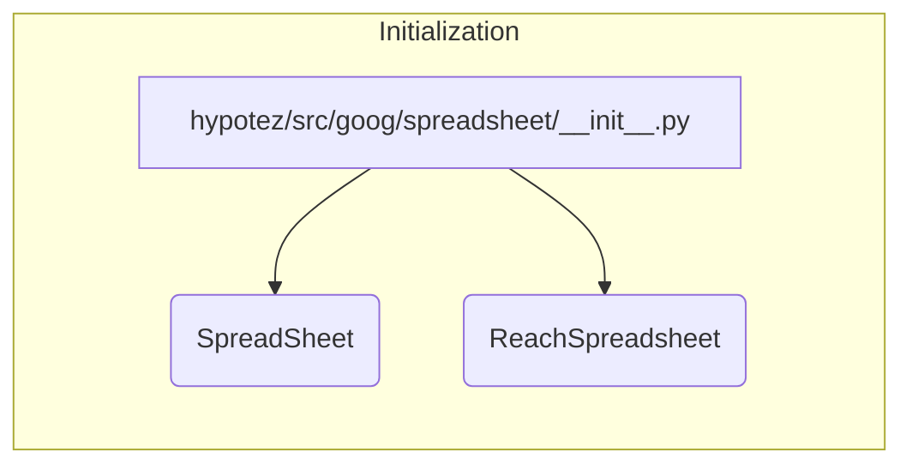

# Code Explanation for hypotez/src/goog/spreadsheet/__init__.py

## <input code>

```python
## \file hypotez/src/goog/spreadsheet/__init__.py
# -*- coding: utf-8 -*-\
#! venv/Scripts/python.exe
#! venv/bin/python/python3.12

"""
.. module: src.goog.spreadsheet 
	:platform: Windows, Unix
	:synopsis:

"""
MODE = 'dev'


from .spreadsheet import SpreadSheet
from .reach_spreadsheet import ReachSpreadsheet
```

## <algorithm>

No explicit algorithm is present in this file.  It's an initialization file, importing classes from submodules. The workflow is simply the import statements.

**Data Flow:**
There's no data processing; the workflow is purely importing functionality from other modules.


## <mermaid>



**Dependencies Analysis:**

The diagram shows a simple import relationship.  `hypotez/src/goog/spreadsheet/__init__.py` imports `SpreadSheet` and `ReachSpreadsheet` from submodules. This implies that `spreadsheet.py` and `reach_spreadsheet.py` (or similar files) must exist within the `hypotez/src/goog/spreadsheet` directory.


## <explanation>

**Imports:**

* `from .spreadsheet import SpreadSheet`: Imports the `SpreadSheet` class from the `spreadsheet.py` module within the `hypotez/src/goog/spreadsheet` directory. The `.` indicates a relative import.
* `from .reach_spreadsheet import ReachSpreadsheet`: Imports the `ReachSpreadsheet` class from the `reach_spreadsheet.py` module within the `hypotez/src/goog/spreadsheet` directory. Also a relative import.

**Classes (implied):**

* `SpreadSheet`:  This likely represents a class for interacting with a spreadsheet in a Google Sheets format.  Details about its methods and attributes are not found in this initialization file, and require analysis of `spreadsheet.py`.
* `ReachSpreadsheet`:  This likely represents a class for handling interactions related to the `ReachSpreadsheet` or a feature using a spreadsheet. Details are similarly found in `reach_spreadsheet.py`.


**Functions (none):**

There are no functions defined in this file.

**Variables:**

* `MODE = 'dev'`:  A string variable defining a mode (likely for development or production). This variable is not used in this particular file but might be used elsewhere in the project.

**Potential Errors or Improvements:**

* **Missing Documentation:**  While the docstring provides a module summary, further documentation for the imported classes within `spreadsheet.py` and `reach_spreadsheet.py` is highly recommended.
* **Error Handling:** No error handling is included.  Catching and handling exceptions during import operations or spreadsheet interactions would improve robustness.
* **Type Hinting:** Utilizing type hints for the imported classes and variables would enhance code readability and maintainability.  For instance, annotating `MODE` as `MODE: str = 'dev'` could be beneficial.

**Relationships with other parts of the project:**

This file acts as an entry point for interacting with spreadsheet functionality within the `hypotez` project.  It relies on `spreadsheet.py` and `reach_spreadsheet.py` for concrete implementation of spreadsheet interactions. These submodules likely use external libraries (e.g., the Google Sheets API) and define classes/methods for interacting with and manipulating spreadsheets.