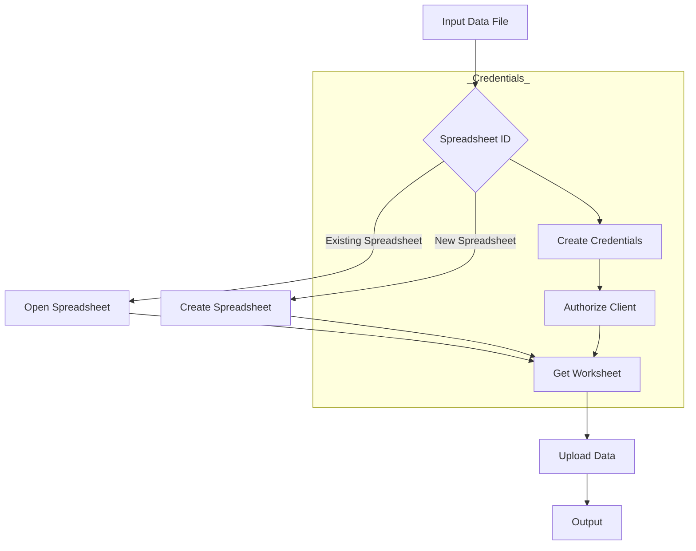
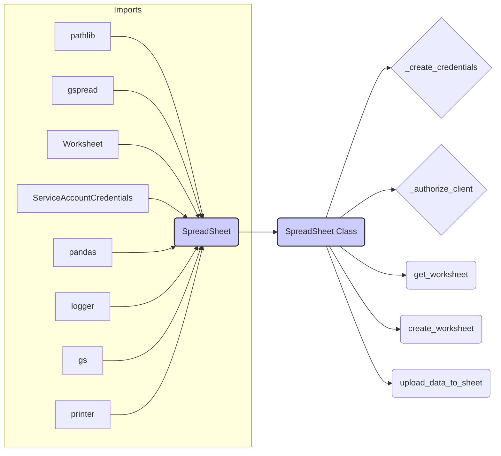

```MD
# Code Explanation for hypotez/src/goog/spreadsheet/spreadsheet.py

## <input code>

```python
# -*- coding: utf-8 -*-\n
#! venv/Scripts/python.exe\n
#! venv/bin/python/python3.12\n

"""
.. module: src.goog.spreadsheet 
	:platform: Windows, Unix
	:synopsis: Minimal library for working with Google Sheets.

```python
# Example usage of the class
if __name__ == "__main__":
    from pathlib import Path

    data_file = Path(\'/mnt/data/google_extracted/your_data_file.csv\')  # Replace with actual data file
    sheet_name = \'Sheet1\'  # Replace with actual sheet name in Google Sheets

    # Create a new Spreadsheet if spreadsheet_id is not specified
    google_sheet_handler = SpreadSheet(
        spreadsheet_id=None,  # Specify None to create a new Spreadsheet
        sheet_name=sheet_name,
        spreadsheet_name=\'My New Spreadsheet\'  # Name of the new Spreadsheet if spreadsheet_id is not specified
    )
    google_sheet_handler.upload_data_to_sheet()
```
"""
MODE = 'dev'


from pathlib import Path
import gspread
from gspread import Spreadsheet, Worksheet
from oauth2client.service_account import ServiceAccountCredentials
import pandas as pd
from src.logger import logger
from src import gs
from src.utils.printer import pprint

class SpreadSheet:
    """ Class for working with Google Sheets.

    This class provides basic methods for accessing the Google Sheets API, creating and managing spreadsheets,
    and uploading data from a CSV file to Google Sheets.
    """

    # Path to the credentials file for accessing Google Sheets.
    #creds_file = gs.path.root / 'secrets' / 'hypo69-c32c8736ca62.json'

    """ оригинал файла хранится в базе данных вместе с паролями
    @todo организовать копирование файла в прогамно созаданом `tmp`,чтобы не хранить файл в физической директории
    """


    spreadsheet_id: str | None
    spreadsheet_name: str | None
    spreadsheet: Spreadsheet
    data_file: Path
    sheet_name: str
    credentials: ServiceAccountCredentials
    client: gspread.Client
    worksheet: Worksheet
    create_sheet: bool

    def __init__(self, 
                 spreadsheet_id: str, *args, **kwards):  # Name of the sheet in Google Sheets
        """ Initialize GoogleSheetHandler with specified credentials and data file.

        @param spreadsheet_id ID of the Google Sheets spreadsheet. Specify None to create a new Spreadsheet.
        @param spreadsheet_name Name of the new Spreadsheet if spreadsheet_id is not specified.
        @param sheet_name Name of the sheet in Google Sheets.
        """
        self.spreadsheet_id = spreadsheet_id
        self.credentials = self._create_credentials()
        self.client = self._authorize_client()
        
        try:
            self.spreadsheet = self.client.open_by_key(self.spreadsheet_id)
            #logger.debug(f"Opened existing spreadsheet with ID: {self.spreadsheet_id}")
        except gspread.exceptions.SpreadsheetNotFound:
            logger.error(f"Spreadsheet with ID '{self.spreadsheet_id}' does not exist.")
            raise
   
    # ... (rest of the class methods)
```

## <algorithm>



**Explanation:**

1. **Input Data File:** The script takes a CSV file path as input.
2. **Spreadsheet ID:** It takes the spreadsheet ID as input. If the ID is `None`, a new spreadsheet is created.
3. **Credentials:**  Credentials are created using `_create_credentials`.
4. **Authorize Client:** The client is authorized using `_authorize_client`.
5. **Open Spreadsheet (if existing) / Create Spreadsheet (if new):** A Google Sheet is opened using the provided ID, or a new spreadsheet is created with the provided name. An error is raised if the spreadsheet with the specified ID is not found.
6. **Get Worksheet:** The script gets the specified worksheet from the spreadsheet. If the worksheet does not exist, it's created using `create_worksheet`.
7. **Upload Data:** Data from the CSV file is read, formatted, and uploaded to the Google Sheet.
8. **Output:** The uploaded data is saved in the spreadsheet.


## <mermaid>



**Dependencies Analysis:**

The `mermaid` diagram illustrates the key imports and their relationship to the `SpreadSheet` class. The `SpreadSheet` class relies on various libraries for core functionality (e.g., accessing Google Sheets, handling files, logging, and data manipulation).


## <explanation>

**Imports:**

- `pathlib`: Provides object-oriented way of working with files and directories.
- `gspread`:  A Python library for interacting with Google Sheets APIs. `Spreadsheet` and `Worksheet` classes are used to represent and work with Google Sheets and their sheets.
- `oauth2client.service_account`: Handles authentication with Google APIs using service accounts, specifically necessary for Google Sheets API access.
- `pandas`:  Provides high-performance data manipulation and analysis tools. Used to read and format data from CSV files.
- `src.logger`: Custom logging module for the project (likely in a different file).
- `src.gs`: Likely a module containing configuration or utility functions related to Google Services.
- `src.utils.printer`: Likely a module for custom data printing or formatting utilities.

**Classes:**

- `SpreadSheet`:  The main class to handle interactions with Google Sheets.
    - `spreadsheet_id`: Stores the ID of the spreadsheet.
    - `spreadsheet`: An instance of the `gspread.Spreadsheet` object, representing a Google Sheet.
    - `data_file`: Path to the CSV file.
    - `credentials`: `ServiceAccountCredentials` object, crucial for authentication.
    - `client`: An instance of `gspread.Client`, providing the connection to the Google Sheets API.
    - `worksheet`: An instance of `gspread.Worksheet`, representing a sheet within a spreadsheet.
    - `__init__`: Initializes the `SpreadSheet` object with spreadsheet ID and credentials. It attempts to open the spreadsheet; if it doesn't exist, an error is raised.
    - `_create_credentials`: Creates credentials from a JSON key file.
    - `_authorize_client`: Creates and authorizes a client for Google Sheets API access.
    - `get_worksheet`: Retrieves a worksheet from the spreadsheet by name or creates it.
    - `create_worksheet`: Creates a new worksheet within the spreadsheet.
    - `copy_worksheet`: Copies an existing worksheet.
    - `upload_data_to_sheet`: Uploads data from a CSV file to the selected sheet.

**Functions:**


- `upload_data_to_sheet`: Uploads data to Google Sheets, reads a CSV file (using pandas), and then updates the spreadsheet with the data.

**Variables:**

- `MODE`: A string variable with the value 'dev'. Likely controls different configurations or behaviors (like logging levels) in a development environment.

**Potential Errors/Improvements:**

- **Error Handling:**  While the code includes `try...except` blocks, the error handling could be more specific for various exceptions (e.g., file not found, incorrect credentials, sheet not found).  Adding more detailed error messages would improve debugging.
- **Resource Management:** The code does not explicitly close connections to Google Sheets, which might lead to issues with prolonged use. Consider using `with` statements for resources to ensure proper cleanup.
- **Data Validation:**  The code assumes that the CSV file has the correct structure. Consider adding validation for the CSV data to ensure data quality.
- **Data Integrity:** Consider checking data types when reading the CSV file and preparing the data for writing.


**Relationships:**

The code interacts with external resources (`gspread`, `pandas`) and potentially other internal modules (`src.logger`, `src.gs`) via imports.  This project structure suggests a larger application architecture involving Google Sheets interaction, potentially for data analysis or processing.