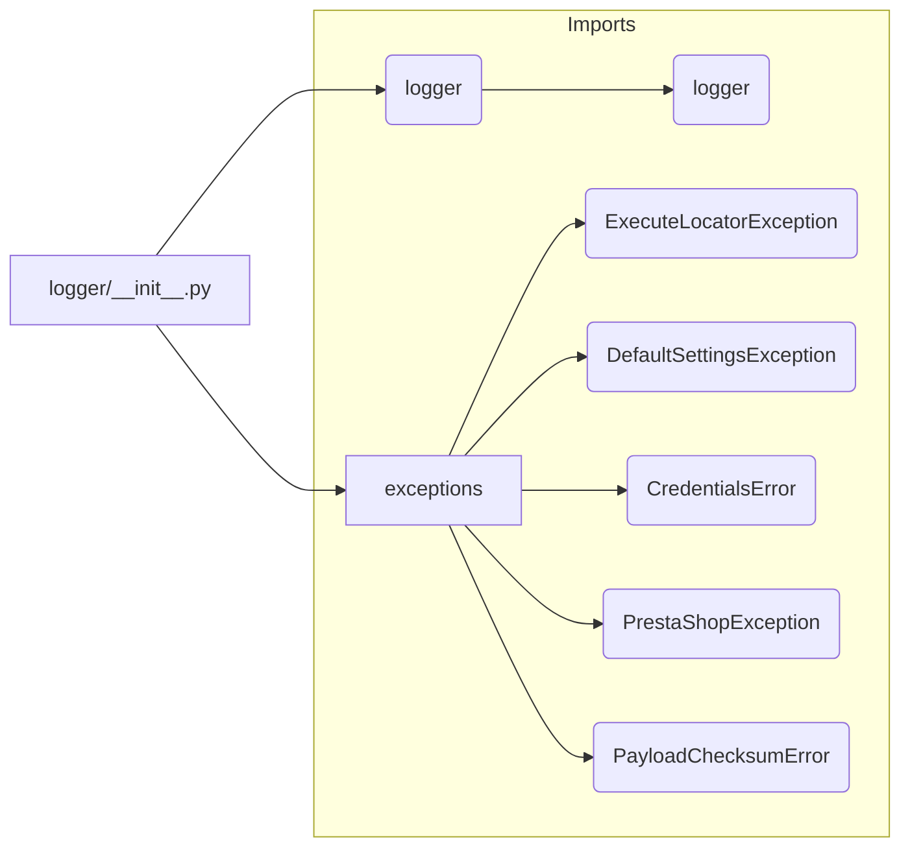

```MD
# Code Explanation for hypotez/src/logger/__init__.py

## <input code>

```python
## \file hypotez/src/logger/__init__.py
# -*- coding: utf-8 -*-\
#! venv/Scripts/python.exe
#! venv/bin/python/python3.12

"""
.. module: src.logger 
	:platform: Windows, Unix
	:synopsis:

"""
MODE = 'dev'

from .logger import logger
#from .beeper import Beeper
from .exceptions import ( ExecuteLocatorException, 
                         DefaultSettingsException, 
                         CredentialsError, 
                         PrestaShopException, 
                         PayloadChecksumError
                        )
```

## <algorithm>

This file acts as an initialization module for the `logger` package.  It primarily imports necessary components from submodules. There's no complex algorithm; it simply sets up the environment by importing other modules within the `src.logger` package.  It defines a global variable `MODE` which might control the behavior of the logger based on its value ('dev' in this case).

**Workflow Diagram (Simplified):**

No complex interactions or looping exist here. The import statements are the core of the workflow, bringing in necessary components from other modules for use in the application.


## <mermaid>



**Dependency Analysis and Explanation:**

The diagram shows the core imports.

- `logger/__init__.py` imports `logger` from `./logger` (relative import).  This implies the `logger` module likely contains logging functions or classes.
- `logger/__init__.py` imports various exception classes (`ExecuteLocatorException`, etc.) from `./exceptions`.  This suggests these exceptions handle specific errors relevant to the logging or related functionalities.  This illustrates a clear dependency relationship between the `logger` and `exceptions` packages.


## <explanation>

**Imports:**

- `from .logger import logger`: Imports the `logger` object (presumably a logging handler or a logger instance) from the `logger` submodule within the same directory. This is a relative import, assuming the `logger` module exists in a subdirectory named `./logger` within the current directory.
- `from .exceptions import ...`: Imports several custom exception classes (like `ExecuteLocatorException`, etc.) from the `exceptions` submodule.  These are likely used for handling errors related to the logger and/or its functionalities (e.g., incorrect configurations or specific errors related to execution). This is a relative import assuming the `exceptions` module exists within `./exceptions`

**Classes (Implied):**

- The `ExecuteLocatorException`, `DefaultSettingsException`, `CredentialsError`, `PrestaShopException`, and `PayloadChecksumError` are custom exception classes likely defined within the `exceptions` module.  Each represents a distinct error condition that might be encountered.

**Variables:**

- `MODE = 'dev'`: This global variable is likely used to control configuration options. For example, different logging levels or output destinations might be used for development mode versus production mode. The significance of this variable depends on how the logger or other modules utilize it in the project.

**Potential Errors/Improvements:**

- **Missing `beeper` import:** The commented-out import `from .beeper import Beeper` suggests that a `beeper` module was intended but wasn't included.  This might have been for notification purposes. Consider restoring this import if needed, or removing the comment if it is definitively unused.

- **Docstrings:** The docstrings (`"""..."""`) in the file are quite basic and not comprehensive. Adding more detailed descriptions about the module's purpose and how different functions/classes interact would greatly improve the understanding of the code.

- **Robust Error Handling:** Error handling should be improved. While custom exception classes are defined, consider specific error handling code to capture exceptions (e.g., try-except blocks) where they may arise.

**Relationship with Other Parts of the Project:**

The `logger` module is crucial for tracking events and errors within the `hypotez` project. It's likely used by other modules (likely in the `src` package) to log various actions, events, and statuses.  The use of exceptions clarifies that this module expects other parts of the application to utilize these specific exceptions, which helps indicate that other components of the `hypotez` project use and rely on this `logger` module.