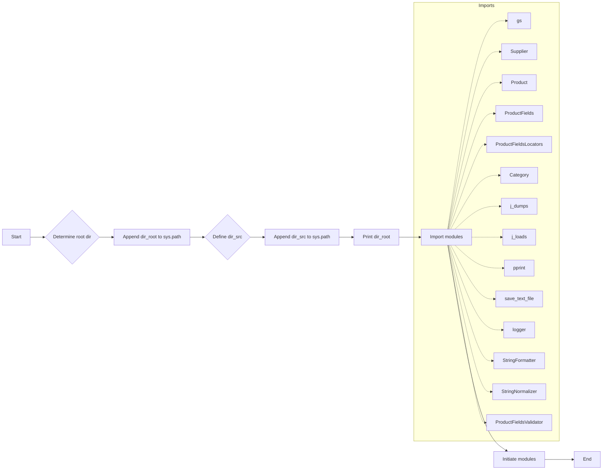

# Code Explanation for hypotez/src/logger/_examples/header.py

## <input code>

```python
## \file hypotez/src/logger/_examples/header.py
# -*- coding: utf-8 -*-\n#! venv/Scripts/python.exe\n#! venv/bin/python/python3.12\n\n"""
.. module: src.logger._examples 
	:platform: Windows, Unix
	:synopsis:

"""
MODE = 'dev'

"""
	:platform: Windows, Unix
	:synopsis:

"""


"""
	:platform: Windows, Unix
	:synopsis:

"""


"""
  :platform: Windows, Unix

"""
"""
  :platform: Windows, Unix
  :platform: Windows, Unix
  :synopsis:
"""MODE = 'dev'
  
""" module: src.logger._examples """


import sys
import os
from pathlib import Path

dir_root : Path = Path (os.getcwd()[:os.getcwd().rfind('hypotez')+11])
sys.path.append (str (dir_root) )  # Добавляю корневую папку в sys.path
dir_src = Path (dir_root, 'src')
sys.path.append (str (dir_root) ) 
...

print(dir_root)
# ----------------
from pathlib import Path
import json
import re
# ----------------

from src import gs
from src.suppliers import Supplier
from src.product import Product, ProductFields, ProductFieldsLocators
from src.category import Category
from src.utils.jjson import j_dumps, j_loads,   pprint, save_text_file
from src.logger import logger
from src.utils.string import StringFormatter, StringNormalizer, ProductFieldsValidator
...
```

## <algorithm>

The code sets up the import path for various modules within a project.  It defines a root directory and adds it to Python's module search path (sys.path). It then imports specific classes and functions from various parts of the `src` package tree, indicating a structure for a project involving product data, categories, suppliers, and potentially logging.

```
[Start]
  --> Determine root directory (dir_root) from current working directory.
  --> Append dir_root to sys.path.
  --> Define dir_src as the 'src' subdirectory under dir_root.
  --> Append dir_src to sys.path.
  --> Print dir_root.
  --> Import necessary modules from different packages in the project.
  --> Initiate modules to utilize. 
[End]
```

**Example:** If `os.getcwd()` returns `/home/user/project/hypotez/example`, and `hypotez` is the project root, `dir_root` will be `/home/user/project/hypotez`.  `dir_src` would then be `/home/user/project/hypotez/src`.


## <mermaid>



**Dependencies Analysis:** The mermaid diagram shows the dependencies between the main part of the code and the modules imported.  `gs`, `Supplier`, `Product`, `ProductFields`, `ProductFieldsLocators`, `Category`, `j_dumps`, `j_loads`, `pprint`, `save_text_file`, `logger`, `StringFormatter`, `StringNormalizer`, `ProductFieldsValidator` are directly imported from different modules within the `src` package. These dependencies are crucial for the functioning of the program, which seems related to product management or a similar application that needs access to data handling utilities.  


## <explanation>

* **Imports:** The code imports necessary modules from various sub-packages.  
    * `sys`, `os`, `pathlib`, `json`, `re`: Standard Python libraries for system interaction, file paths, data handling, and regular expressions.
    * `src.gs`, `src.suppliers.Supplier`, `src.product.Product`, `src.product.ProductFields`, `src.product.ProductFieldsLocators`, `src.category.Category`, `src.utils.jjson.j_dumps`, `src.utils.jjson.j_loads`, `src.utils.jjson.pprint`, `src.utils.jjson.save_text_file`, `src.logger.logger`, `src.utils.string.StringFormatter`, `src.utils.string.StringNormalizer`, `src.utils.string.ProductFieldsValidator`:  These imports indicate a well-structured Python project (`src` package) with modules for handling data (`Product`, `Category`, `Supplier`), JSON operations, strings, a dedicated logger, and potentially a general service (`gs`).

* **Variables:**
    * `dir_root`, `dir_src`: These are `Path` objects, indicating intended use for manipulating file paths.
    * `MODE`: A string variable likely used to control the operation mode (e.g., 'dev', 'prod')

* **Potential Errors/Improvements:**
    * The `...` sections within the file highlight incomplete code or sections that need additional logic.  
    *  The repeated `sys.path.append(str(dir_root))`  may be a temporary fix for importing modules.  A more robust solution would be to maintain the `src` directory structure consistent with Python packaging standards for dependency management.


* **Relationship with other parts of the project:** The code clearly integrates with components from `src.suppliers`, `src.product`, `src.category`, `src.utils`, `src.logger`. This implies the existence of a project structure, likely a data processing or management application, where these various parts work together.  The goal is probably to load and process product data from external sources, using utilities for validation and formatting, and using a logging system.
```