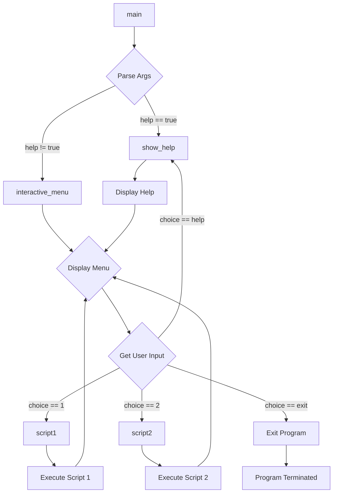

# <input code>

```python
## \file hypotez/src/main.py
# -*- coding: utf-8 -*-\
#! venv/Scripts/python.exe
#! venv/bin/python/python3.12


                    #################################################################################################
                    #                                                                                               #
                    #           THIS IS ONLY TEMPLATE FOR FUTURE REALISATION                                        #
                    #                                                                                               #
                    #################################################################################################


MODE = 'dev'


"""
Module for interactive script execution.
=========================================================================================

This module provides an interactive menu for running predefined scripts.
It takes user input to select and execute scripts 1 or 2.

Usage Example
--------------------
.. module: src 
	:platform: Windows, Unix
	:synopsis:

.. code-block:: python

    python main.py  # Starts interactive menu
    python main.py --help # Displays help

"""
MODE = 'dev'


import argparse
from src.utils.jjson import j_loads, j_loads_ns
from src.logger import logger

def script1():
    """Executes script 1."""
    print("Script 1 started")
    # ... (Add script 1 code here)

def script2():
    """Executes script 2."""
    print("Script 2 started")
    # ... (Add script 2 code here)

def show_help():
    """Displays help information for available commands."""
    print("\nAvailable commands:")
    print("1. Run script 1 - Executes script 1.")
    print("2. Run script 2 - Executes script 2.")
    print("3. --help - Displays this help menu.")
    print("4. exit - Exits the program.\n")

def interactive_menu():
    """Interactive menu for selecting and running scripts."""
    print("Welcome! Choose one of the commands:\n")
    while True:
        print("1. Run script 1")
        print("2. Run script 2")
        print("3. --help - Show command list.")
        print("4. exit - Exit the program.")

        choice = input("Enter command number: ").strip()

        if choice == "1":
            script1()
        elif choice == "2":
            script2()
        elif choice == "3" or choice.lower() == "--help":
            show_help()
        elif choice.lower() == "exit":
            print("Exiting the program.")
            break
        else:
            logger.error("Invalid input. Please choose a valid command.")


def main():
    """Main function for handling command-line arguments and starting the menu."""
    parser = argparse.ArgumentParser(description="Interactive menu for running scripts.")
    parser.add_argument(
        "--help",
        action="store_true",
        help="Show available options and help information",
    )
    args = parser.parse_args()

    if args.help:
        show_help()
    else:
        interactive_menu()


if __name__ == "__main__":
    main()
```

# <algorithm>

1. **Parse Arguments:** The `main` function uses `argparse` to parse command-line arguments, specifically checking for `--help`.

    * **Example:** `python main.py --help`

2. **Conditional Execution:** If `--help` is provided, `show_help` is called, otherwise `interactive_menu` is executed.

3. **Interactive Menu:**
    * **Display Menu:** Presents options to the user (run script 1, run script 2, help, exit).
    * **Get User Input:** Takes user input regarding which script to execute.
    * **Choice Handling:** Based on user's choice, corresponding functions (`script1`, `script2`, `show_help`) are called or the program exits.

    * **Example:** User enters "1", `script1` is called.
    * **Example:** User enters "3", `show_help` is called.
    * **Example:** User enters "exit", the program terminates.
4. **Script Execution (script1 and script2):** Placeholder functions, waiting to be implemented with actual script logic.


# <mermaid>



**Dependencies Analysis:**

* `argparse`: Used for command-line argument parsing.
* `src.utils.jjson`: Likely for JSON handling, based on the import name. This likely relates to utilities for working with JSON data.
* `src.logger`: Used for logging.  This implies other packages in the `src` directory handle logging and/or other aspects of the application. The exact functions and behavior are not visible from this file alone.


# <explanation>

* **Imports:**
    * `argparse`:  Provides tools to parse command-line arguments. Necessary for handling the `--help` option.
    * `src.utils.jjson`:  Implements functions for loading JSON data. The exact relationship with other parts of the project depends on the specific implementations within `src.utils.jjson`.
    * `src.logger`: Likely a custom logger with additional functionalities.  It likely defines methods for logging errors, which `main` uses in case of invalid input.  This would have further context within the `src` folder.

* **Classes:** None defined in the given code.

* **Functions:**
    * `script1()`, `script2()`: Placeholder functions for future script implementations.  These functions do not do anything but print a message, they are placeholders and need to have code added to execute the actual scripts.
    * `show_help()`: Displays a help message for possible commands, useful for users to understand how to use this program.
    * `interactive_menu()`: Implements the interactive command-line menu. This function handles user input, selecting and calling scripts.
    * `main()`: Handles command-line arguments, determines whether to display help or start the interactive menu.


* **Variables:**
    * `MODE`: A string variable, likely a configuration flag (e.g., 'dev', 'prod'). It seems to be unused in the current code and is defined twice.

* **Potential Errors/Improvements:**
    * The code is a template and lacks actual script implementations (`script1` and `script2`).
    * The script logic should be added to `script1` and `script2`.
    * `MODE` variable usage is not consistent.
    * Error handling is basic.  The error handling when input is invalid is logged using the `logger` object, but the error isn't directly shown to the user.


**Relationships:**

This file (`main.py`) is likely a starting point for an interactive application. It interacts with other parts of the `hypotez` project (`src.utils.jjson`, `src.logger`) for data handling and logging. The missing script implementations in `script1` and `script2` will likely call functions or classes defined elsewhere in the `hypotez/src` folder, possibly to perform specific tasks.  The `src` package is likely to contain modules for different functionality; thus, other files within the `hypotez/src` folder could have a crucial role.


```