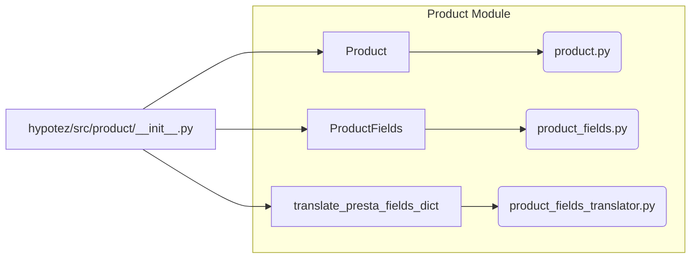

# Code Explanation for hypotez/src/product/__init__.py

## <input code>

```python
## \file hypotez/src/product/__init__.py
# -*- coding: utf-8 -*-\
#! venv/Scripts/python.exe
#! venv/bin/python/python3.12

"""
.. module: src.product 
	:platform: Windows, Unix
	:synopsis: Product module
External classes and attributes:
- `Product`: Methods and attributes of the product. Detailed description in `product.py`
- `ProductFields`: Product fields. Detailed description in `product_fields.py`
- `record`: A dictionary of product fields in flat format (without nesting)
- `translate_presta_fields_dict`: Function that translates multilingual fields of `ProductFields`


"""
MODE = 'dev'

from .product import Product
from .product_fields.product_fields import ProductFields
from .product_fields.product_fields_translator import translate_presta_fields_dict
```

## <algorithm>

This module acts as an entry point for the `product` package.  It imports necessary classes and functions from submodules, making them accessible in other parts of the application.  There's no complex algorithm in this file, it mainly establishes the namespace.

```
+-----------------+
|  __init__.py    |
+-----------------+
|  MODE = 'dev'   |
+-----------------+
|  Import Product |
+-----------------+
| Import ProductFields |
+-----------------+
| Import translate_presta_fields_dict |
+-----------------+
```

No specific data flows are depicted because this file primarily handles imports.


## <mermaid>




**Dependencies Analysis:**

* `hypotez/src/product/__init__.py` imports:
    * `Product` from `hypotez/src/product/product.py`: This suggests that `product.py` contains the `Product` class definition.
    * `ProductFields` from `hypotez/src/product/product_fields/product_fields.py`: This indicates that `product_fields/product_fields.py` defines the structure and behavior of product fields.
    * `translate_presta_fields_dict` from `hypotez/src/product/product_fields/product_fields_translator.py`: Implies that translation functionality is isolated in a separate component within the `product_fields` package.


## <explanation>

* **Imports:**
    * `from .product import Product`: Imports the `Product` class from the `product` submodule. The `.` indicates a relative import within the same package.
    * `from .product_fields.product_fields import ProductFields`: Imports the `ProductFields` class from the nested `product_fields` submodule.
    * `from .product_fields.product_fields_translator import translate_presta_fields_dict`: Imports the `translate_presta_fields_dict` function likely responsible for translating product fields.

* **Classes:** This file doesn't define any classes; it only imports them. The actual implementation details of `Product` and `ProductFields` are in `product.py` and `product_fields/product_fields.py` respectively.

* **Functions:** This file imports the function `translate_presta_fields_dict`. The actual implementation of this function, defining its behavior, arguments, and return value, is found in `product_fields/product_fields_translator.py`.

* **Variables:**  `MODE = 'dev'`: This variable likely controls runtime behavior (e.g., logging levels, feature toggles). Its use is not immediately apparent from the snippet.

* **Potential Errors/Improvements:**
    * **Docstrings:** While the module docstring is present, it could benefit from more detailed information about the purpose and usage of the exported `Product`, `ProductFields`, and `translate_presta_fields_dict`. Similar detailed docstrings should be present in the imported classes and functions.
    * **`record`:** The `record` variable is mentioned in the docstring but not defined within this `__init__.py` file. Its declaration and initialization likely occur in another file or module.

* **Relationships with other parts of the project:** The `product` module is likely part of a larger system. The `product.py`, `product_fields.py`, and  `product_fields_translator.py` files, which define core product-related functionalities, are dependent on other modules and functionalities not apparent from this single file's scope.  A more complete picture of the application architecture would require examining other related files.