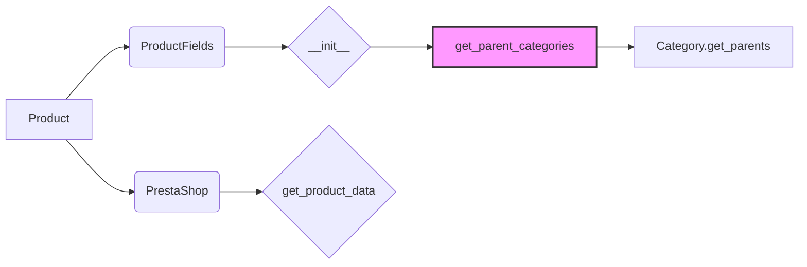

# Code Explanation for hypotez/src/product/product.py

## <input code>

```python
# -*- coding: utf-8 -*-\n#! venv/Scripts/python.exe\n#! venv/bin/python/python3.12\n\n"""\n.. module: src.product \n\t:platform: Windows, Unix\n\t:synopsis: Interaction between website, product, and PrestaShop.\nDefines the behavior of a product in the project.\n\n"""\nMODE = 'dev'\n\nimport header\nfrom src import gs\nfrom src.endpoints.prestashop import PrestaShop  # Explicit import\nfrom src.category import Category\nfrom src.product.product_fields import ProductFields\nfrom src.logger import logger\n\n\nclass Product(ProductFields, PrestaShop):\n    """  Manipulations with the product.\n    Initially, I instruct the grabber to fetch data from the product page,\n    and then work with the PrestaShop API.\n    """\n    def __init__(self, *args, **kwargs):\n        """\n        Initializes a Product object.\n\n        :param args: Variable length argument list.\n        :param kwargs: Arbitrary keyword arguments.\n        """\n        super().__init__(*args, **kwargs)\n        # ... (rest of the __init__ method)\n\n\n    @staticmethod\n    def get_parent_categories(id_category: int, dept: int = 0) -> list:\n        """ Collects parent categories from the specified category.\n        Duplicates the function get_parents() from the Category class.\n\n        :param id_category: ID of the category.\n        :type id_category: int\n        :param dept: Depth of the category.\n        :type dept: int\n        :raises TypeError: if id_category is not an integer.\n        :returns: List of parent categories.\n        :rtype: list\n        """\n        if not isinstance(id_category, int):\n            raise TypeError("id_category must be an integer")\n        return Category.get_parents(id_category, dept)
```

## <algorithm>

```
+-----------------+
|  Initialization  |
+-----------------+
|      Input      |-->| Product Object |
|  args, kwargs   |-->|   __init__   |
+-----------------+     |             |
                      |             |
                      +-----+-----+
                      |     |
                      |     v
+---------------------+
|  Parent Categories  |
+---------------------+
|  Input: id_category |-->| get_parent_categories|
|        dept         |-->|  (static method)  |
|                     |             |
|                     +-----+-----+
|                     |     |
|                     |     v
|      Validation     |--->|   Return Value     |
|   id_category int?  |--->| List of Parent Cats|
+---------------------+
```

Example:

```
Input args = (123, name = 'test')
Input kwargs = {'attribute' : 'value'}
id_category = 10, dept = 2
Validation checks if id_category is an integer.
Returns a list of parent category objects from Category.get_parents(id_category, dept)
```

## <mermaid>




Dependencies analysis:

* `header`: Likely contains general project headers, configuration, or utility functions.
* `gs`: Short for "grabber services" or similar, likely a module for fetching data from external sources.
* `PrestaShop`: Contains logic specific to interacting with the PrestaShop API.
* `Category`: Likely contains logic for managing product categories.
* `ProductFields`: Probably a base class or mixin providing common product attributes and methods.
* `logger`: A logging module for capturing and managing application logs.

## <explanation>

* **Imports:**
    * `header`:  Used for general imports or settings. Its role isn't entirely clear without seeing the implementation.
    * `gs`:  Presumably interacts with data-gathering services.
    * `PrestaShop`:  Essential for PrestaShop API interactions. The import path (`from src.endpoints.prestashop import PrestaShop`) suggests it's in the `src.endpoints` package.
    * `Category`: Used for handling product categories and likely interacting with databases or other sources of category information.
    * `ProductFields`: Used as a base class, probably containing attributes and methods shared across different product types.
    * `logger`: Critical for logging, ensuring proper debugging and monitoring.

* **Classes:**
    * `Product`: This class extends both `ProductFields` and `PrestaShop`. This indicates that it leverages common product attributes and methods from `ProductFields` and inherits API interaction capabilities from `PrestaShop`. The `__init__` method initializes the object, likely setting up the necessary connections or attributes. The `get_parent_categories` method is a static method acting as a helper function for fetching parent categories for a given product.


* **Functions:**
    * `get_parent_categories`:  A static method that retrieves parent categories for a given category ID.
        * Arguments:
            * `id_category`: The ID of the category.
            * `dept`: Depth of the category (default is 0).
        * Return Value: A list of parent category IDs.
        * Raises `TypeError` if `id_category` is not an integer.
        * Logic: It checks if the input `id_category` is an integer. If not, raises `TypeError` to indicate a validation error. Otherwise, calls `Category.get_parents` to get parent categories, passing the `id_category` and `dept` value, returning the retrieved list.


* **Variables:**
    * `MODE`: A string variable that likely represents the application's mode (e.g., "dev," "prod").


* **Potential Errors/Improvements:**
    * The `...` in the `__init__` method indicates missing code.  The code should be completed to fully initialize the `Product` object and implement the inherited methods from `ProductFields` and `PrestaShop`.
    * Error handling in `get_parent_categories` is good, but it could be enhanced by handling potential exceptions from `Category.get_parents`, such as `KeyError` if the specified category ID is not found in the database.  More comprehensive exception handling can make the function more robust.

* **Relationships:**
    * `Product` relies on `PrestaShop` for API interaction and `Category` for category data retrieval.
    * `Product` uses the functionalities of `ProductFields` for common operations related to product management.