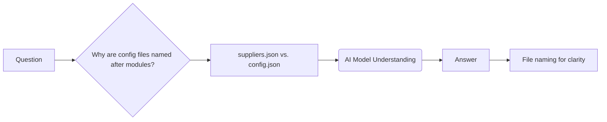

# Code Explanation

## <input code>

```
**ВОПРОС** Почему конфигурационные файлы называются по имени модуля (например: `suppliers.json`)?  
Не лучше ли было их именовать `config.json`?  
**ОТВЕТ** Имена файлов сделаны для удобства понимания моделями ИИ.
```

## <algorithm>

This code snippet is not a program; it's a question-answer pair.  There's no algorithm to describe in a block diagram format.  The code represents a discussion, not a computational process.


## <mermaid>



**Dependency Analysis:**

There are no external dependencies in this snippet. It's a natural language exchange.  The mermaid diagram reflects the conversational flow.


## <explanation>

This code snippet is a Q&A interaction.  There are no imports, classes, functions, or variables in the traditional programming sense.

* **Question:**  The user asks a question about file naming conventions for configuration files.
* **Answer:** The answer explains that the file names are chosen for better comprehension by AI models.


**Relationships with other parts of the project (if applicable):**

The file naming convention decision (e.g., `suppliers.json`)  is likely part of a larger project's configuration management system or data handling strategy.  There's an implicit relationship between the naming convention and the way any AI models within that project might consume and use those configuration files.


**Potential Errors or Areas for Improvement:**

The question and answer are adequate but lack context.  A more comprehensive analysis would need to understand the larger project architecture and the reasons for choosing the `suppliers.json` naming pattern.  For example, does the project use a dedicated configuration management tool?  Does the `suppliers.json` file contain data that's explicitly about suppliers, making the file name more descriptive to the specific AI models?