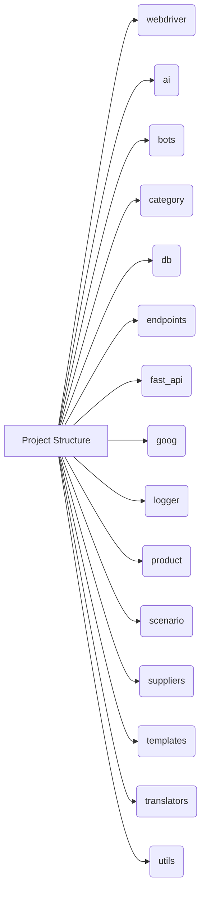

# <input code>

```[Русский](https://github.com/hypo69/hypo/blob/master/README.RU.MD)
# Table of Contents

1. [webdriver](#webdriver)
2. [ai](#ai)
3. [bots](#bots)
4. [category](#category)
5. [db](#db)
6. [endpoints](#endpoints)
7. [fast_api](#fast_api)
8. [goog](#goog)
9. [logger](#logger)
10. [product](#product)
11. [scenario](#scenario)
12. [suppliers](#suppliers)
13. [templates](#templates)
14. [translators](#translators)
15. [utils](#utils)

# Modules

## webdriver
Module for working with web drivers and automating browser actions.

## ai
Module for integrating artificial intelligence, including interaction with various AI models.

## bots
Module for creating and managing bots that interact with users.

## category
Module for working with product or data categories.

## db
Module for interacting with databases, including creating, reading, and updating data.

## endpoints
Module for creating and handling API endpoints that interact with clients.

## fast_api
Module for using FastAPI within the project, including request routing and configuration.

## goog
Module for working with Google services, such as Google Cloud or APIs.

## logger
Module for logging, providing functionality for recording logs and errors.

## product
Module for working with products, including processing product and service data.

## scenario
Module for modeling and executing interaction scenarios.

## suppliers
Module for interacting with suppliers, including integration with external systems.

## templates
Module for working with data templates and generating them.

## translators
Module for text translation using various tools and APIs.

## utils
Utility module that includes various helper functions for the project.
```

# <algorithm>

This code snippet is a table of contents and a list of modules within a project, not executable code. It's a description of different parts of a software system, with no step-by-step algorithm to demonstrate.  Therefore, there's no data flow or block diagram to illustrate.


# <mermaid>



**Explanation of Dependencies**:

The mermaid diagram shows a simple structure where each module (webdriver, ai, etc.) is a component of the overall project.  There are no direct dependencies shown because the structure is a table of contents, not a dependency graph of executable code.


# <explanation>

This code snippet is *not* executable code; it's a documentation file.  It outlines different modules and components that likely exist within a larger Python (or similar) project.

* **Imports**:  There are no imports; this is a documentation file listing the modules.
* **Classes**: There are no classes defined; this is simply a table of contents.
* **Functions**: No functions are defined; this describes modules, not functions.
* **Variables**: No variables are declared; this is not code.
* **Potential errors or areas for improvement**:  This code snippet is fine as a documentation file; the potential for errors lies in the *code* (not shown) these modules would contain.


**Relationship Chain**:

This documentation provides a high-level overview of module relationships within the project. The relationships are implicitly hierarchical - some modules (like `fast_api`) are likely used to coordinate and manage interactions between other modules (like `webdriver`, `endpoints`, etc.)  Detailed relationships between them would require looking at the actual code and implementation details of each module.