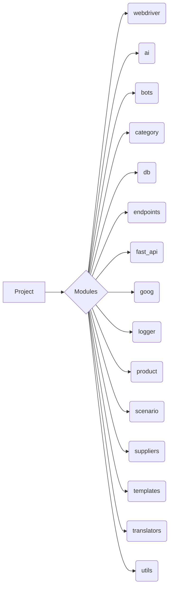

# Code Explanation

## <input code>

```
# Оглавление

1. [webdriver](#webdriver)
2. [ai](#ai)
3. [bots](#bots)
4. [category](#category)
5. [db](#db)
6. [endpoints](#endpoints)
7. [fast_api](#fast_api)
8. [goog](#goog)
9. [logger](#logger)
10. [product](#product)
11. [scenario](#scenario)
12. [suppliers](#suppliers)
13. [templates](#templates)
14. [translators](#translators)
15. [utils](#utils)

# Модули

## webdriver
Модуль для работы с веб-драйверами и автоматизацией действий в браузере.

## ai
Модуль для интеграции с искусственным интеллектом, включая взаимодействие с различными ИИ-моделями.

## bots
Модуль для создания и управления ботами, которые взаимодействуют с пользователями.

## category
Модуль для работы с категориями товаров или данных.

## db
Модуль для работы с базами данных, включая создание, чтение и обновление данных.

## endpoints
Модуль для создания и обработки API эндпоинтов, которые взаимодействуют с клиентами.

## fast_api
Модуль для использования FastAPI в проекте, включая маршрутизацию запросов и конфигурацию.

## goog
Модуль для работы с сервисами Google, такими как Google Cloud или API.

## logger
Модуль для логирования, предоставляет функциональность для записи логов и ошибок.

## product
Модуль для работы с продуктами, включая обработку данных о товарах и услугах.

## scenario
Модуль для моделирования и выполнения сценариев взаимодействия.

## suppliers
Модуль для работы с поставщиками, включая интеграцию с внешними системами.

## templates
Модуль для работы с шаблонами данных и их генерации.

## translators
Модуль для перевода текста с использованием различных инструментов и API.

## utils
Утилитарный модуль, включающий различные вспомогательные функции для проекта.
```

## <algorithm>

This code is a table of contents and module descriptions.  It doesn't describe an algorithm in the typical sense. It's a documentation file, outlining the different modules and their purpose within a larger project. There's no step-by-step process or data flow.


## <mermaid>



**Dependencies Analysis:**

The mermaid diagram shows a simple graph of the project structure, where the "Project" is connected to its various "Modules."  There aren't any explicit dependencies defined within this document. The relationships are only implied by the grouping of related modules, i.e. "webdriver" will likely interact with "endpoints".


## <explanation>

This file serves as a comprehensive list and detailed description of different modules within a project. This structured table of contents is crucial for understanding the different parts of the project and their responsibilities. The structure of the document assists in project documentation, navigation, and outlining the scope of individual components.


- **Imports:** There are no imports in this code snippet. The document itself does not contain code, but rather a structured description of the codebase.

- **Classes:** No classes are defined.  This is a description file, not code.

- **Functions:** No functions are defined.

- **Variables:** No variables are defined.

- **Potential Errors/Improvements:** No errors are present, but a more detailed description of the *interactions* between modules, and perhaps a description of the overall project goals/structure might be added for further improvement.

**Relationship Chain:**

The relationships between modules are implied by their grouping. For example, "webdriver" and "endpoints" are related because web interactions might need an API handling component.  "db" is closely related to multiple modules because it's the data store.  The overall project structure is implied through the organization of the modules, but no explicit relationships are presented.


```