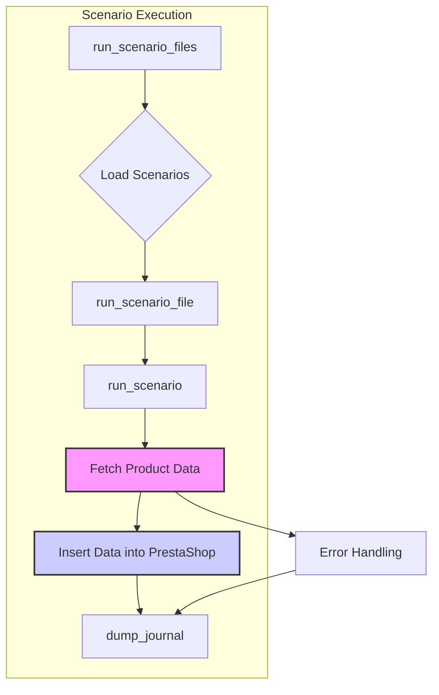

# Code Explanation: `src.scenario`

## 1. <input code>

```
### Module Overview: `src.scenario`

# ... (Module description, function descriptions, example scenario)

### Example Scenario

```json
{
    "scenarios": {
        "מינרל+לחויותלפניםמינרליםותמציותצמחים": {
            "url": "https://hbdeadsea.co.il/product-category/facial/moisture-face/",
            "name": "מינרל+לחויותלפניםמינרליםותמציותצמחים",
            "presta_categories": {
                "default_category": 11245,
                "additional_categories": [11288]
            }
        }
    }
}
```

# ... (Scenario fields, how it works, workflow, example usage)
```

## 2. <algorithm>

The workflow can be described in a step-by-step block diagram as follows:

**1. Initialization (Input: Supplier type, file list or single scenario):**
   - Instantiate a `Supplier` object (e.g., `Supplier('aliexpress')`).
   - Pass a list of scenario files or a single file path (`run_scenario_files`, `run_scenario_file`).

**2. Scenario File Execution (`run_scenario_files`):**
   - Takes the list of scenario files.
   - For each file:
     - Calls `run_scenario_file`.

**3. Scenario File Processing (`run_scenario_file`):**
   - Loads scenarios from the specified JSON file.
   - For each scenario:
     - Calls `run_scenario`.

**4. Scenario Execution (`run_scenario`):**
   - Gets URL from the scenario.
   - Fetches the category page.
   - Fetches product links from the category page.
   - For each product link:
     - Fetches product page.
     - Extracts product data.
     - Creates a `Product` object.
     - Calls `insert_grabbed_data`.

**5. Data Insertion (`insert_grabbed_data`):**
   - Asynchronously calls `execute_PrestaShop_insert`.

**6. PrestaShop Insertion (`execute_PrestaShop_insert`):**
   - Inserts product data into PrestaShop.
   - Handles errors and logs issues.

**7. Logging (`dump_journal`, error handling):**
   - Records execution details to a log (journal) file.


**Example:**

```
[Scenario Files] --> [Supplier object]
      |                             |
      |   Input: ['file1.json', 'file2.json'] -> 
      |   Initialization --> run_scenario_files() --> run_scenario_file(file1) --> run_scenario() --> Fetch Data --> insert_grabbed_data() --> [PrestaShop Data]
      |                             |                             |
      |      _________________________|____________________________|_________________________|
      |     | run_scenario_file(file2) |  --->run_scenario() --> Fetch Data --> insert_grabbed_data()
      |     |_________________________|____________________________|_________________________|
      |           [Log file]             
      |__________________________________|_________________________________________________|
```

## 3. <mermaid>



**Dependencies:**

The diagram shows the primary functions within the `src.scenario` module. Implicit dependencies, such as the `Supplier` class, `Product` class, and the `PrestaShop` client library, are assumed to exist but are not explicitly visualized here. The `PrestaShop` interaction, `dump_journal`, `Error Handling`, and `Load Scenarios` are logical blocks representing crucial steps in the process, though their internal implementations are not detailed in the provided code snippet.


## 4. <explanation>

**Imports:**

No import statements are provided in the code snippet.  However,  based on the function calls (`run`, `Supplier`, `Product`, `PrestaShop`), this module likely interacts with other modules or classes,  particularly likely ones in `src.supplier` (containing the Supplier class), `src.prestashop` (containing the PrestaShop client), and possibly a logging module.

**Classes:**

The code describes a `Supplier` class, and a `Product` class.  These are not fully defined in the snippet, but are assumed to exist and handle the specific tasks needed for interacting with a given supplier (e.g., `aliexpress`) and handling product data, respectively.  The provided `PrestaShop` class is also hinted at, likely implementing the PrestaShop API interaction.

**Functions:**

*   **`run_scenario_files(s, scenario_files_list)`**: Executes a list of scenario files. Takes a `Supplier` instance (`s`) and a list of file paths (`scenario_files_list`).  Uses `run_scenario_file` for each file.
*   **`run_scenario_file(s, scenario_file)`**: Executes scenarios from a single scenario file. Takes a `Supplier` instance and file path. Loads scenarios, calls `run_scenario`.
*   **`run_scenario(supplier, scenario, scenario_name)`**: Processes an individual scenario.  Crucial function.  Takes the `Supplier` object, scenario details from JSON, and a scenario name.
*   **`dump_journal(s, journal)`**: Saves the execution log (journal). Takes a `Supplier` instance and journal data.
*   **`insert_grabbed_data(product_fields)`**: Inserts product data into PrestaShop.  Takes product fields as input. Asynchronously calls a PrestaShop insertion function.
*   **`execute_PrestaShop_insert_async`**: Asynchronous function to insert product data into PrestaShop.
*   **`execute_PrestaShop_insert`**: Synchronous function for insertion. This likely uses a `PrestaShop` class (or similar) to interact with the PrestaShop API.
*   **`run_scenarios(s, scenarios = None)`**: Executes one or more scenarios.  Handles a list of scenarios or defaults to the current scenario from the `Supplier` instance.

**Variables:**

Variables such as `s` (Supplier instance), `scenario_files_list` (file paths), and `scenario` (scenario data) are used to store and pass data between functions, classes and methods.

**Potential Errors and Improvements:**

*   **Error Handling**: The code lacks detailed error handling.  The `execute_PrestaShop_insert` functions should have robust error handling (e.g., catching exceptions, logging errors appropriately), especially in the `insert_grabbed_data` calls.  Logging should also capture failures, exceptions, and timestamps.
*   **Asynchronous operations**: Using asynchronous operations (`execute_PrestaShop_insert_async`) is good practice to avoid blocking the main thread.  However, it's crucial to handle potential issues arising from asynchronous execution, ensuring that all operations are completed.
*   **Data Validation**:  There should be checks to validate the format of JSON scenarios, extracted data (e.g., URLs, category IDs), and the consistency of the data from the supplier's website.

**Chain of Relationships:**

The module relies on other parts of the project for:

1.  `Supplier` class: Requires interaction with supplier-specific functions (e.g., web scraping, data parsing).
2.  `Product` class: Handling and storing product data.
3.  `PrestaShop` class: Interacting with the PrestaShop API, potentially using a dedicated client library.
4.  Logging functionality: Likely using a Python logging framework (e.g., `logging`) for recording events and errors.


The workflow orchestrates data flow between these modules or components, enabling automated data extraction and PrestaShop integration.  The code assumes a pre-existing system for interacting with PrestaShop (e.g., an API client). This analysis assumes the project's structure is clear enough to establish these dependencies.