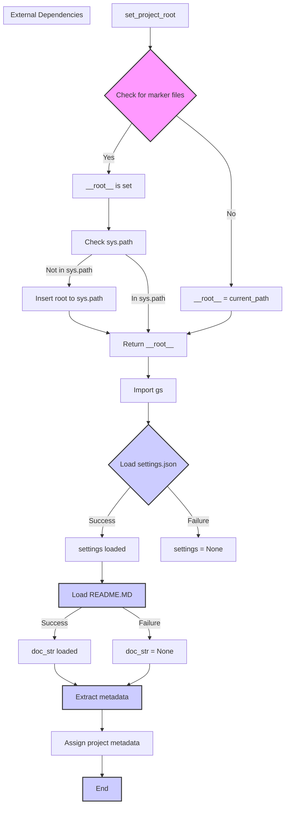

# Code Explanation for hypotez/src/scenario/header.py

## <input code>

```python
## \file hypotez/src/scenario/header.py
# -*- coding: utf-8 -*-\n#! venv/Scripts/python.exe
#! venv/bin/python/python3.12
"""
.. module: src.scenario 
	:platform: Windows, Unix
	:synopsis:

"""
MODE = 'dev'

import sys
import json
from packaging.version import Version
from pathlib import Path
def set_project_root(marker_files=('pyproject.toml', 'requirements.txt', '.git')) -> Path:
    """
    Finds the root directory of the project starting from the current file's directory,
    searching upwards and stopping at the first directory containing any of the marker files.

    Args:
        marker_files (tuple): Filenames or directory names to identify the project root.
    
    Returns:
        Path: Path to the root directory if found, otherwise the directory where the script is located.
    """
    __root__:Path
    current_path:Path = Path(__file__).resolve().parent
    __root__ = current_path
    for parent in [current_path] + list(current_path.parents):
        if any((parent / marker).exists() for marker in marker_files):
            __root__ = parent
            break
    if __root__ not in sys.path:
        sys.path.insert(0, str(__root__))
    return __root__

# Get the root directory of the project
__root__ = set_project_root()
"""__root__ (Path): Path to the root directory of the project"""

from src import gs

settings:dict = None
try:
    with open(gs.path.root / 'src' / 'settings.json', 'r') as settings_file:
        settings = json.load(settings_file)
except (FileNotFoundError, json.JSONDecodeError):
    ...

doc_str:str = None
try:
    with open(gs.path.root / 'src' / 'README.MD', 'r') as settings_file:
        doc_str = settings_file.read()
except (FileNotFoundError, json.JSONDecodeError):
    ...


__project_name__ = settings.get("project_name", 'hypotez') if settings  else 'hypotez'
__version__: str = settings.get("version", '')  if settings  else ''
__doc__: str = doc_str if doc_str else ''
__details__: str = ''
__author__: str = settings.get("author", '')  if settings  else ''
__copyright__: str = settings.get("copyrihgnt", '')  if settings  else ''
__cofee__: str = settings.get("cofee", "Treat the developer to a cup of coffee for boosting enthusiasm in development: https://boosty.to/hypo69")  if settings else "Treat the developer to a cup of coffee for boosting enthusiasm in development: https://boosty.to/hypo69"
```

## <algorithm>

**1. Find Project Root:**
   - Takes a tuple of marker file names (e.g., `('pyproject.toml', 'requirements.txt', '.git')`).
   - Starts at the directory of the current script.
   - Traverses up the directory tree (parent directories).
   - Checks if any of the specified marker files exists in the current directory.
   - If found, returns the directory path.
   - If not found, returns the directory of the current script.
     - **Example:** If `__file__` is in `/hypotez/src/scenario/header.py`, it will check `/hypotez/src/scenario`, `/hypotez/src`, `/hypotez`, etc. for the marker files. If `pyproject.toml` is found in `/hypotez`, then `/hypotez` is returned.
   
**2. Add Root to System Path:**
   - Checks if the root directory is already in the system path (`sys.path`).
   - If not, adds it to the beginning of the path.

**3. Load Settings:**
   - Constructs a path to `settings.json` relative to the project root.
   - Tries to open and load the JSON file using `json.load()`.
   - **Example:** If `__root__` is `/hypotez`, then the path will be `/hypotez/src/settings.json`.
   - If the file is not found or is not valid JSON, sets `settings` to `None`.
   
**4. Load Documentation:**
   - Constructs a path to `README.MD` relative to the project root.
   - Tries to open and read the file using `file.read()`.
   - **Example:** If `__root__` is `/hypotez`, then the path will be `/hypotez/src/README.MD`.
   - If the file is not found or an error occurs, sets `doc_str` to `None`.
   
**5. Extract Metadata:**
   - Extracts project name, version, author, copyright, etc from the `settings` dictionary (if available).
   - If `settings` is `None`, defaults to default values like `hypotez`.
   - **Example:** If `settings` has `project_name = 'MyProject'`, `__project_name__` will be 'MyProject'.
     


## <mermaid>



**Dependencies Analysis:**

- `sys`: Provides access to system-specific parameters and functions.
- `json`: Used for encoding and decoding JSON data.
- `packaging.version`: Used to work with software version numbers.
- `pathlib`: Used for working with file paths.
- `src.gs`: This likely represents a custom module (`gs`) within the project. This implies a strong internal dependency. The import `from src import gs` suggests that this `gs` module defines functions related to file paths and potentially other project resources.


## <explanation>

**Imports:**

- `sys`: Used to manipulate the Python path (`sys.path`), crucial for finding and importing modules in a project structure.  This is necessary when a project is structured hierarchically or has several sub-packages.
- `json`:  Handles JSON data. Used for loading configuration information (e.g., project settings) stored in JSON format.
- `packaging.version`: Provides tools for working with software versions. This is often used for checking compatibility or versioning.
- `pathlib`: Provides an object-oriented way to work with file paths.  The use of `Path` objects makes file handling more robust, readable, and avoids the common issues of string-based path manipulation.
- `src.gs`: This import suggests the existence of a custom module (likely part of the larger `src` package). This module appears to contain functions (like `gs.path.root`) for handling file paths within the project's directory structure. This clearly establishes a dependency relationship between this file and other parts of the project's source code.

**Classes:**

- None defined directly in the given file.

**Functions:**

- `set_project_root(marker_files)`: Recursively searches up the directory tree from the current file's location for directories containing specified marker files (e.g., `pyproject.toml`).  Returns the path of the project root.  This is a crucial helper function for making the rest of the code more independent of the project's exact directory location.  The function now gracefully handles cases where marker files are not found. This improves robustness, and it is crucial to add robust error handling when dealing with files or directories.

**Variables:**

- `MODE`: A string variable set to 'dev'.  Likely a global configuration variable that could be used to control specific settings during development (or other modes like 'production').
- `__root__`: Stores the absolute path to the project root.
- `settings`: Dictionary that holds project settings loaded from `settings.json`.
- `doc_str`: Holds the content of the README.MD file, which will be used as the docstring if `settings.json` does not have one.


**Potential Errors/Improvements:**

- **Error Handling:** The `try...except` blocks for `settings` and `doc_str` handle file not found (`FileNotFoundError`) and invalid JSON (`json.JSONDecodeError`).  This is a good practice to make the code more robust and less prone to crashing if `settings.json` or `README.MD` are missing or malformed.


**Relationships:**

This file has a clear dependency on `src.gs` for path manipulation, and on `settings.json` for project metadata.  It's likely part of a larger project using a specific source code structure (the `src` folder) to separate modules and to ensure that the code's behavior and data access is consistent with the broader project structure.


```