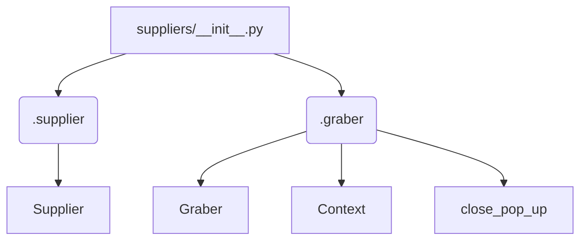

# Code Explanation for hypotez/src/suppliers/__init__.py

## <input code>

```python
## \file hypotez/src/suppliers/__init__.py
# -*- coding: utf-8 -*-\
#! venv/Scripts/python.exe
#! venv/bin/python/python3.12

"""
.. module: src.suppliers 
	:platform: Windows, Unix
	:synopsis: Модуль поставщика. Класс `Supplier`

Для каждого конкретного поставщика есть свои специфичные методы (функции) извлечения информации. 
Эти функции дополняют базовый класс `Supplier` и подключаются через интерфейс `supplier.related_functions`.

Методы каждого конкретного поставщика находятся в директориях с именем <supplier_prefix>, 
например: `amazon`, `aliexpress`, `morlevi`,...  
- `supplier_prefix` задается во время создания в системе нового поставщика и обычно основывается на сокращении имени или сайта поставщика.

## Взаимосвязь сущностей Supplier, Driver, Product
@image html supplier-warehouse-client.png

"""
MODE = 'dev'

from .supplier import Supplier
from .graber import Graber, Context, close_pop_up
```

## <algorithm>

The code initializes the `suppliers` module.  It primarily imports necessary classes from submodules within the `src.suppliers` package.  There's no complex algorithm; it's a setup for subsequent supplier-specific functions.

```
[Start]
  -> Import Supplier class from .supplier
  -> Import Graber, Context, and close_pop_up from .graber
  -> Set MODE to 'dev' (likely for configuration)
[End]
```

## <mermaid>



**Explanation of Dependencies:**

* **`from .supplier import Supplier`**: Imports the `Supplier` class from the `supplier.py` file located in the same directory (`.supplier`).  This implies `supplier.py` defines the base `Supplier` class.  The `.` indicates a relative import, highlighting a clear structure within the `src.suppliers` package.

* **`from .graber import Graber, Context, close_pop_up`**: Imports the `Graber`, `Context`, and `close_pop_up` from `graber.py` within the `src.suppliers` package.  This suggests the `graber.py` module handles web scraping or data extraction functionality.


## <explanation>

* **Imports:**
    * `from .supplier import Supplier`: Imports the `Supplier` class. This class is likely the base for all supplier-specific logic in the project. The relative import (`from .`) indicates a file (`supplier.py`) in the same directory, which is good practice.
    * `from .graber import Graber, Context, close_pop_up`: Imports classes related to web data extraction.  The `Graber` class likely handles the actual scraping, `Context` possibly holds necessary data for the scraping, and `close_pop_up` might close pop-ups that appear during web data collection. These classes are probably part of the core scraping mechanism within the `src.suppliers` package.
    * `MODE = 'dev'`: Defines a variable for a mode, likely used for conditional behavior in different environments (e.g., development, production).

* **Classes (Implied):**
    * `Supplier`: The base class for handling data retrieval from various suppliers. The `__init__.py` file itself doesn't define any instance methods. The implication is that other modules within `src/suppliers/` define subclasses of `Supplier` (e.g., `AmazonSupplier`, `AliExpressSupplier`) that handle the specific functionality for each supplier.

* **Functions (Implied):**
    * Methods within `Supplier` and `Graber` classes will contain the logic for data collection and processing.  For instance, `Supplier`'s methods may extract data like prices, product information, availability, etc.  `Graber`'s methods would handle making requests and processing the responses.

* **Variables:**
    * `MODE`: A string variable likely used for conditional compilation or configuration.

* **Potential Errors/Improvements:**
    * The code lacks crucial implementation details and usage examples. For example, we don't know how the `Supplier` and `Graber` classes are used, or what happens with the `MODE` variable.
    *  The docstrings mention supplier-specific methods, but they are not implemented in the `__init__.py` file.  All relevant classes/methods would be defined in other Python files in the `hypotez/src/suppliers` package.
    * More context about the `supplier-warehouse-client.png` would be helpful in understanding the system design.

**Chain of Relationships:**

The code establishes a clear hierarchical structure within the `src.suppliers` package, showing a relationship between a base `Supplier` class and potential subclasses within `hypotez/src/suppliers` package (e.g., `AmazonSupplier`, `AliExpressSupplier`).


```
src.suppliers
├── __init__.py
└── supplier.py  // Likely defines the base Supplier class
└── graber.py   // Likely handles web scraping functionality
└── ... (other supplier-specific modules)
```

The `graber` module probably interacts with the web via HTTP requests to gather the data for the suppliers.  The `Supplier` base class would then handle parsing and storing this data, with specific subclasses handling differences between particular suppliers.  There's an implied dependency on a web scraping library to handle HTTP and parsing.