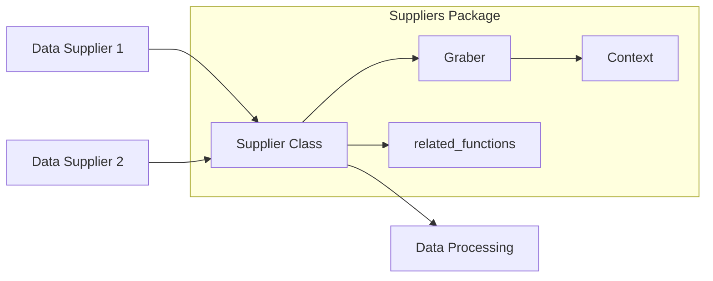

# Code Explanation for hypotez/src/suppliers/__init__.py

## <input code>

```python
## \file hypotez/src/suppliers/__init__.py
# -*- coding: utf-8 -*-\
#! venv/Scripts/python.exe
#! venv/bin/python/python3.12

"""
.. module: src.suppliers 
	:platform: Windows, Unix
	:synopsis: Модуль поставщика. Класс `Supplier`

Для каждого конкретного поставщика есть свои специфичные методы (функции) извлечения информации. 
Эти функции дополняют базовый класс `Supplier` и подключаются через интерфейс `supplier.related_functions`.

Методы каждого конкретного поставщика находятся в директориях с именем <supplier_prefix>, 
например: `amazon`, `aliexpress`, `morlevi`,...  
- `supplier_prefix` задается во время создания в системе нового поставщика и обычно основывается на сокращении имени или сайта поставщика.

## Взаимосвязь сущностей Supplier, Driver, Product
@image html supplier-warehouse-client.png

"""
MODE = 'dev'

# from .supplier import Supplier
# from .graber import Graber, Context, close_pop_up
```

## <algorithm>

This `__init__.py` file is a module initializer for the `suppliers` package.  It likely defines the basic structure and imports for interacting with different data suppliers (e.g., Amazon, AliExpress).  However, without the rest of the code, the algorithm cannot be fully illustrated.  A step-by-step algorithm for a complete module would involve:

1. Importing necessary classes and functions (e.g., `Supplier`, `Graber`) from related modules within the `suppliers` package.
2. Defining constants (e.g., `MODE`).
3. Setting up an interface (`supplier.related_functions`) for connecting supplier-specific methods.

**Example Data Flow (Hypothetical):**

```
+-----------------+     +-----------------+     +-----------------+
| Data Supplier 1 | --> |  Supplier Class  | --> | Data Processing |
+-----------------+     +-----------------+     +-----------------+
          |                                 |
          v                                 v
+-----------------+     +-----------------+     +-----------------+
| Data Supplier 2 | --> |  Supplier Class  | --> | Data Processing |
+-----------------+     +-----------------+     +-----------------+
     ...                  ...
                                      ...
```


## <mermaid>



**Explanation of Dependencies (Hypothetical):**

The `mermaid` diagram shows a hypothetical relationship.  It assumes the existence of classes/functions such as `Supplier`, `Graber`, `Context`, and `related_functions`.  The diagram depicts a flow where data from different suppliers (`Data_Supplier1`, `Data_Supplier2`) is processed by the `Supplier` class, which leverages `Graber` and other functionalities to retrieve, store, and process supplier-specific data (e.g., using `related_functions` for custom functions).

**Dependencies are not fully visible, requiring knowledge of other .py files in the project.**


## <explanation>

* **Imports:**
    * The commented-out lines (`from .supplier import Supplier`, etc.)  indicate that the code intends to import classes and functions from other files/modules within the `suppliers` package (e.g., `supplier.py`, `graber.py`).  These imports would handle various aspects of interacting with the data.
    *  Crucially, the `from ... import ...` parts are *commented out*. This means the code is not currently using these imports.


* **Classes:**
    * `Supplier`:  (Absent in the provided code, but implied)  Represents a base class for interacting with different suppliers.
    * `Graber`: (Absent, but implied) A class likely responsible for web scraping or other data retrieval methods, potentially interacting with specific web elements using libraries such as `requests`.


* **Functions:**
    * (`graber.close_pop_up`): (Absent, but implied) A function to handle closing pop-ups or dialog boxes that may appear during web scraping.

* **Variables:**
    * `MODE`: Likely a string variable to control the application's mode (e.g., 'dev', 'prod').  This is a common practice for handling different configurations during development and production.


* **Potential Errors/Improvements:**
    * The commented-out import statements are an error, as they won't be executed. The code should be adjusted to uncomment imports and import the relevant modules.


* **Relationship with Other Project Parts (Hypothetical):**
    * **`product`:** The module interacts with the `product` package to process or update product data.
    * **`driver`:** The `supplier` package interacts with the `driver` module for tasks such as launching browsers for web scraping and handling browser context.


**In Conclusion:**

The code snippet is a module initializer for the `suppliers` package. Its main purpose is to organize and import necessary components for handling various data sources, like Amazon or AliExpress.  The current state of the code is incomplete; critical import statements are commented out. It's crucial to uncomment those and provide the rest of the project's code to fully understand the functionality and dependencies.