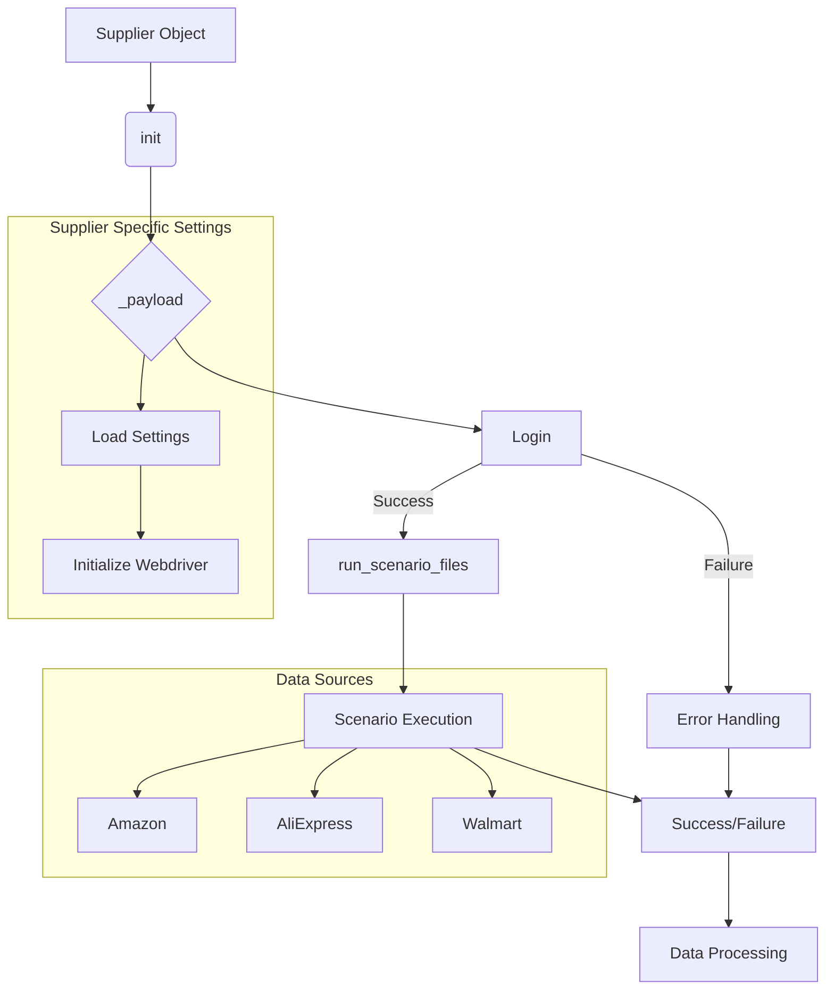

# Supplier Class Explanation

## <input code>

```
Here's a detailed explanation of what the `Supplier` class does, in English:

### Overview of the `Supplier` Class

The `Supplier` class serves as a base class for managing data suppliers in your application. It provides a framework for interacting with various data sources, such as Amazon, AliExpress, Walmart, and others. This class handles the initialization of supplier-specific settings, manages scenarios for data collection, and provides methods for logging in and executing scenarios.

### Components of the `Supplier` Class

#### 1. **Class Attributes**
   - `supplier_id`: Unique identifier for the supplier.
   - `supplier_prefix`: Prefix for the supplier, e.g., `aliexpress` or `amazon`.
   - `supplier_settings`: Settings for the supplier, loaded from a configuration file.
   - `locale`: Localization code (e.g., `en` for English, `ru` for Russian).
   - `price_rule`: Rule for calculating prices (e.g., adding VAT or applying discounts).
   - `related_modules`: Module containing supplier-specific functions.
   - `scenario_files`: List of scenario files to be executed.
   - `current_scenario`: The currently executing scenario.
   - `login_data`: Login credentials for accessing the supplier’s website (if required).
   - `locators`: Locators for web elements on the supplier’s site.
   - `driver`: Web driver for interacting with the supplier’s site.
   - `parsing_method`: Method for data parsing (e.g., `webdriver`, `api`, `xls`, `csv`).


#### 2. **Methods**
   - `__init__`: Constructor that initializes attributes based on the supplier prefix and other parameters.
     ```python
     def __init__(self, supplier_prefix: str, locale: str = 'en', webdriver: str | Driver | bool = 'default', *attrs, **kwargs):
         # Initializes supplier prefix, locale, and web driver
     ```

   - `_payload`: Loads supplier-specific configurations, locators, and initializes the web driver.
     ```python
     def _payload(self, webdriver: str | Driver | bool, *attrs, **kwargs) -> bool:
         # Loads configuration files and initializes the web driver
     ```

   - `login`: Handles the login process for the supplier’s site if authentication is required.
     ```python
     def login(self) -> bool:
         # Performs login to the supplier's site
     ```

   - `run_scenario_files`: Executes one or more scenario files.
     ```python
     def run_scenario_files(self, scenario_files: str | List[str] = None) -> bool:
         # Executes scenario files and returns True if all scenarios are successfully completed
     ```

   - `run_scenarios`: Executes one or more scenarios.
     ```python
     def run_scenarios(self, scenarios: dict | list[dict]) -> bool:
         # Executes given scenarios and returns True if all scenarios are successfully completed
     ```
```

## <algorithm>

The `Supplier` class manages data collection tasks for different online retailers.

**1. Initialization:** A `Supplier` object is created with the `__init__` method, setting up initial configurations like `supplier_prefix`, `locale`, and potentially a `webdriver`.

**2. Configuration Loading:** The `_payload` method is called to load supplier-specific settings, locators, and potentially initiate a web driver. This is crucial for accessing data sources effectively.

**3. Login (if required):** The `login` method authenticates with the target e-commerce platform if authentication is necessary.

**4. Scenario Execution (Files):** The `run_scenario_files` method executes scenarios specified in scenario files.

**5. Scenario Execution (Specific):** The `run_scenarios` method executes scenarios provided as a list of dictionaries, giving more granular control over the data collection process.


## <mermaid>



**Dependencies Analysis:**

The mermaid diagram implicitly references `Driver` (potentially from Selenium or similar libraries) for web driver initialization in `_payload` and `login` methods.  Further, the `scenario_files` and scenarios themselves imply external data sources and configuration files. The `parsing_method` suggests the possibility of using other parsing libraries (`xls`, `csv`) not shown in the diagram, depending on the scenario.


## <explanation>

**Imports:**

No specific imports are shown.  The code assumes the existence of `Driver` and potential libraries for handling configuration files, web drivers (e.g., Selenium), scenario files, and data parsing.

**Classes:**

*   **Supplier:** This class acts as an abstraction for dealing with different data suppliers. It encapsulates the logic needed to manage supplier-specific settings, logins, and scenario execution.  Subclasses could be written for each specific supplier to handle different configurations and scenario requirements.

**Methods:**

*   **`__init__`:** Initializes the `Supplier` object with supplier-specific settings and drivers.
*   **`_payload`:** Loads configurations, locators, and starts the necessary drivers (e.g. browser).  This is a key method for setting up the environment for interacting with the supplier's site.
*   **`login`:** This function attempts to log into the supplier's site, handling authentication-related details, which may vary significantly between different sites.
*   **`run_scenario_files`:** Executes scenarios defined in files, returning a boolean to indicate success or failure.
*   **`run_scenarios`:** Allows execution of specific scenarios based on a set of instructions (like `scrape`, `target`).

**Variables:**

*   Attributes like `supplier_prefix`, `locale`, `login_data`, and `locators` hold critical data for interacting with the particular supplier and their platform.
*   `scenario_files` and `scenarios` are essential for defining the tasks for the system to execute on different data sources.

**Potential Errors & Improvements:**

*   **Error Handling:** The code lacks explicit error handling for various scenarios (e.g., login failures, file reading errors, scenario execution issues).  Adding `try...except` blocks within methods is crucial for robustness.
*   **Input Validation:**  The code doesn't validate inputs to prevent unexpected behavior. Validating `supplier_prefix`, `locale`, `webdriver`, and scenarios can help prevent runtime problems.
*   **Logging:** Adding logging would allow debugging and tracking the execution flow of the system more effectively.
*   **Scalability:** The design is good for multiple suppliers, but consideration should be made for how many steps would be involved in processing one scenario.  If there are thousands of scenarios to run for many different suppliers, scalability and performance must be factored into the implementation.
*   **Dependency Management:**  While the code provides a high-level design, explicitly defining and managing dependencies through a package management system (e.g., `pip`) is good practice.

**Chain of Relationships:**

The `Supplier` class interacts with various external components:

*   Configuration files (`supplier_settings`, `scenario_files`): These are used to obtain supplier-specific information.
*   Web driver libraries (e.g., Selenium): Interact with websites through browsers.
*   Data parsing libraries: Handle data extraction based on `parsing_method` (e.g., APIs or file formats).
*   Scenario files/specifications: Contain instructions for data collection.


The `Supplier` class serves as a central point for controlling interactions with diverse suppliers, promoting consistency and maintainability.  This is a good structure to build upon for handling various online retailers.