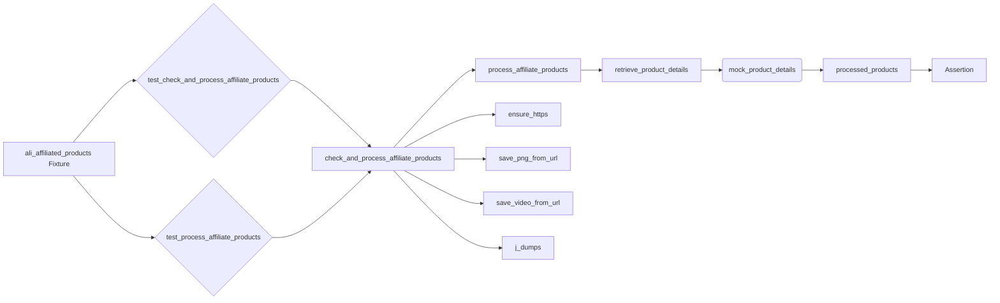

# <input code>

```python
## \file hypotez/src/suppliers/aliexpress/_pytests/test_affiliated_products_generator.py
# -*- coding: utf-8 -*-\n#! venv/Scripts/python.exe\n#! venv/bin/python/python3.12\n\n"""
.. module: src.suppliers.aliexpress._pytests 
	:platform: Windows, Unix
	:synopsis:

"""
MODE = 'dev'

"""
	:platform: Windows, Unix
	:synopsis:

"""

"""
	:platform: Windows, Unix
	:synopsis:

"""


"""
  :platform: Windows, Unix

"""
"""
  :platform: Windows, Unix
  :platform: Windows, Unix
  :synopsis:
"""MODE = 'dev'
  
""" module: src.suppliers.aliexpress._pytests """


""" YOU MUST WRITE A DESCRIPTION !
This script contains the following:

#Fixtures:
 - ali_affiliated_products: A fixture that returns an instance of AliAffiliatedProducts.

#Tests:
 - test_check_and_process_affiliate_products: 
Tests the check_and_process_affiliate_products method to ensure it calls process_affiliate_products correctly.

 - test_process_affiliate_products: 
Tests the process_affiliate_products method to ensure it processes the products correctly. 

It mocks external dependencies and verifies the output.
"""
import pytest
from unittest.mock import patch, MagicMock
from src.suppliers.aliexpress.affiliated_products_generator import AliAffiliatedProducts
from types import SimpleNamespace

# Sample data
campaign_name = "sample_campaign"
category_name = "sample_category"
language = "EN"
currency = "USD"
prod_urls = ["https://www.aliexpress.com/item/123.html", "456"]

@pytest.fixture
def ali_affiliated_products():
    return AliAffiliatedProducts(campaign_name, category_name, language, currency)

def test_check_and_process_affiliate_products(ali_affiliated_products):
    with patch.object(ali_affiliated_products, 'process_affiliate_products') as mock_process:
        ali_affiliated_products.check_and_process_affiliate_products(prod_urls)
        mock_process.assert_called_once_with(prod_urls)

def test_process_affiliate_products(ali_affiliated_products):
    mock_product_details = [SimpleNamespace(product_id="123", promotion_link="promo_link", product_main_image_url="image_url", product_video_url="video_url")]
    
    with patch.object(ali_affiliated_products, 'retrieve_product_details', return_value=mock_product_details) as mock_retrieve, \
         patch("src.suppliers.aliexpress.affiliated_products_generator.ensure_https", return_value=prod_urls), \
         patch("src.suppliers.aliexpress.affiliated_products_generator.save_png_from_url"), \
         patch("src.suppliers.aliexpress.affiliated_products_generator.save_video_from_url"), \
         patch("src.suppliers.aliexpress.affiliated_products_generator.j_dumps", return_value=True):
        
        processed_products = ali_affiliated_products.process_affiliate_products(prod_urls)
        
        assert len(processed_products) == 1
        assert processed_products[0].product_id == "123"

if __name__ == "__main__":
    pytest.main()
```

# <algorithm>

**Workflow Diagram:**

1. **`ali_affiliated_products` Fixture:** Creates an instance of `AliAffiliatedProducts` with predefined campaign, category, language, and currency.
2. **`test_check_and_process_affiliate_products`:**
    * Mocks the `process_affiliate_products` method of the `AliAffiliatedProducts` object.
    * Calls `check_and_process_affiliate_products` passing `prod_urls`.
    * Verifies that `process_affiliate_products` was called exactly once with `prod_urls`.
3. **`test_process_affiliate_products`:**
    * Mocks `retrieve_product_details` to return sample `mock_product_details`.
    * Mocks `ensure_https`, `save_png_from_url`, `save_video_from_url`, and `j_dumps` (likely for external dependencies handling).
    * Calls `process_affiliate_products` passing `prod_urls`.
    * Asserts the length of `processed_products` and a specific attribute of the first element to validate the results.

**Data Flow Examples:**

- The `ali_affiliated_products` fixture provides an object for testing methods.
- `prod_urls` is passed as an argument to `check_and_process_affiliate_products` and `process_affiliate_products`.
- The mocked `retrieve_product_details` function returns a list of product details.
- The `processed_products` list contains the processed product data from the `process_affiliate_products` method.


# <mermaid>



**Dependencies Analysis:**

- `pytest`: Used for running the test suite.
- `unittest.mock`: Provides tools for mocking external dependencies (e.g., functions, classes).
- `src.suppliers.aliexpress.affiliated_products_generator`: The class being tested. Contains the `AliAffiliatedProducts` class.
- `types.SimpleNamespace`: Used to create simple objects for mocking purposes.

# <explanation>

**Imports:**

- `pytest`: Import pytest library for running unit tests. Used extensively in testing libraries for python projects, especially in testing projects with unit or functional tests.
- `unittest.mock`: Provides the `patch` decorator to mock external dependencies. Crucial for testing functions relying on other services or external APIs in an isolated manner.
- `src.suppliers.aliexpress.affiliated_products_generator`: Imports the `AliAffiliatedProducts` class, which is the class under test.  Indicates the code is part of a larger project with a clear structure organized by source code (src). This import is a crucial dependency, as without access to the functionality in `AliAffiliatedProducts`, the testing process is not possible.  Import path signifies this module likely sits within the project's `src` directory.

**Classes:**

- `AliAffiliatedProducts`:  The class to be tested in this file.  This class likely encapsulates the logic for fetching and processing affiliated product information from AliExpress.  Attributes and methods within this class are not fully defined in this test file but are crucial for testing.  Dependencies for external services like fetching product details are mocked for testing isolation.


**Functions:**

- `test_check_and_process_affiliate_products`: Tests the correctness of calling `process_affiliate_products` from `check_and_process_affiliate_products`.
- `test_process_affiliate_products`:  Tests `process_affiliate_products` by mocking the `retrieve_product_details` and external functions to ensure it fetches and processes product information correctly.
- `ali_affiliated_products`: Fixture to setup `AliAffiliatedProducts` objects with various campaign details.


**Variables:**

- `campaign_name`, `category_name`, `language`, `currency`: Sample data for testing.
- `prod_urls`: List of product URLs to process.
- `mock_product_details`:  Sample data simulating the output of `retrieve_product_details`


**Potential Errors/Improvements:**

- **Missing `AliAffiliatedProducts` class definition:** The test file only defines the fixture and tests. The actual implementation of `AliAffiliatedProducts` resides in `src.suppliers.aliexpress.affiliated_products_generator`, and it's crucial to validate it in this test file, including a thorough testing coverage for its methods, including `retrieve_product_details` and other external integrations.
- **Incomplete mocking:**  The test suite correctly mocks `retrieve_product_details`, `ensure_https`, `save_png_from_url`, `save_video_from_url`, and `j_dumps`. However, if `AliAffiliatedProducts` interacts with other external services or local functions, ensure all necessary dependencies are mocked appropriately.
- **Lack of edge case testing:** The provided tests are a good starting point but may not cover all potential edge cases or unexpected input values, such as invalid URLs, empty lists, or non-existent product details. More extensive tests should be developed to verify the robustness and reliability of `AliAffiliatedProducts`.


**Relationships with other parts of the project:**

The `AliAffiliatedProducts` class in `src.suppliers.aliexpress.affiliated_products_generator` is a critical part of this project's supplier system. It directly interacts with the `retrieve_product_details`, `ensure_https`, `save_png_from_url`, `save_video_from_url`, and `j_dumps` (presumably a JSON dump function). This signifies the test suite is part of a wider system designed to handle data processing and storage associated with products from AliExpress.