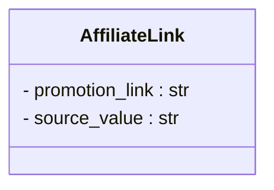

# <input code>

```python
## \file hypotez/src/suppliers/aliexpress/api/models/affiliate_link.py
# -*- coding: utf-8 -*-\
#! venv/Scripts/python.exe # <- venv win
## ~~~~~~~~~~~~~\
""" module: src.suppliers.aliexpress.api.models """
class AffiliateLink:
    promotion_link: str
    source_value: str
```

# <algorithm>

The code defines a simple class `AffiliateLink` with two attributes.  There's no algorithm or data flow in the traditional sense as there are no methods to process data.  The class simply structures data representing an affiliate link.

**Example Data Structure:**

```
{
    "promotion_link": "https://example.com/product/123?aff=abc",
    "source_value": "search result"
}
```


# <mermaid>



**Dependencies Analysis:**

The provided code only defines a class.  There are no dependencies on other modules/files explicitly shown. This is a basic class definition. The `str` type is a built-in Python type, and is not imported.


# <explanation>

* **Imports:**  There are no imports. The code defines a class that uses built-in Python types. This means there are no external dependencies.

* **Classes:**
    * `AffiliateLink`: This class represents an affiliate link. It has two attributes:
        * `promotion_link`: A string representing the affiliate link URL.
        * `source_value`: A string indicating the source of the link (e.g., "search result", "banner ad").

* **Functions:** There are no functions in this code snippet.

* **Variables:** There are no variables other than the attributes within the `AffiliateLink` class.

* **Potential Errors/Improvements:**
    * **Data Validation:** The code lacks any validation for the `promotion_link` and `source_value`.  A real-world implementation would likely include checks to ensure the `promotion_link` is a valid URL and `source_value` has a meaningful string.
    * **Type Hinting:** The use of type hinting (`promotion_link: str`, `source_value: str`) is good practice and helps with code readability and maintainability.

* **Relationship with other parts of the project:**

    * The `AffiliateLink` model class likely serves as part of a larger data structure or object model in the `aliexpress` supplier module.  The actual implementation would involve usage of the class, likely within functions for fetching data, handling requests, or processing affiliate link information. This would likely be in other files within the `src.suppliers.aliexpress` package.

**Overall:**

The code is a minimal representation of a data model.  Its purpose is to define a structure for storing and representing affiliate links from AliExpress.  Real-world implementation would necessitate further methods to manipulate and process this data, potentially interacting with other services, such as a database, to maintain a complete record of these links.  The absence of imports and methods makes it incomplete as a standalone unit.