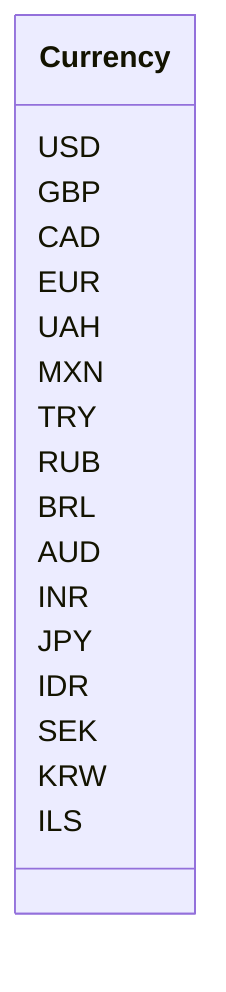

```MD
# Code Explanation for hypotez/src/suppliers/aliexpress/api/models/currencies.py

## <input code>

```python
## \file hypotez/src/suppliers/aliexpress/api/models/currencies.py
# -*- coding: utf-8 -*-
#! venv/Scripts/python.exe # <- venv win
## ~~~~~~~~~~~~
""" module: src.suppliers.aliexpress.api.models """
class Currency:
    USD = 'USD'
    GBP = 'GBP'
    CAD = 'CAD'
    EUR = 'EUR'
    UAH = 'UAH'
    MXN = 'MXN'
    TRY = 'TRY'
    RUB = 'RUB'
    BRL = 'BRL'
    AUD = 'AUD'
    INR = 'INR'
    JPY = 'JPY'
    IDR = 'IDR'
    SEK = 'SEK'
    KRW = 'KRW'
    ILS = 'ILS'
```

## <algorithm>

This code defines a class named `Currency` containing several constants representing currency codes.  There's no dynamic behavior or function calls within the class.  Data flow is minimal; it's purely a declaration of a set of string literals for currency symbols.

```mermaid
graph TD
    A[Currency Class] --> B{USD};
    A --> C{GBP};
    A --> D{CAD};
    ... (other currencies)
```

## <mermaid>



This Mermaid code creates a simple class diagram showing the `Currency` class and its constant attributes.  There are no dependencies to visualize as it's a self-contained class definition.


## <explanation>

**Imports:**

There are no imports in this code.  This is a straightforward declaration of constants within a Python class.

**Classes:**

* **`Currency`:** This class defines a set of named constants (attributes) representing various currency codes (e.g., USD, GBP, EUR).  These are essentially string literals, not objects with methods.   The class itself is intended to act as a container and namespace for these currency codes, to make sure you use consistent and correct names to avoid typos.

**Functions:**

There are no functions in this code.

**Variables:**

The variables are the currency codes (e.g., `USD`, `GBP`, `CAD`). They are strings and are essentially constants within the `Currency` class.

**Potential Errors or Improvements:**

* **Immutability:** The currency codes are strings.  This is generally a good choice for simple currency code constants, although if currency exchange rates were to be involved or complex currency transformations were required, then making them objects with methods might be a better choice.

* **Docstrings:** While the `""" module: src.suppliers.aliexpress.api.models """` docstring is present, better docstrings explaining *why* these specific currency codes are defined here, and potentially how they will be used in the rest of the program, would be extremely helpful.

**Relationship with other parts of the project:**

This file likely acts as a data model component for the `aliexpress` supplier module. The currency codes defined in this class are likely utilized in functions within the module. To be clear, the `currencies.py` file exports an interface which provides the standardized list of currencies for this module; that means it is used by other `api` module files.

**Example Usage (Illustrative):**

```python
from hypotez.src.suppliers.aliexpress.api.models import currencies

def process_price(amount, currency):
    if currency not in currencies.Currency.__dict__.values(): #check for valid currencies
        raise ValueError(f"Invalid currency code: {currency}")
    # ... process the price with currency logic
    return calculated_value

# Example usage
price = process_price(100, 'USD')
print(price)
```

This example shows a hypothetical function using the defined currency codes.


```