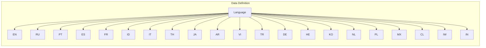

# Code Explanation for hypotez/src/suppliers/aliexpress/api/models/languages.py

## <input code>

```python
## \file hypotez/src/suppliers/aliexpress/api/models/languages.py
# -*- coding: utf-8 -*-\
#! venv/Scripts/python.exe # <- venv win
## ~~~~~~~~~~~~~\
""" module: src.suppliers.aliexpress.api.models """
class Language:
    EN = 'EN'
    RU = 'RU'
    PT = 'PT'
    ES = 'ES'
    FR = 'FR'
    ID = 'ID'
    IT = 'IT'
    TH = 'TH'
    JA = 'JA'
    AR = 'AR'
    VI = 'VI'
    TR = 'TR'
    DE = 'DE'
    HE = 'HE'
    KO = 'KO'
    NL = 'NL'
    PL = 'PL'
    MX = 'MX'
    CL = 'CL'
    IW = 'IW'
    IN = 'IN'
```

## <algorithm>

This code defines a Python class named `Language` containing a set of constants representing different language codes.  There is no algorithm as such; it's purely a data definition.

```
+-----------------+
| Data Definition |
+-----------------+
|    Language     |
|     EN          |
|     RU          |
|     ...         |
+-----------------+
```

## <mermaid>



This mermaid diagram depicts a simple structure, representing a class named `Language` with a set of constants that are its attributes.  Import dependencies are not shown in this static structure.


## <explanation>

**Imports**:

There are no imports in this file.  This code defines a class for storing language codes as constants.

**Classes**:

*   **`Language`**: This class encapsulates language codes.  Critically, it's *not* meant for instantiation; rather, it's a namespace container for language codes. This is a common pattern for defining sets of named constants in Python, and greatly enhances code readability compared to simply having a list of strings.

**Functions**:

There are no functions.  This code defines a class with named constants; it's not structured to have any functions to call.

**Variables**:

All the variables (`EN`, `RU`, etc.) are class-level attributes (constants) of the `Language` class.  They are strings representing language codes.

**Potential Errors or Areas for Improvement**:

*   **Immutability**:  This is good.  Using constants like this ensures the language codes cannot be accidentally changed after the class is defined.
*   **Documentation**:  While the docstring at the top is a good start, adding a more detailed explanation of each language code could further improve maintainability if these constants are used elsewhere in the codebase.
*   **Validation**: There's no validation, though a function could be added to the class to check if a given string exists in this predefined set.


**Relationship to other parts of the project:**

This file likely serves as a reference for other parts of the project dealing with multilingual support, such as handling user preferences, translating strings, or determining specific API requests based on the language of the user.  The specific use will depend on how it's referenced in other files within the `hypotez` project, but the inclusion of language constants in this part of the file structure strongly suggests such a connection.  Importantly, the file structure (`hypotez/src/suppliers/aliexpress/api/models`) shows it's part of the code dealing with data models and the API for a supplier, probably to handle things like language selection for the AliExpress API in the `hypotez` application.
```