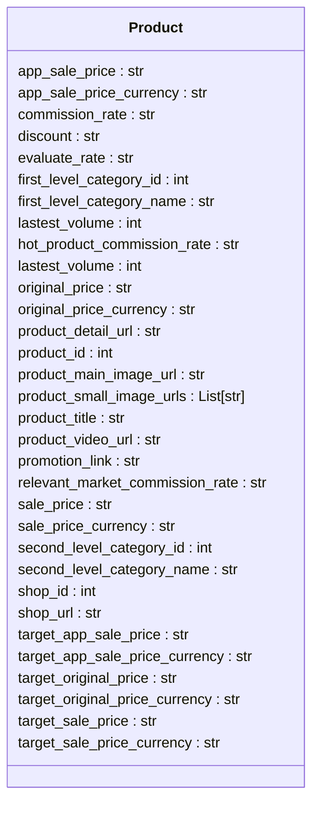

# <input code>

```python
## \file hypotez/src/suppliers/aliexpress/api/models/product.py
# -*- coding: utf-8 -*-\
#! venv/Scripts/python.exe # <- venv win
## ~~~~~~~~~~~~~\
""" module: src.suppliers.aliexpress.api.models """
from typing import List


class Product:
    app_sale_price: str
    app_sale_price_currency: str
    commission_rate: str
    discount: str
    evaluate_rate: str
    first_level_category_id: int
    first_level_category_name: str
    lastest_volume: int
    hot_product_commission_rate: str
    lastest_volume: int
    original_price: str
    original_price_currency: str
    product_detail_url: str
    product_id: int
    product_main_image_url: str
    product_small_image_urls: List[str]
    product_title: str
    product_video_url: str
    promotion_link: str
    relevant_market_commission_rate: str
    sale_price: str
    sale_price_currency: str
    second_level_category_id: int
    second_level_category_name: str
    shop_id: int
    shop_url: str
    target_app_sale_price: str
    target_app_sale_price_currency: str
    target_original_price: str
    target_original_price_currency: str
    target_sale_price: str
    target_sale_price_currency: str

```

# <algorithm>

The code defines a class `Product` with various attributes representing different aspects of a product on AliExpress.  There is no algorithm, as the code simply defines the structure of a product object.  No methods or functions are present to describe any actions on the `Product` object.


# <mermaid>



The mermaid code defines a class diagram for the `Product` class.  It lists all the attributes (data members) of the class.  There are no dependencies to external modules or other classes shown in the diagram.


# <explanation>

- **Imports:**
    - `from typing import List`: This imports the `List` type from the `typing` module.  This is used to indicate that the `product_small_image_urls` attribute will store a list of strings.  This is a standard Python type hint and plays a critical role in type safety and code readability, often improving code maintainability and reducing potential bugs by catching type errors during development.

- **Classes:**
    - `Product`: This class defines a blueprint for representing product data.  It has many attributes (variables) describing various product aspects, including pricing, categories, URLs, images, and more.  This class is crucial for organizing and storing product information extracted from the AliExpress API.

- **Functions/Methods:**
    - There are no functions or methods defined.  The code only defines the structure of a product object.

- **Variables:**
    - All the variables (`app_sale_price`, `app_sale_price_currency`, etc.) are attributes of the `Product` class.  They are defined as strings, integers, or lists of strings, reflecting the data types associated with product information.  It is important that the attributes have meaningful names that clearly indicate the kind of data they store.


- **Potential Errors/Improvements:**
    - **Missing Data Validation:** The code lacks validation for the data types of the attributes.  For example, `lastest_volume` should probably be a `float` or `int`, but it's currently a string.  Adding validation would prevent issues if data from the API doesn't match the expected types.
    - **Type Hinting Improvements:**  While using `typing` is good,  consider using more specific types where appropriate (e.g., `Decimal` for currency values to handle precision).  Using `Optional` for fields that might be missing would also improve robustness.
    - **Docstrings:** Adding docstrings to the `Product` class would explain its purpose and usage in more detail.

- **Relationships with Other Parts of the Project:**

    This `Product` class likely interacts with other parts of the `hypotez` project.  For example, there could be functions in `src/suppliers/aliexpress/api` which make HTTP requests to the AliExpress API and return `Product` objects. This suggests a workflow where data is fetched and then stored/processed in `Product` objects before further use.  There likely will be functions to process/use the `Product` objects in subsequent layers of the project architecture, potentially for analysis, data warehousing, or further processing.