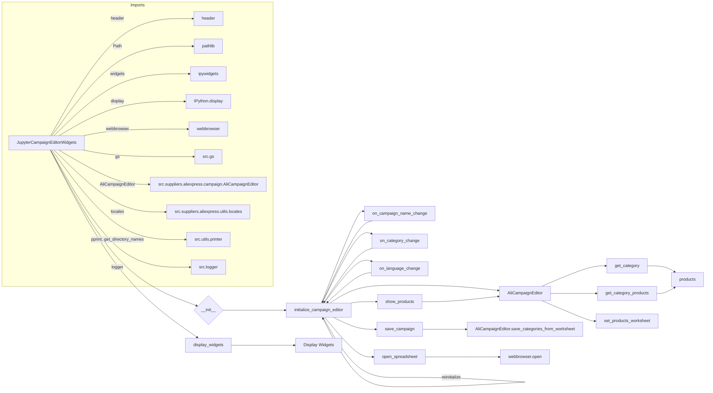

# <input code>

```python
## \file hypotez/src/suppliers/aliexpress/campaign/ali_campaign_editor_jupyter_widgets.py
# -*- coding: utf-8 -*-\
#! venv/Scripts/python.exe
#! venv/bin/python/python3.12

"""
.. module: src.suppliers.aliexpress.campaign 
	:platform: Windows, Unix
	:synopsis: Jupyter widgets for the AliExpress campaign editor.

This module contains widgets for managing AliExpress campaigns in Jupyter notebooks.

Testfile:
    file test_ali_campaign_editor_jupyter_widgets.py

"""
MODE = 'dev'


from types import SimpleNamespace
import header
from pathlib import Path
from ipywidgets import widgets
from IPython.display import display
import webbrowser

from src import gs
from src.suppliers.aliexpress.campaign import AliCampaignEditor
from src.suppliers.aliexpress.utils import locales
from src.utils.printer import pprint, get_directory_names
from src.logger import logger


class JupyterCampaignEditorWidgets:
    """Widgets for the AliExpress campaign editor.

    This class provides widgets for interacting with and managing AliExpress campaigns,
    including selecting campaigns, categories, and languages, and performing actions such as
    initializing editors, saving campaigns, and showing products.

    Example:
        >>> editor_widgets: JupyterCampaignEditorWidgets = JupyterCampaignEditorWidgets()
        >>> editor_widgets.display_widgets()
    """

    # Class attributes declaration
    language: str = None
    currency: str = None
    campaign_name: str = None
    category_name: str = None
    category:SimpleNamespace = None
    campaign_editor: AliCampaignEditor = None
    products:list[SimpleNamespace] = None
    def __init__(self):
        """Initialize the widgets and set up the campaign editor.

        Sets up the widgets for selecting campaigns, categories, and languages. Also sets up
        default values and callbacks for the widgets.
        """
        self.campaigns_directory:str = Path(
            gs.path.google_drive, "aliexpress", "campaigns"
        )
        
        if not self.campaigns_directory.exists():
            raise FileNotFoundError(
                f"Directory does not exist: {self.campaigns_directory}"
            )

        #self.languages = {"EN": "USD", "HE": "ILS", "RU": "ILS"}
        self.campaign_name_dropdown = widgets.Dropdown(
            options = get_directory_names(self.campaigns_directory),
            description = "Campaign Name:",
        )
        self.category_name_dropdown = widgets.Dropdown(
            options=[], description="Category:"
        )
        self.language_dropdown = widgets.Dropdown(
            options=[f"{key} {value}" for locale in locales for key, value in locale.items()],
            description="Language/Currency:",
        )
        # ... (rest of the code)
```

# <algorithm>

1. **Initialization:**
   - `__init__`: Creates Jupyter widgets for campaign name, category, language/currency, initialization, save, product display, and spreadsheet opening.
   - Sets up callbacks for widget changes.
   - Initializes `campaign_editor` with the first campaign.

2. **Initialization of Campaign Editor:**
   - `initialize_campaign_editor`: Retrieves campaign name, category name, and language/currency from dropdowns.
   - Creates `AliCampaignEditor` instance based on the selected data.
   - Calls `get_category` and `get_category_products` if valid campaign_name and category_name.

3. **Callback Handling:**
   - `on_campaign_name_change`, `on_category_change`, `on_language_change`: Update the corresponding dropdowns and reinitialize the campaign editor when selections change.

4. **Saving Campaign:**
   - `save_campaign`: Calls `AliCampaignEditor.save_categories_from_worksheet` if campaign name and language/currency are selected.


5. **Displaying Products:**
   - `show_products`: Creates `AliCampaignEditor` instance, calls `set_products_worksheet` to display products for the selected category.


6. **Opening Spreadsheet:**
   - `open_spreadsheet`: Opens the Google Spreadsheet in a browser using the URL generated by `AliCampaignEditor.spreadsheet_id`.

7. **Display Widgets:**
   - `display_widgets`: Displays all the initialized widgets in the Jupyter notebook environment.


# <mermaid>



**Dependencies Analysis:**

- `header`: Likely a custom module containing necessary imports or configurations for the project.
- `pathlib`: Used for working with file paths in a platform-independent way.
- `ipywidgets`: Provides interactive widgets for Jupyter notebooks.
- `IPython.display`: Used to display the widgets in Jupyter notebooks.
- `webbrowser`: Used to open the Google spreadsheet in a browser.
- `src.gs`: Likely a module providing access to Google Drive related functions.
- `src.suppliers.aliexpress.campaign.AliCampaignEditor`: A class that represents the campaign editor.
- `src.suppliers.aliexpress.utils.locales`: Contains language/currency information.
- `src.utils.printer`: Contains utilities for printing (e.g., `pprint`, `get_directory_names`).
- `src.logger`: Handles logging in the application.


# <explanation>

- **Imports:**
    - `header`: Likely an internal module containing imports needed for the application (not fully explainable without the content of `header.py`).
    - `pathlib`: Provides object-oriented way to work with filesystem paths, useful for platform-independent file operations.
    - `ipywidgets`: Provides interactive widgets for Jupyter notebooks.
    - `IPython.display`: Handles display of interactive elements (like widgets).
    - `webbrowser`: For opening web links.
    - `src.gs`: Likely a custom module for Google Drive interactions.
    - `src.suppliers.aliexpress.campaign.AliCampaignEditor`: Represents the core campaign editor functionality.  Crucial for handling interactions with the campaign data.
    - `src.suppliers.aliexpress.utils.locales`: Contains data structures, likely a dictionary-like format to maintain language-currency associations.
    - `src.utils.printer`: Contains utility functions for formatted output and file system traversal (like `get_directory_names`).
    - `src.logger`: Implements a logging mechanism for error handling and application tracking.

- **Classes:**
    - `JupyterCampaignEditorWidgets`: Acts as a central controller for the user interface.
        - Attributes: Store configuration values like selected campaign, language, and currency, and reference the core `AliCampaignEditor` object for data handling.
        - `__init__`: Initializes the widgets for interaction and sets up callbacks.
        - Methods: Handle user interactions (like selecting campaigns, languages, saving campaigns), controlling the core functionalities and the flow of information. `initialize_campaign_editor` is the most critical method for triggering the core functionality.

- **Functions:**
    - `initialize_campaign_editor`: Retrieves data and creates an `AliCampaignEditor` instance. Crucial for the core logic.
    - `update_category_dropdown`: Updates the category dropdown based on the selected campaign.
    - `on_*_change`: Handle changes in the widgets and update related data and trigger re-initialization of campaign editor.
    - `save_campaign`: Saves the selected campaign and categories to Google Spreadsheet.
    - `show_products`: Displays the products in the selected category.
    - `open_spreadsheet`: Opens the corresponding spreadsheet in a browser.

- **Variables:**
    - `MODE`: A string indicating the application mode ('dev' in this example).
    - `campaigns_directory`: Stores the path to the directory containing campaign data on Google Drive.

- **Potential Errors/Improvements:**
    - Error handling could be further improved in `save_campaign` and `show_products` to handle specific exceptions that might occur during file operations.
    - Consider more robust input validation for dropdown values (campaign name, category name) to prevent unexpected behavior.
    - Clearer error messages in the user interface for situations like missing campaign directories.


- **Relationships:** This code interacts with `AliCampaignEditor`, `locales`, Google Drive, and other project components through imports and calls to specific functions and classes.  The chain of relationships goes from user interaction with widgets to initializing and using the `AliCampaignEditor` functionality, which interacts with the Google Drive data to either display the data, update it, or save it.