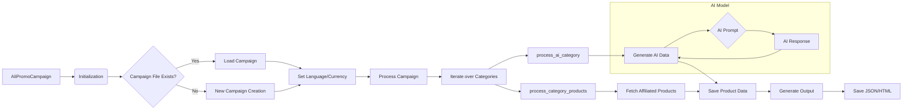

# Analysis of `ali_promo_campaign.py`

## <input code>

```python
# -*- coding: utf-8 -*-\n#! venv/Scripts/python.exe\n#! venv/bin/python/python3.12\n
"""
.. module: src.suppliers.aliexpress.campaign
	:platform: Windows, Unix
	:synopsis: AliPromoCampaign


## AliPromoCampaign

### Назначение:
Модуль предназначен для управления рекламными кампаниями на платформе AliExpress, включая обработку данных о категориях и товарах, создание и редактирование JSON-файлов с информацией о кампаниях, а также использование AI для генерации данных о кампаниях.

### Описание:
Класс `AliPromoCampaign` позволяет загружать и обрабатывать данные рекламных кампаний, управлять категориями и товарами, а также использовать ИИ для генерации описаний и других данных. Модуль поддерживает различные языки и валюты, обеспечивая гибкость в настройке кампаний.

### Примеры:
Пример инициализации рекламной кампании:

    >>> campaign = AliPromoCampaign("new_campaign", "EN", "USD")
    >>> print(campaign.campaign_name)

Пример обработки всей кампании:

    >>> campaign = AliPromoCampaign("new_campaign", "EN", "USD")
    >>> campaign.process_campaign()

Пример обработки данных о товарах в категории:

    >>> campaign = AliPromoCampaign("new_campaign", "EN", "USD")
    >>> products = campaign.process_category_products("electronics")

Пример заполнения данных категорий с использованием AI:

    >>> campaign = AliPromoCampaign("new_campaign", "EN", "USD")
    >>> campaign.process_ai_category("Electronics")
"""
# ... (rest of the code)
```

## <algorithm>

The `AliPromoCampaign` class manages AliExpress promotional campaigns.  The workflow involves these steps:

1. **Initialization (`__init__`)**:
    * Takes campaign name, language, and currency as input.
    * Determines the base path for campaign files.
    * Loads campaign data from a JSON file if it exists.  If not, it initiates a new campaign creation process. 
    * Sets the `language` and `currency` attributes based on loaded data or provided arguments.
    * Initializes AI models (Gemini).


2. **New Campaign Creation (`process_new_campaign`)**:
   * Creates a new campaign directory structure if the JSON file is missing.
   * Creates categories from directory names within the 'category' folder.
   * Collects affiliated products into files (e.g., <product_id>.JSON).
   * Generates AI parameters for the campaign.


3. **Campaign Processing (`process_campaign`)**:
   * Iterates over each category within the campaign.
   * For each category:
     * Processes products within the category using `process_category_products`.
     * Processes AI data for the category using `process_ai_category`.


4. **Category Processing (`process_category_products`)**:
   * Reads product IDs from HTML files and a sources.txt file within the category's 'sources' directory.
   * If product IDs are found, it uses `AliAffiliatedProducts` to fetch affiliated product data and returns the results.


5. **AI Category Processing (`process_ai_category`)**:
   * Loads product titles from a text file.
   * Constructs a prompt for the AI model (Gemini).
   * Calls the AI model to generate data for the category.
   * Updates or creates campaign categories with AI-generated data.


6. **Output Generation (`generate_output`)**:
   * Formats campaign data for output files:
     * Saves individual product data in JSON files (<product_id>.json).
     * Collects titles and promotion links into lists.
     * Saves promotion links and titles to files.
     * Generates HTML files for products and categories within the campaign.


## <mermaid>



**Dependencies Explanation:**

* `header`:  Likely a custom header file or a module with common functions (likely for logging, configuration, or other helper functions.)
* `asyncio`: For asynchronous operations, crucial if any of the code interacts with external services or performs lengthy tasks.
* `time`: For timing or scheduling tasks.
* `copy`: For creating copies of objects, essential for handling data manipulation without side effects.
* `html`: For handling HTML entities. Crucial if HTML is being parsed or generated.
* `pathlib`: For working with file paths in an object-oriented manner, important for handling file operations.
* `types`: For using `SimpleNamespace` to create easily extensible data structures.
* `typing`: For type hints, improving code readability and maintainability.
* `src`:  Likely a root directory in the project structure. Likely imports from packages within the `src.` namespace.
* `gs`: A likely utility/config module (`gs.path.google_drive`) for managing file paths related to Google Drive storage.
* `campaign`: Module related to AliExpress campaign operations.
* `AliAffiliatedProducts`:  Handles affiliated product retrieval for AliExpress.
* `locales`:  likely a dictionary or module containing supported language and currency combinations.
* `GoogleGenerativeAI`, `OpenAIModel`: For utilizing AI (likely Gemini or OpenAI) for generating campaign descriptions, and other data.
* `ProductHTMLGenerator`, `CategoryHTMLGenerator`, `CampaignHTMLGenerator`:  Custom modules for generating HTML content related to products, categories, and the entire campaign.
* `logger`:  Likely a custom logging module.
* `get_filenames`, `read_text_file`, `get_directory_names`:  Custom file handling utilities.
* `j_dumps`, `j_loads_ns`, `j_loads`: Likely for handling JSON serialization and deserialization.
* `csv2dict`: For converting CSV data to dictionaries.
* `extract_product_id`:  Extracts product IDs from various sources.


## <explanation>

* **Imports**: The imports are mostly standard Python libraries and modules from within the project's `src` package, indicating a structured codebase.  It's evident that this project manages campaign data, uses AI models, and interacts with external APIs (Google Drive or other services).


* **Classes**:
    * `AliPromoCampaign`: This class encapsulates the logic for managing a single campaign. It has attributes like `language`, `currency`, `base_path`, and `campaign` (holding campaign data). The `__init__` method loads existing campaign data, or creates a new campaign if needed. It defines methods (`process_campaign`, `process_category_products`, `process_ai_category`) for processing campaign components.


* **Functions**:
    * `process_campaign`: Iterates through categories in the campaign and handles AI generation.
    * `process_category_products`: Retrieves product data for a given category.
    * `process_ai_category`: Uses AI (Gemini in this case) to generate category data.
    * `process_new_campaign`: Handles creating a new campaign, including generating an initial campaign JSON.
    * `read_sources`: Extracts product IDs from various sources like HTML files and `sources.txt` within the campaign directory.
    * `generate_output`: Saves processed campaign data in JSON, text, and HTML formats.
    * `generate_html`: Generates HTML for a given category, which is useful for display.


* **Variables**: Most variables are consistently typed, for example, using `Optional[str]` to indicate that a parameter might be `None`. This is good practice to avoid unexpected errors.


* **Potential Errors/Improvements**:

    * **Error Handling**: While the code includes `try...except` blocks for some error scenarios, more robust error handling could be added to catch and log various exceptions.  For example, during JSON loading or AI calls.
    * **File Locking**: If multiple processes or threads might access the same campaign files simultaneously, adding file locking mechanisms could prevent data corruption.
    * **AI Model Selection**: The code uses both Gemini and OpenAI models. This logic could be abstracted, letting the user specify the desired model, reducing complexity.
    * **Asynchronous Operations**: The use of `asyncio` is good for I/O bound tasks. However, ensure that all relevant functions that use external resources (e.g., fetching product data, making AI calls) are marked as `async` for efficient use of asynchronous processes.
    * **Code Readability**: The code might benefit from more docstrings, and comments to explain the logic within each function in greater detail. This would help maintainers and developers understand the codebase without spending much time on understanding the code structure.  The comments are helpful, but more detailed comments within functions might enhance readability.
    * **Robustness for missing files:** The code assumes that campaign data might be missing (`self.campaign`), but the same logic for `category_name` and `product_id` is missing. This makes it hard to use it without files.


* **Relationships with other parts of the project**: The `src` package clearly indicates a larger project.  The `gs` module implies integration with Google services. There's interaction with AliExpress-specific components (e.g., `AliAffiliatedProducts`).   The campaign data seems structured to eventually be used in other parts of the project, e.g., an e-commerce platform. The HTML generators suggest the eventual visualization or display of the campaign data.

The overall structure and the use of Python's strengths (object-oriented programming, asynchronous tasks, type hints) suggest a well-organized and potentially scalable project.