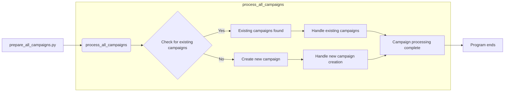

# Code Explanation for hypotez/src/suppliers/aliexpress/campaign/prepare_all_camapaigns.py

## <input code>

```python
## \file hypotez/src/suppliers/aliexpress/campaign/prepare_all_camapaigns.py
# -*- coding: utf-8 -*-\
#! venv/Scripts/python.exe
#! venv/bin/python/python3.12

"""
.. module: src.suppliers.aliexpress.campaign 
	:platform: Windows, Unix
	:synopsis: Проверка создания affiliate для рекламной кампании  
Если текой рекламной кампании не существует - будет создана новая

"""
MODE = 'dev'


import header
from src.suppliers.aliexpress.campaign import process_all_campaigns

process_all_campaigns()
```

## <algorithm>

The code executes the `process_all_campaigns` function, which is presumably defined elsewhere in the `src.suppliers.aliexpress.campaign` module.  It likely handles the logic for preparing AliExpress campaigns, possibly by checking for existing affiliate accounts and creating them if necessary.

**Block Diagram:**

```
+-----------------+
|     Main        | --> process_all_campaigns()
+-----------------+
```


**Example Data Flow:**

The `prepare_all_campaigns` function would initiate processes within the `process_all_campaigns` function. No example data flow is possible without the definition of `process_all_campaigns()`.


## <mermaid>



**Dependencies Analysis:**


The diagram shows a single dependency. `prepare_all_campaigns.py` directly calls `process_all_campaigns`. The `process_all_campaigns` function is assumed to exist within `src.suppliers.aliexpress.campaign` module. This is implied by the import statement.


## <explanation>

* **Imports:**
    * `header`: This import suggests `header` module provides some initialization or configuration relevant to the `aliexpress` campaigns.  Without seeing `header`'s contents, its purpose and relationship to other modules in `src` are unclear. The use of `import header` is unusual and potentially a legacy practice.  It would be preferable to utilize more structured imports and initialization functions.
    * `process_all_campaigns`: Imports the function from the `aliexpress.campaign` module in the `src` package, likely containing the core logic for handling the AliExpress campaigns.

* **Classes:** There are no classes defined in this file.

* **Functions:** The script's primary functionality is to call the `process_all_campaigns()` function.  Understanding `process_all_campaigns()`'s implementation is crucial to knowing the full workflow.  This function would check campaign status and take appropriate actions to create or update campaigns.

* **Variables:**
    * `MODE`: Stores a string value likely indicating the execution mode (e.g., 'dev', 'prod'). This is often used for conditional behavior, like enabling logging or different configurations in different environments.

* **Potential Errors and Improvements:**
    * **Missing `process_all_campaigns` definition:** The code will raise an `AttributeError` if `process_all_campaigns` isn't defined.  The file's comment mentions the function's purpose, so it likely exists elsewhere.
    * **Unclear `header` import:** The `header` import is non-standard, potentially causing ambiguity about initialization and setup. Using a more explicit import and better structuring of the code is recommended to improve readability and maintainability.
    * **Error Handling:** The code lacks any error handling.  If `process_all_campaigns()` encounters an error (e.g., database connection issues), the program will likely crash without any output.  Adding `try...except` blocks to handle exceptions would be essential in production.

* **Relationship with other project parts:**
    * **`src.suppliers.aliexpress`:** The code interacts with the AliExpress supplier's infrastructure and logic, potentially accessing data from databases, APIs, or other services related to this particular supplier.
    * **`process_all_campaigns` (likely in another file):** This function is the core of the campaign preparation.  Understanding the calls and operations within it will be critical to understanding the interactions with other parts of the project.

**In summary**: This script acts as a simple entry point, initiating campaign preparation processes defined in the `process_all_campaigns` function. The core functionality and details of data interactions and error handling are outside of this file, requiring examination of the file containing that function to fully understand the behavior.