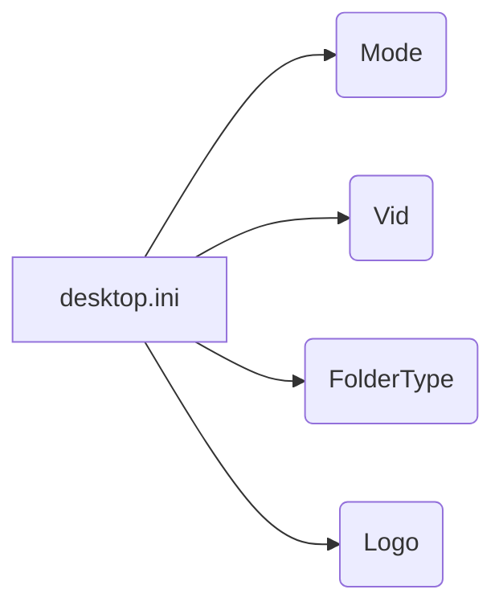

# Code Analysis of `hypotez/src/suppliers/aliexpress/desktop.ini`

## <input code>

```
[ViewState]
Mode=
Vid=
FolderType=Generic
Logo=E:\\Users\\user\\images\\LOGOS\\R.png
```

## <algorithm>

This file appears to be a Windows `desktop.ini` file, a configuration file used to store information about the presentation of a folder (e.g., icons).  It's not a typical programming language.  It uses key-value pairs to store configuration settings.  There isn't a step-by-step workflow in the traditional sense as there's no programmatic logic.


| Key          | Value                       | Description                                                                                    |
|--------------|------------------------------|------------------------------------------------------------------------------------------------|
| Mode         |                             | Likely indicates the mode of display for the folder, often empty or unspecified.          |
| Vid          |                             |  Likely a unique identifier for the view state.                                                 |
| FolderType  | Generic                     | Specifies the type of the folder as "Generic".                                               |
| Logo         | E:\\Users\\user\\images\\LOGOS\\R.png | Specifies the path to an image file (likely a logo) to be used as the folder icon. |


There's no algorithm to diagram because the file is simply data.


## <mermaid>



**Dependencies:**

This file is a configuration file, not a program.  Thus, there are no imports or dependencies in the traditional sense.

## <explanation>

* **Imports:** There are no imports as this file is not a Python, Java, or similar program.  It's a simple configuration file.
* **Classes:** There are no classes.
* **Functions:** There are no functions.
* **Variables:**  The file contains key-value pairs which act like variables, but again, not in a programming context.
* **Potential Errors/Improvements:**

    * **Path Issues:** The `Logo` path (`E:\\Users\\user\\images\\LOGOS\\R.png`) may be invalid if the file isn't in the expected location.  Error-handling or validation of the path would improve robustness.


**Relationships with other parts of the project:**

The `desktop.ini` file likely belongs to a project that manages or displays folder contents.  The path in the `Logo` setting might reference images managed in a different part of the project.  The project, most likely, is using this file to configure the visual appearance of the folder in a file explorer window.  The  `hypotez` and `src/suppliers/aliexpress` directories suggest that this is potentially part of a larger project managing data and interface elements from various "suppliers".