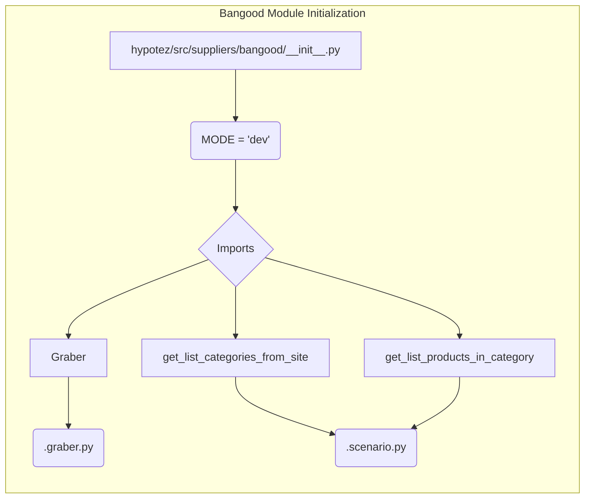

# Code Explanation for hypotez/src/suppliers/bangood/__init__.py

## <input code>

```python
## \file hypotez/src/suppliers/bangood/__init__.py
# -*- coding: utf-8 -*-\
#! venv/Scripts/python.exe
#! venv/bin/python/python3.12

"""
.. module: src.suppliers.bangood 
	:platform: Windows, Unix
	:synopsis:

"""
MODE = 'dev'

from .graber import Graber
from .scenario import get_list_categories_from_site, get_list_products_in_category
```

## <algorithm>

This file appears to be an initialization module for the `bangood` supplier within the `hypotez` project.  It primarily imports necessary classes and functions from submodules, likely for interacting with the Banggood e-commerce platform.

**Step-by-step workflow (conceptual):**

1. **Initialization:**  The module is initialized. No specific actions are taken within this file.
2. **Import Statements:** The file imports the `Graber` class and `get_list_categories_from_site`, `get_list_products_in_category` functions from submodules (likely `.graber.py` and `.scenario.py`). These imports make the functionality of these modules available in this file.


## <mermaid>



**Dependencies Analysis:**

The mermaid diagram shows that the `__init__.py` file imports `Graber` from `.graber.py` and related functions from `.scenario.py`. This implies a dependency structure where the functions and the class imported are defined in separate modules within the `bangood` supplier directory. These dependencies are essential for utilizing the functionalities of those modules within the `bangood` supplier.  `MODE = 'dev'` is a likely configuration variable for the module.


## <explanation>

**Imports:**

- `from .graber import Graber`: Imports the `Graber` class from the `graber.py` module within the same `bangood` directory.  This suggests `Graber` is a class likely containing methods for interacting with the Banggood API or web scraping tools.
- `from .scenario import get_list_categories_from_site, get_list_products_in_category`: Imports two functions from the `scenario.py` module.  These functions are likely responsible for fetching lists of categories and products from the Banggood site (presumably using the `Graber` class).

**Variables:**

- `MODE = 'dev'`: This variable likely defines the operating mode of the `bangood` supplier (e.g., development, testing, production).  Using `dev` as a constant suggests this might be set by a global config in the larger project.


**Classes:**

- `Graber`:  (Not fully defined here, but implied by the import) A class for interacting with the Banggood website, potentially using web scraping or API access.

**Functions:**

- `get_list_categories_from_site`: Retrieves a list of categories from the Banggood website.  Further details would be found in `scenario.py`.
- `get_list_products_in_category`: Retrieves a list of products within a given Banggood category.

**Potential Errors/Improvements:**

- **Missing docstrings:** While the module docstring exists, individual functions and classes within `graber.py` and `scenario.py` likely need more detailed docstrings for better understanding.
- **Error Handling:** The code lacks error handling. If there are network issues or problems with the Banggood site, the `get_list_categories_from_site` and `get_list_products_in_category` might raise exceptions that aren't handled.
- **Robustness:** Consider adding more robust error handling, logging, and input validation (e.g., ensuring `category` parameter in `get_list_products_in_category` is valid).


**Relationships with other parts of the project:**

The `__init__.py` file establishes connections to other modules, implying that it is part of a project structure with a specific directory organization. Functions in `scenario.py` are used to interact with Banggood, likely part of a larger `hypotez` project that has other suppliers modules and associated logic.


```