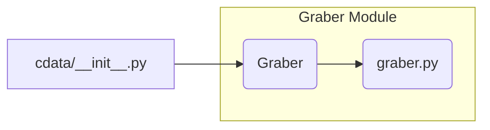

# <input code>

```python
## \file hypotez/src/suppliers/cdata/__init__.py
# -*- coding: utf-8 -*-\
#! venv/Scripts/python.exe
#! venv/bin/python/python3.12

"""
.. module: src.suppliers.cdata 
	:platform: Windows, Unix
	:synopsis:

"""
MODE = 'dev'


from .graber import Graber
```

# <algorithm>

There is no algorithm in the provided code; it's an initialization file for a Python module.  The primary action is importing a class (`Graber`) from a sub-module (`graber`).

**Data Flow (Illustrative):**

There's no data exchange to visualize. The code simply sets up a module, defining a variable (`MODE`) and importing a class.

# <mermaid>



**Dependencies Analysis:**

The diagram shows a single dependency: `cdata/__init__.py` imports `Graber` from `graber.py` (which is presumed to be within the `src/suppliers/cdata` directory).

# <explanation>

* **Imports:**
    * `from .graber import Graber`: This line imports the `Graber` class from the file `graber.py`, which is located in the same directory as `__init__.py`.  The `.` prefix indicates a relative import, signifying that `graber.py` resides within the `cdata` sub-package.  This is a standard Python practice for organizing modules within a package structure.

* **Variables:**
    * `MODE = 'dev'`: This global variable likely controls operational modes (e.g., development vs. production).  It's a string, initialized to 'dev'.  Its purpose is to be used later within the package in different parts to implement different logic conditionally.

* **Classes:**
    * The code defines no classes within `__init__.py`.  It only imports the `Graber` class from `graber.py`. The role and functionality of `Graber` are not present in this `__init__.py` file. Further investigation into `graber.py` is needed to determine its purpose.

* **Functions:**
    * There are no functions defined in this file.

* **Potential Errors or Areas for Improvement:**
    * The code is missing crucial details. The lack of function definition or usage of the imported `Graber` class in `__init__.py` makes it an incomplete starting point. It suggests that `Graber` likely contains the core logic for interacting with data, which needs further analysis from the `graber.py` file itself.
    * Missing documentation or docstrings in `graber.py` will make it difficult to fully understand how the functionality of `Graber` works.


**Relationship with Other Project Components:**

The `cdata` module is likely part of a larger project structure dealing with data supply or processing. `Graber` likely handles the fetching or extraction of data from a source, and `__init__.py` is the entry point for interactions with that component. The specific relationships would be determined by the functions within `graber.py` and the places where `cdata` is used in other parts of the project.


**In summary:** This `__init__.py` file acts as an entry point for accessing data-related components, but a complete understanding of its functionality depends on examining the content of `graber.py`.