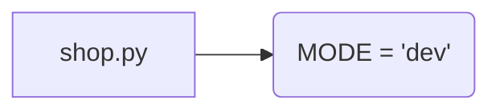

# Code Explanation for hypotez/src/suppliers/ebay/shop.py

## <input code>

```python
## \file hypotez/src/suppliers/ebay/shop.py
# -*- coding: utf-8 -*-
#! venv/Scripts/python.exe
#! venv/bin/python/python3.12

"""
.. module: src.suppliers.ebay 
	:platform: Windows, Unix
	:synopsis:

"""
MODE = 'dev'

"""
	:platform: Windows, Unix
	:synopsis:

"""


"""
	:platform: Windows, Unix
	:synopsis:

"""


"""
  :platform: Windows, Unix

"""
"""
  :platform: Windows, Unix
  :platform: Windows, Unix
  :synopsis:
"""MODE = 'dev'
  
""" module: src.suppliers.ebay """


"""   ebay - shop

 @section libs imports:
Author(s):
  - Created by Davidka on 09.11.2023 .
"""
```

## <algorithm>

No meaningful algorithm can be determined from the provided code.  The code consists primarily of docstrings and comments, with a single variable declaration.  There are no functions or classes to define a workflow.


## <mermaid>



**Explanation of Dependencies:**

No external libraries are imported in this file.  The diagram reflects the single variable declaration, which is the core of the code. The dependency relationship is limited to the file itself.

## <explanation>

**Imports:**

There are no imports in this file.

**Classes:**

There are no classes defined.

**Functions:**

There are no functions defined.

**Variables:**

- `MODE`: A string variable assigned the value `'dev'`.  This variable likely represents a configuration mode (e.g., development, production), and is probably used for conditional logic elsewhere in the project.

**Potential Errors or Areas for Improvement:**

- **Lack of Functionality:**  The file is currently empty of any meaningful code.  It's a placeholder or a draft, and needs significant implementation of methods and logic for data processing or interaction.
- **Missing Purpose:** The file's purpose isn't clearly stated.  It's unclear what role this specific `shop.py` file is supposed to play within the `hypotez` project.  More details about expected functionality are necessary to understand its intended design.
- **Redundant Docstrings:**  The repeated docstrings seem unnecessary and likely result from copying and pasting.  Trim to a single, coherent set of docstrings that accurately reflects the file's function.

**Relationship with Other Parts of the Project:**

Without any code for interacting with external data or services, it's hard to assess the relationship with other project parts.  The file likely relies on other files in the `src.suppliers.ebay` package or potentially the `hypotez` project as a whole to fetch product information or perform other actions.  More code will clarify dependencies.  The `MODE` variable will be a crucial factor for setting up conditions of execution in associated scripts.