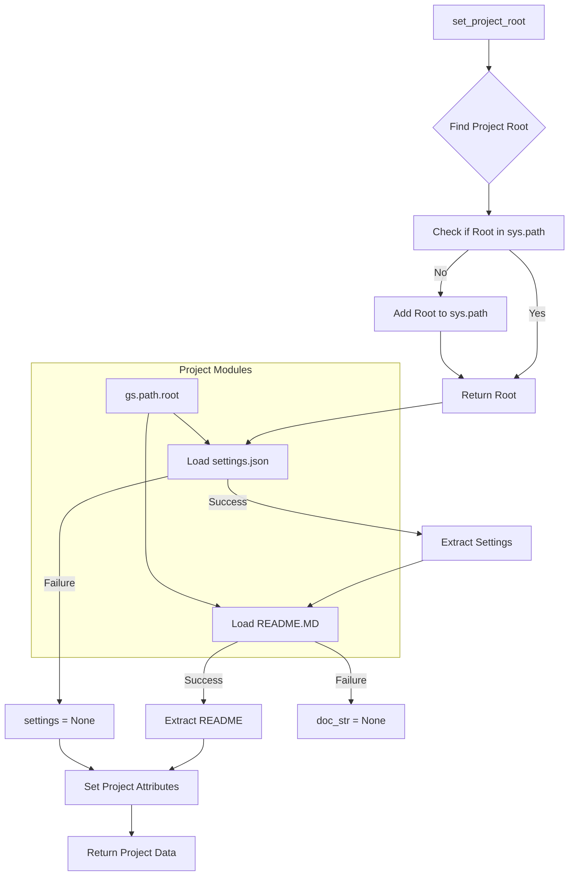

# Code Explanation for hypotez/src/suppliers/etzmaleh/header.py

## <input code>

```python
## \file hypotez/src/suppliers/etzmaleh/header.py
# -*- coding: utf-8 -*-\
#! venv/Scripts/python.exe
#! venv/bin/python/python3.12

"""
.. module: src.suppliers.etzmaleh 
	:platform: Windows, Unix
	:synopsis:

"""
MODE = 'dev'


import sys
import json
from packaging.version import Version

from pathlib import Path
def set_project_root(marker_files=('pyproject.toml', 'requirements.txt', '.git')) -> Path:
    """
    Finds the root directory of the project starting from the current file's directory,
    searching upwards and stopping at the first directory containing any of the marker files.

    Args:
        marker_files (tuple): Filenames or directory names to identify the project root.
    
    Returns:
        Path: Path to the root directory if found, otherwise the directory where the script is located.
    """
    __root__:Path
    current_path:Path = Path(__file__).resolve().parent
    __root__ = current_path
    for parent in [current_path] + list(current_path.parents):
        if any((parent / marker).exists() for marker in marker_files):
            __root__ = parent
            break
    if __root__ not in sys.path:
        sys.path.insert(0, str(__root__))
    return __root__


# Get the root directory of the project
__root__ = set_project_root()
"""__root__ (Path): Path to the root directory of the project"""

from src import gs

settings:dict = None
try:
    with open(gs.path.root / 'src' /  'settings.json', 'r') as settings_file:
        settings = json.load(settings_file)
except (FileNotFoundError, json.JSONDecodeError):
    ...

doc_str:str = None
try:
    with open(gs.path.root / 'src' /  'README.MD', 'r') as settings_file:
        doc_str = settings_file.read()
except (FileNotFoundError, json.JSONDecodeError):
    ...


__project_name__ = settings.get("project_name", 'hypotez') if settings  else 'hypotez'
__version__: str = settings.get("version", '')  if settings  else ''
__doc__: str = doc_str if doc_str else ''
__details__: str = ''
__author__: str = settings.get("author", '')  if settings else ''
__copyright__: str = settings.get("copyrihgnt", '')  if settings else ''
__cofee__: str = settings.get("cofee", "Treat the developer to a cup of coffee for boosting enthusiasm in development: https://boosty.to/hypo69")  if settings else "Treat the developer to a cup of coffee for boosting enthusiasm in development: https://boosty.to/hypo69"
```

## <algorithm>

**Step 1:** The `set_project_root` function is called to locate the project root directory.
   * **Input:** A tuple of filenames/directory names (default: `pyproject.toml`, `requirements.txt`, `.git`).
   * **Process:** Starts from the directory containing the current file (`__file__`). Traverses upwards through parent directories. Checks if any of the specified marker files exist in the current directory.
   * **Output:** A `Path` object representing the project root directory.

**Step 2:** Checks if the determined root directory is already in `sys.path`. If not, adds it to the beginning of `sys.path`.
   * **Input:** The root `Path` returned by `set_project_root`.
   * **Output:** `sys.path` with the root directory added.

**Step 3:**  Loads project settings from `settings.json`.
   * **Input:** The project's root directory.
   * **Process:** Uses `gs.path.root` (a function from the `gs` module) to construct the file path. Attempts to read `settings.json`.
   * **Output:** A dictionary containing project settings (`settings`) if successful; `None` otherwise.

**Step 4:** Loads project documentation from `README.MD`.
   * **Input:** The project's root directory.
   * **Process:** Uses `gs.path.root` to construct the file path. Attempts to read `README.MD`.
   * **Output:** The content of `README.MD` (`doc_str`) if successful; `None` otherwise.


**Step 5:** Extracts various project properties from the `settings` dictionary if available.  Defaults are set in case `settings` is empty.
   * **Input:** The `settings` dictionary (or `None`).
   * **Output:** Various project attributes (__project_name__, __version__, __doc__, __author__, __copyright__, __coffee__).

## <mermaid>



**Dependencies Analysis:**

* `sys`, `json`: Standard Python libraries, no specific relationship within this file.
* `packaging.version`: Used for handling version strings, likely for semantic versioning or project version management.
* `pathlib`: Used to work with file paths in a more object-oriented manner, improving code clarity and maintainability.
* `src.gs`:  Crucial for finding the project root (`gs.path.root`). This suggests a module (`gs`) in the `src` package is managing file system paths and project structure. This is critical to the code's function and establishes a relationship with the `src` package.

## <explanation>

**Imports:**

* `sys`: Provides access to system-specific parameters and functions, like `sys.path` which is critical for locating the project's modules.
* `json`: Used for loading JSON data from the `settings.json` file.
* `packaging.version`: Used for handling version numbers in a robust way.  Important for compatibility.
* `pathlib`:  Provides an object-oriented way to work with paths, enhancing code readability and robustness, especially when handling file paths.
* `src.gs`: This module is vital for obtaining the root path of the project.  It indicates a dependency on a module within the project's `src` package, indicating a broader project structure.

**Classes:**

There are no classes defined in this file.

**Functions:**

* `set_project_root(marker_files=...)`: This function is crucial for locating the project's root directory.  Its crucial role in the code ensures that modules within the project can be easily imported, regardless of the current working directory. It leverages `pathlib.Path` to ensure robustness with path manipulations, especially when working with various operating systems.

**Variables:**

* `MODE`: A string variable likely controlling the application's mode (e.g., 'dev', 'prod').
* `__root__`: A `Path` object representing the root directory of the project.
* `settings`: A dictionary containing project settings loaded from `settings.json`.
* `doc_str`: A string containing the content of the project's `README.MD` file.
* `__project_name__`, `__version__`, `__doc__`, `__author__`, `__copyright__`, `__cofee__`: Strings representing project metadata (name, version, description, author, copyright, and a potential encouragement for the developer), fetched from the `settings` dictionary if it's available.


**Potential Errors/Improvements:**

* **Error Handling:**  While the `try...except` blocks for `settings` and `doc_str` are good, the `...` in the `except` blocks could be replaced with more specific error handling.  Knowing *exactly* what to do if a file cannot be found or decoded is crucial, and might involve a logging mechanism.
* **`gs` Module:** The `gs.path.root` access is opaque.  Making `gs` a proper module with clearly defined responsibilities would improve the code's organization and reusability.

**Relationship to Other Parts of the Project:**

The `gs` module, accessed via `gs.path.root`, is a significant link to other parts of the project, implying that the `src` package has further structure that uses these project-root related functions. The use of `settings.json` and `README.MD` indicates a reliance on external configuration files and documentation for project management. The file `header.py` is important for proper module loading, which ensures smooth interaction with the rest of the project.