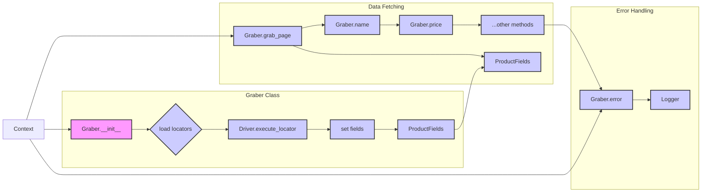

```MD
# Analysis of hypotez/src/suppliers/graber.py

## <input code>

```python
## \file hypotez/src/suppliers/graber.py
# -*- coding: utf-8 -*-\n#! venv/Scripts/python.exe\n#! venv/bin/python/python3.12\n\n"""
# ... (module docstring)
# ...
```
(rest of the code)
```

## <algorithm>

The code defines a `Graber` class for collecting product data from HTML pages of various suppliers.  The workflow involves:

1. **Initialization (`__init__`):**
   - Takes the `supplier_prefix` (e.g., 'graber') and `driver` object as input.
   - Loads locators from a JSON file (`locators/product.json`) specific to the supplier using `j_loads_ns`.
   - Initializes `self.fields` with a `ProductFields` object.
   - Sets `Context.driver` and `Context.supplier_prefix`.


2. **Data Fetching (`set_field_value`, specific methods like `name`, `price` etc.):**
   - Attempts to retrieve a field's value using `self.driver.execute_locator`.
   - Optionally accepts a `value` argument to override the value fetched from the locator.
   - Handles potential errors during locator execution using `try...except` blocks.
   - Performs normalization on fetched data (e.g., strings, numbers) using functions like `normalize_string`, `normalize_int`.
   - Stores the fetched (and normalized) value in the appropriate attribute of `self.fields`.


3. **Data Gathering (`grab_page`):**
   - Calls a series of individual functions (`e.g., name`, `price`, `description`) to collect data.
   - Each individual function fetches data from the web page and stores it in the `ProductFields` object.


4. **Error Handling (`error`):**
   - Logs errors encountered during the fetching process.


**Example Data Flow:**

```
+-----------------+     +-----------------+     +-----------------+
|  HTML Page      |--->| Graber.grab_page |--->| ProductFields   |
+-----------------+     +-----------------+     +-----------------+
      |                                  ^
      |      fetch_all_data           |    |
      |       |      +-----------------|----|
      |       |      | Graber.name     |----|  .name
      |       |      +-----------------|----|  .price
      |       |      | Graber.price    |----|  .description
      |       v      v     ...            |  ...
      |             |   +-----------------+     +-----------------+
      |             |   |   Webdriver       |     | ...Data Results |
      |             |   +-----------------+     +-----------------+
```


## <mermaid>




**Dependencies Analysis:**


- `os`, `sys`, `asyncio`, `pathlib`, `types`, `typing`, `langdetect`, `functools`: Standard Python libraries for operating system interaction, asynchronous programming, data types, language detection, and function wrapping.
- `header`:  Likely a custom module for handling header-related tasks.
- `gs`:  A custom module (`src.gs`) likely managing global settings and paths.
- `ProductFields`: A class from `src.product.product_fields` for storing product attributes.
- `Category`: A class from `src.category` probably for handling categories.
- `Driver`: A class from `src.webdriver` for controlling web browsers (or similar).
- `j_loads`, `j_loads_ns`, `j_dumps`: Functions from `src.utils.jjson` for handling JSON data, potentially using a custom JSON library.
- `save_png_from_url`, `save_png`: Functions from `src.utils.image` for saving images.
- `normalize_string`, `normalize_int`, `normalize_float`, `normalize_boolean`: Normalization functions from `src.utils.string.normalizer`.
- `ExecuteLocatorException`: Custom exception class from `src.logger.exceptions` for handling errors during locator execution.
- `PrestaShop`: A class from `src.endpoints.prestashop`. (Possibly for handling PrestaShop-specific endpoints)
- `pprint`: Likely a pretty printing function from `src.utils`.
- `logger`: A logging module from `src.logger`.


## <explanation>

**Imports:** The code imports necessary libraries for various tasks, including web scraping, JSON manipulation, image handling, normalization, asynchronous operations, and logging. The use of `src.` suggests these are components from the Hypotez project.  The imported modules and classes will be fundamental to the functionality of the Graber class in handling product data.

**Classes:**

- **`Graber`:** This is the core class for scraping product data. It handles initialization (`__init__`), error handling (`error`), and most importantly, the `set_field_value` and many individual methods to fetch data from the web page for various fields (name, price, description, etc.).  The use of the `@close_pop_up` decorator is evident.
- **`Context`:** This class acts as a container for global settings, holding important objects like the `Driver` object and the `locator`. The `locator_for_decorator` attribute is crucial in the `close_pop_up` decorator.

**Functions:**

- **`close_pop_up`:** A decorator function that, when used as `@close_pop_up()`  attempts to execute a locator for closing pop-ups before invoking the wrapped function. This ensures consistency in dealing with potential pop-ups across different supplier classes.

- **`set_field_value`:** This function is a utility for fetching field values, handling potential errors, and setting the value to the appropriate field in `ProductFields`.

- **`grab_page`:** This async function is the entry point for fetching all product data from a page. It orchestrates the calls to the various other field-fetching functions (e.g., `name`, `price`).

- **Individual methods (e.g., `name`, `price`):**  These methods are responsible for fetching the value of a specific product field from the HTML using `execute_locator`.  They are specifically designed for different product attributes (e.g., name, price) and handle error cases during the process. Each has a  `@close_pop_up` decorator.


**Variables:**

- `MODE`: A global variable (likely a string) determining the mode of operation (e.g., 'dev', 'prod').
- `self.supplier_prefix`: Stores the supplier's prefix, which is crucial for identifying the correct locators.
- `self.fields`: An instance of `ProductFields` used to store the fetched product data.
- `Context.driver`:  References the current webdriver instance.
- `Context.supplier_prefix`: Stores the supplier prefix for identifying the correct locators.
- `self.locator`: Contains the locators loaded from the JSON file, and holds methods if specific processing like pop-up closing is needed.


**Potential Errors and Improvements:**

- **Data Validation:** The code includes checks for valid `value` results, but more comprehensive data validation (e.g., data type checks for price, quantity) could be beneficial to prevent unexpected errors.
- **Error Handling in `grab_page`:**  The `fetch_all_data` function within `grab_page` is incomplete. It should contain error handling or validation for its invocations to avoid unexpected behavior.
- **Explicit `fetch_specific_data`:** The `fetch_all_data` function currently has a placeholder. An explicit function `fetch_specific_data` should exist that actually fetches data and could be useful for adding error handling and testing.
- **Robust Error Handling:** The `try...except` blocks in many methods are not comprehensive enough.  Consider more specific exception handling, logging more detailed error information, and handling cases where the locator might not find the element.
- **Decorator Logic:** The `@close_pop_up` decorator has a potential issue. How to pass the required `id_product` or other parameters to the `grab_page` method from the call site where it gets initialized is not clear.
- **`id_product` Logic:** The `id_product` method attempts to populate `self.fields.id_supplier` when there might be better ways to generate it based on supplier data.
- **`local_saved_image` Bug:**  The `id_product` is called from within `local_saved_image` without handling potential errors from that call.


**Relationship with other parts of the project:** The code is clearly part of a larger project (`hypotez`) focused on web scraping and product data management. It depends on modules like `src.product.product_fields`, `src.webdriver`, `src.logger`, and `src.utils` for essential functionalities.


```