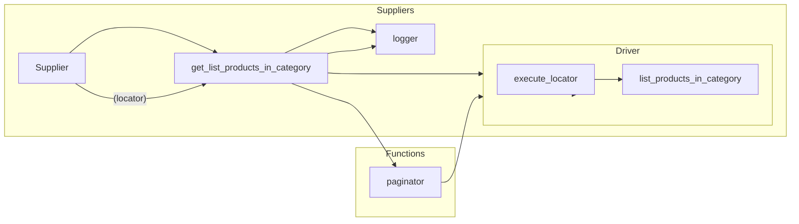

# Code Explanation for `hypotez/src/suppliers/hb/category.py`

## <input code>

```python
# -*- coding: utf-8 -*-\
#! venv/Scripts/python.exe
#! venv/bin/python/python3.12

"""
.. module: src.suppliers.hb 
	:platform: Windows, Unix
	:synopsis:

"""
MODE = 'dev'

"""
	:platform: Windows, Unix
	:synopsis:

"""


"""
	:platform: Windows, Unix
	:synopsis:

"""


"""
  :platform: Windows, Unix

"""
"""
  :platform: Windows, Unix
  :platform: Windows, Unix
  :synopsis:
"""MODE = 'dev'
  
""" module: src.suppliers.hb """


"""  Модуль сбора товаров со страницы категорий поставщика hb.co.il через вебдрайвер
У каждого поставщика свой сценарий обреботки категорий

-Модуль Собирает список категорий со страниц продавца . `get_list_categories_from_site()`
@todo Сделать проверку на изменение категорий на страницах продавца. 
Продавец может добавлять новые категории, переименовывать или удалять/прятать уже существующие. 
По большому счету надо держать таблицу категории `PrestaShop.categories <-> aliexpress.shop.categoies`
- Собирает список товаров со страницы категории `get_list_products_in_category()`
- Итерируясь по списку передает управление в `grab_product_page()` отсылая функции текущий url страницы  
`grab_product_page()` обрабатывает поля товара и передает управление классу `Product` 

"""
from typing import Dict, List
from pathlib import Path

from src import gs
from src.logger import logger
from src.webdriver.driver import Driver
from src.suppliers import Supplier


def get_list_products_in_category (s: Supplier) -> list[str, str, None]:    
    """ Returns list of products urls from category page
    Если надо пролистстать - страницы категорий - листаю ??????

    Attrs:
        s - Supplier
    @returns
        list or one of products urls or None
    """
    ...
    d:Driver = s.driver
    l: dict = s.locators['category']
    ...
    d.wait(1)
    d.execute_locator (s.locators ['product']['close_banner'] )
    d.scroll()
    ...

    list_products_in_category: List = d.execute_locator(l['product_links'])

    if not list_products_in_category:
        logger.warning('Нет ссылок на товары. Так бывает')
        ...
        return
    ...
    while d.current_url != d.previous_url:
        if paginator(d,l,list_products_in_category):
            list_products_in_category.append(d.execute_locator(l['product_links']))
        else:
            break
        
    list_products_in_category = [list_products_in_category] if isinstance(list_products_in_category, str) else list_products_in_category

    logger.debug(f""" Found {len(list_products_in_category)} items in category {s.current_scenario['name']} """)
    
    return list_products_in_category

def paginator(d:Driver, locator: dict, list_products_in_category: list):
    """ Листалка """
    response = d.execute_locator(locator['pagination']['<-'])
    if not response or (isinstance(response, list) and len(response) == 0): 
        ...
        return
    return True

def get_list_categories_from_site(s):
    """ сборщик актуальных категорий с сайта """
    ...
```

## <algorithm>

**Diagram:**

```mermaid
graph TD
    A[get_list_products_in_category(Supplier)] --> B{Validate Product Links};
    B -- Yes --> C[Loop through Pages];
    B -- No --> D[Log Warning];
    C --> E[Get Product Links];
    E --> C;
    C --> F[Append to List];
    F --> G[Check for Pagination];
    G -- Yes --> C;
    G -- No --> H[Return List];
    D --> H;
    A --> I[Initialize Driver & Locators];
    I --> B;
```


**Step-by-step explanation (with examples):**

1. **`get_list_products_in_category(Supplier)`:** Retrieves a list of product URLs from a category page. Example input: `Supplier` object with driver and locator data.
2. **Validation:** Checks if the initial list of product links is empty. If empty, logs a warning and returns. Example: `list_products_in_category = []`.
3. **Page Loop:** Continues retrieving product links while the current page URL is different from the previous one.
4. **Pagination:** Calls the `paginator` function to check if there's more data on the page. Example: If the next page exists, the function returns `True`.
5. **Appending to List:** If more pages exist, appends the retrieved product links to the `list_products_in_category` list.
6. **Return:** Returns the final `list_products_in_category`. Example output: `['url1', 'url2', 'url3']`.

## <mermaid>



**Explanation of Dependencies:**

- `from typing import Dict, List`: Provides typing information for better code clarity and maintainability.
- `from pathlib import Path`: Used for file path manipulation, not directly relevant in this case.
- `from src import gs`: Imports a component from the `src` package, likely for global services or configuration.
- `from src.logger import logger`: Imports a logging component from the `src` package for logging messages.
- `from src.webdriver.driver import Driver`: Imports the `Driver` class from the `src.webdriver` package, which represents a web driver interface.
- `from src.suppliers import Supplier`: Imports the `Supplier` class from the `src.suppliers` package.


## <explanation>

**Imports:**

- The imports are crucial for modularity. They show dependencies on the `gs`, `logger`, `Driver`, and `Supplier` classes/modules within the `src` package. This suggests a layered architecture.


**Classes:**


- `Supplier`:  Represents a supplier's data and functionalities.


**Functions:**


- `get_list_products_in_category`: Retrieves a list of product URLs from a category page. It handles pagination by checking for `next_page`. Takes `Supplier` object as input and returns a list of product URLs. Example usage: 
   ```python
   supplier_instance = Supplier(...)  # ... some initialization
   product_urls = get_list_products_in_category(supplier_instance)
   ```


- `paginator`: Checks for pagination elements on a product category page. It takes a `Driver` object and `locator` as inputs. `True` means there's more pagination. Example usage:
   ```python
   # Assuming 'd' is a Driver object and 'locator' is a dictionary
   more_pages = paginator(d, locator)
   ```

- `get_list_categories_from_site`: Retrieves categories from the site.  This function is currently incomplete (`...`).


**Potential Errors and Improvements:**

- The code lacks error handling for specific cases (e.g., the page elements not being found). Error handling is very important for production code. Adding `try-except` blocks would improve robustness.


- The use of `...` indicates that parts of the functions are not defined. Completing these parts is necessary for a functional script.


- Clarity on the `Supplier` class and its interactions with other classes would improve understanding.


- The `MODE` variables are repeated; consider putting it in an initialization function or module.

- Comments are in Russian and English. Using consistent language throughout the project is recommended.

**Relationship Chain:**

The code interacts with the `src` package for logging, web driver interactions, and supplier data. This suggests a dependency on the broader project's infrastructure for data handling and external interaction.