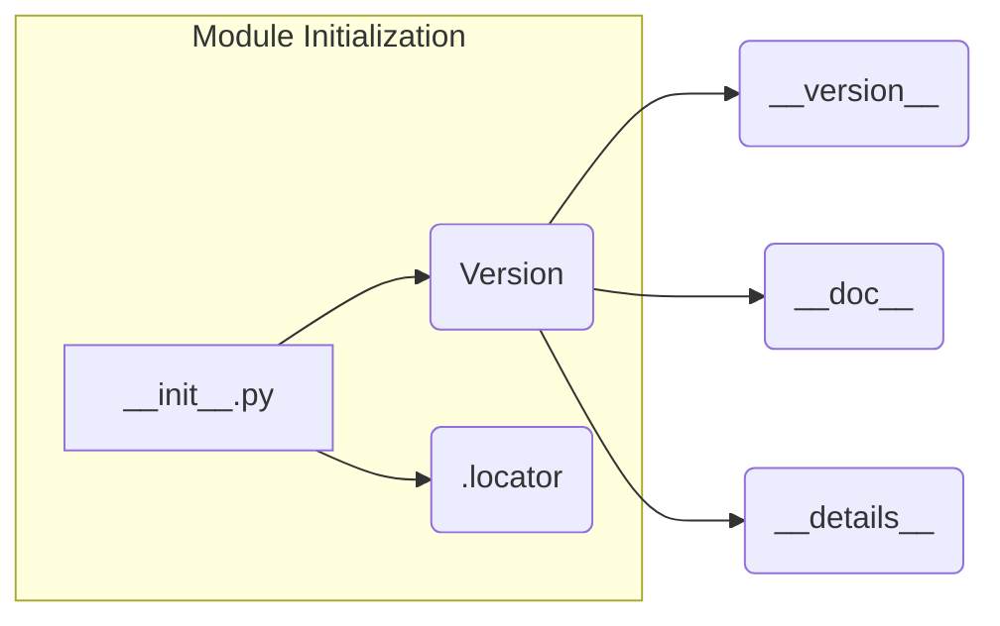

# Code Explanation for hypotez/src/suppliers/hb/locators/__init__.py

## <input code>

```python
## \file hypotez/src/suppliers/hb/locators/__init__.py
# -*- coding: utf-8 -*-
#! venv/Scripts/python.exe
#! venv/bin/python/python3.12

"""
.. module: src.suppliers.hb.locators 
	:platform: Windows, Unix
	:synopsis:

"""
MODE = 'dev'

"""
	:platform: Windows, Unix
	:synopsis:

"""


"""
	:platform: Windows, Unix
	:synopsis:

"""


"""
  :platform: Windows, Unix

"""
"""
  :platform: Windows, Unix
  :platform: Windows, Unix
  :synopsis:
"""MODE = 'dev'
  
""" module: src.suppliers.hb.locators """


""" Изменения в локаторах. Применять с осторожносастью  """
...

from packaging.version import Version
from .version import __version__, __doc__, __details__  

from .locator import 
```

## <algorithm>

No explicit algorithm is present in this file. It's an initialization file for a module.  The primary functionality is importing necessary components.

## <mermaid>



**Dependencies Analysis:**

This diagram shows the relationship between `__init__.py` and the imported modules.
- `packaging.version`: This is an external library for handling version numbers.  It's necessary for proper version management and comparison within the `hypotez` project.
- `.version`: This is assumed to be a module within the same directory (`hypotez/src/suppliers/hb/locators`) that contains version information (`__version__`, `__doc__`, `__details__`). It's a local dependency.
- `.locator`: This is another module likely within the same directory that contains the core locator logic.


## <explanation>

**Imports:**

- `from packaging.version import Version`: Imports the `Version` class from the `packaging` library. This is crucial for comparing and working with software versions, probably essential for handling version-specific logic.
- `from .version import __version__, __doc__, __details__`: Imports specific variables (`__version__`, `__doc__`, `__details__`) from a module named `version.py` within the same directory (`locators`).  This module likely holds information about the `locators` sub-package version and documentation.
- `from .locator import`: Imports functionality from the `locator` module, most likely containing the core locator classes and methods.  This module defines the main locator logic.

**Classes (Implied):**

- The code shows imports from `.locator`, implying the presence of classes and methods (e.g., locator objects) within that module that this initialization file depends upon.  Specific class details are not visible in this initial file.


**Functions (Implied):**

- No functions are directly defined in this `__init__.py`.  Functions and methods will be in the `locator` module and potentially the `version` module.


**Variables:**

- `MODE = 'dev'`: This is a global variable likely defining the operational mode (e.g., 'dev', 'prod').  This variable allows the code to adapt to different environments or configurations.


**Potential Errors/Improvements:**

- **Missing Docstrings:** While docstrings are present, some are empty or very brief.  More comprehensive docstrings would improve the code's maintainability and readability.
- **Import Errors:** Errors could occur if the `packaging` library isn't installed or if the `version.py` or `locator.py` files are missing, or don't have the expected contents.
- **Type Hinting:** Adding type hints (e.g., `MODE: str`) would increase the clarity and robustness of the code.
- **`...`:** The `...` denotes a section of code that is not included.  This should be included in the analysis for a full understanding.


**Relationship to other parts of the project:**

- The `locators` sub-package is clearly a part of the `suppliers` package within the `hypotez` project, indicating its role in handling location-related logic for suppliers.
- Imports from `packaging.version` show that `locators` is integrated with broader Python packages used within the `hypotez` project.
- The use of `__version__`, `__doc__`, and `__details__` suggests the file is designed for version control and documentation, which is common practice for modular projects.


**Chain of Relationships (Partial):**

`hypotez` > `suppliers` > `hb` > `locators`.  This initialization file establishes the entry point for importing functions from `locators` module.


**Missing Information:**


The omitted code (`...`) prevents a complete analysis and understanding of the file's full functionality and potential error handling.