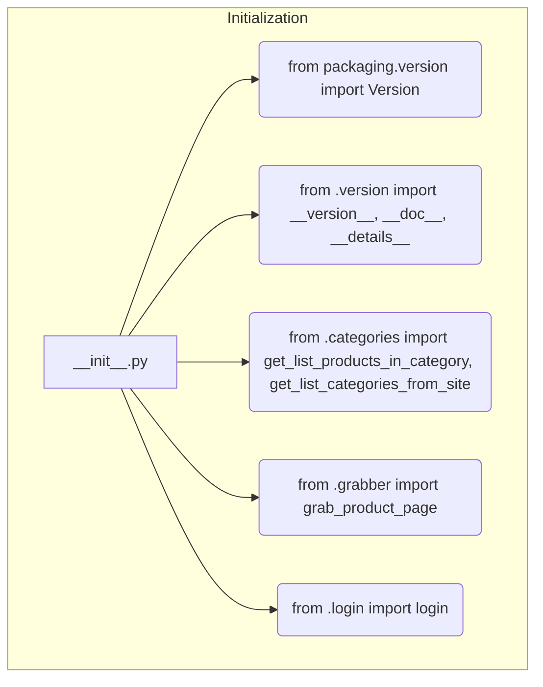

# Code Analysis of hypotez/src/suppliers/hb/scenarios/__init__.py

## <input code>

```python
## \file hypotez/src/suppliers/hb/scenarios/__init__.py
# -*- coding: utf-8 -*-\
#! venv/Scripts/python.exe
#! venv/bin/python/python3.12

"""
.. module: src.suppliers.hb.scenarios 
	:platform: Windows, Unix
	:synopsis:

"""
MODE = 'dev'

"""
	:platform: Windows, Unix
	:synopsis:

"""


"""
	:platform: Windows, Unix
	:synopsis:

"""


"""
  :platform: Windows, Unix

"""
"""
  :platform: Windows, Unix
  :platform: Windows, Unix
  :synopsis:
"""MODE = 'dev'
  
""" module: src.suppliers.hb.scenarios """


"""  Поставщик <I>hb.co.il</I> """
...

from packaging.version import Version
from .version import __version__, __doc__, __details__  

from .categories import get_list_products_in_category, get_list_categories_from_site
from .grabber import grab_product_page
from .login import login
```

## <algorithm>

This file appears to be an initialization module for a supplier (hb.co.il) within a larger project (hypotez).  It likely defines the entry points for interacting with the hb.co.il website.  The workflow is primarily about importing functions and variables from submodules related to different aspects of interacting with the website. There is no explicit step-by-step process.

## <mermaid>



**Explanation of Dependencies:**

* **`packaging.version`**: This is an external library used for handling and manipulating software version numbers.  It's a dependency that needs to be installed separately.  It's likely used for version checking or management in the project.
* **`src.suppliers.hb.scenarios.version`**:  This is a module internal to the project. It probably contains version information (e.g., the version number, documentation, details) related to the hb.co.il supplier interactions.
* **`src.suppliers.hb.scenarios.categories`**: This likely holds functions related to product categories, including fetching a list of products in a specific category and a list of categories from the website (hb.co.il).
* **`src.suppliers.hb.scenarios.grabber`**: This likely handles the process of retrieving product pages from the website (hb.co.il).
* **`src.suppliers.hb.scenarios.login`**: This handles the login procedure needed to access the hb.co.il website.

## <explanation>

* **Imports:** The file imports necessary modules.  `from packaging.version import Version` is for version handling, while `from .version import __version__, __doc__, __details__` imports version-related data specifically for the hb.co.il supplier. The other imports (`get_list_products_in_category`, `get_list_categories_from_site`, `grab_product_page`, `login`) are functions from other modules within the `src.suppliers.hb.scenarios` package likely dealing with the specific aspects of interaction.


* **Variables:** `MODE = 'dev'` is a global variable that likely controls the operational mode of the supplier interaction functions.

* **Missing Components:** There are several multi-line strings that appear to be docstrings, but they are empty.   Proper docstrings should be added to explain the purpose, arguments, and return values of the imported functions.


* **Potential Errors/Improvements:** The `...` and the comments (`# -*- coding: utf-8 -*-\` etc.) suggest missing or incomplete parts of the code.


* **Relationship to Other Parts of the Project:** This `__init__.py` file acts as the entry point for the hb.co.il supplier's functionalities. The imported functions from `categories`, `grabber`, and `login` would reside in their respective modules under `src/suppliers/hb/scenarios/`. These functions are likely used by other modules in `hypotez` for data collection, processing, or other data-related tasks.  The `__version__`, `__doc__`, and `__details__` variables likely influence configuration or reporting mechanisms within `hypotez`.  For instance, the `MODE` variable might signal whether test data should be used, if the supplier functions should run in a debug or production mode, etc.