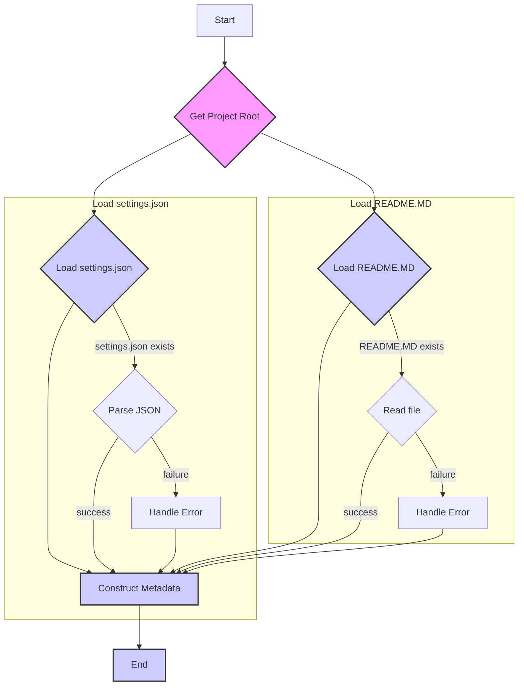

# Code Explanation for hypotez/src/suppliers/header.py

## <input code>

```python
## \file hypotez/src/suppliers/header.py
# -*- coding: utf-8 -*-\n#! venv/Scripts/python.exe
#! venv/bin/python/python3.12

"""
.. module: src.suppliers.header 
	:platform: Windows, Unix
	:synopsis:

"""
MODE = 'dev'

import sys
import json
from packaging.version import Version

from pathlib import Path
def set_project_root(marker_files=('pyproject.toml', 'requirements.txt', '.git')) -> Path:
    """
    Finds the root directory of the project starting from the current file's directory,
    searching upwards and stopping at the first directory containing any of the marker files.

    Args:
        marker_files (tuple): Filenames or directory names to identify the project root.
    
    Returns:
        Path: Path to the root directory if found, otherwise the directory where the script is located.
    """
    __root__:Path
    current_path:Path = Path(__file__).resolve().parent
    __root__ = current_path
    for parent in [current_path] + list(current_path.parents):
        if any((parent / marker).exists() for marker in marker_files):
            __root__ = parent
            break
    if __root__ not in sys.path:
        sys.path.insert(0, str(__root__))
    return __root__


# Get the root directory of the project
__root__ = set_project_root()
"""__root__ (Path): Path to the root directory of the project"""

from src import gs

settings:dict = None
try:
    with open(gs.path.root / 'src' / 'settings.json', 'r') as settings_file:
        settings = json.load(settings_file)
except (FileNotFoundError, json.JSONDecodeError):
    ...

doc_str:str = None
try:
    with open(gs.path.root / 'src' / 'README.MD', 'r') as settings_file:
        doc_str = settings_file.read()
except (FileNotFoundError, json.JSONDecodeError):
    ...


__project_name__ = settings.get("project_name", 'hypotez') if settings  else 'hypotez'
__version__: str = settings.get("version", '')  if settings  else ''
__doc__: str = doc_str if doc_str else ''
__details__: str = ''
__author__: str = settings.get("author", '')  if settings else ''
__copyright__: str = settings.get("copyrihgnt", '')  if settings else ''
__cofee__: str = settings.get("cofee", "Treat the developer to a cup of coffee for boosting enthusiasm in development: https://boosty.to/hypo69")  if settings else "Treat the developer to a cup of coffee for boosting enthusiasm in development: https://boosty.to/hypo69"
```

## <algorithm>

```
[Start] --> [Get Project Root] --> [Load Settings] --> [Load README.md] --> [Construct Project Metadata] --> [End]

Example Data Flow:

- Input: File 'header.py'
- Get Project Root: Traverses up directories from 'header.py' to find a directory with 'pyproject.toml', 'requirements.txt' or '.git'. If found, append directory path to sys.path.  Example: project root might be '/Users/user/hypotez'
- Load Settings: Reads 'settings.json' in the project root. Example: 'settings.json' content: `{"project_name": "MyProject", "version": "1.0.0"}`
- Load README.MD: Reads the content of 'README.MD' in the project root. Example: `README.MD` content: "This is the project description"
- Construct Project Metadata: Extracts 'project_name', 'version', etc from the 'settings.json' if present, and uses defaults otherwise. Extracts `README.MD`'s content and populates the respective variables.

```

## <mermaid>



**Dependencies Analysis and Diagram Explanation:**

The diagram depicts the sequential steps involved in setting up project metadata.

- `import sys`: Used for manipulating the Python path.
- `import json`: For parsing the JSON data in `settings.json`.
- `from packaging.version import Version`: (Potentially) used for handling version numbers, though not directly used in this code snippet.
- `from pathlib import Path`: For working with file paths in a platform-independent way.
- `from src import gs`: Imports the `gs` module, likely containing functions or classes related to accessing the project's resources and structure.  This `gs` module is crucial in establishing the path to project files and requires a parent `src` package to be in the `sys.path`.


## <explanation>

### Imports:

- `sys`: Used to modify the Python path to include the project root directory. This is crucial for finding modules in the project structure.
- `json`: Used for loading and decoding the data from `settings.json`.
- `packaging.version`: Used for version handling, though in this specific snippet it's not used.
- `pathlib`: Used for a platform-independent way of manipulating file paths.  This is better practice than using string-based manipulation when working with file paths.
- `src.gs`: This import is crucial for accessing resources within the project. It likely contains functions to find the project root directory (`gs.path.root`) and other paths. This strongly indicates a modular structure within the project and a centralized module for managing project resources.

### Classes:

There are no classes defined in this code.

### Functions:

- `set_project_root()`:  This function searches for the project root directory by checking if specific files (`pyproject.toml`, `requirements.txt`, `.git`) exist in parent directories.  If found, it appends the root path to `sys.path`.
    - **Args:** `marker_files`: A tuple of filenames/directory names used to locate the root.
    - **Return:** `Path`: The path to the project root directory.

### Variables:

- `MODE`: A string constant, probably representing a development mode (e.g., `dev`, `prod`).
- `settings`: A dictionary, used to store the project settings loaded from `settings.json`.
- `doc_str`: A string variable, stores the content of `README.MD`.
- `__root__`: A `Path` object representing the absolute path to the project root directory.  Crucially, this variable is used to construct paths to files related to project metadata, like the settings.
- `__project_name__`, `__version__`, `__doc__`, `__details__`, `__author__`, `__copyright__`, `__cofee__`:  These are read-only variables used to store metadata extracted from `settings.json` or defaults if not available. These constants are used for referencing project details without the need to look up the value each time.

### Potential Errors/Improvements:

- **Error Handling:** The `try...except` blocks for loading `settings.json` and `README.MD` are good, but the `...` is less informative than an explicit `print("Error loading file")`.  More detailed error messages would aid debugging.
- **Error Propagation**: The `...` in the exceptions does not provide any useful context for what went wrong. The functions that use this file should be made more robust by returning an error code or an exception rather than continuing execution. Consider using a structured logging mechanism to log errors.
- **`set_project_root` improvements:** The function could potentially be made faster by using a more efficient algorithm.  Searching parent directories can be costly if the project is deeply nested.


### Relationship with Other Project Parts:

This file is likely part of an overarching project structure. The import of `gs` (which is heavily implied by its usage) indicates a strong dependency on a module for managing the project's fundamental resources (paths, etc.).


```