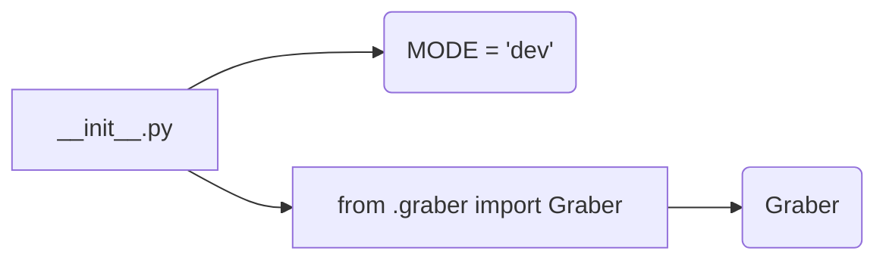

# <input code>

```python
## \file hypotez/src/suppliers/ksp/__init__.py
# -*- coding: utf-8 -*-
#! venv/Scripts/python.exe
#! venv/bin/python/python3.12

"""
.. module: src.suppliers.ksp 
	:platform: Windows, Unix
	:synopsis:

"""
MODE = 'dev'

from .graber import Graber
```

# <algorithm>

The code is an initialization file for a module named `ksp` within the `suppliers` package.  It primarily imports a class `Graber` from a submodule named `graber`.

There's no significant algorithm flow within this file itself, as it's merely setting up imports.  The workflow involves the Python interpreter recognizing and importing the `Graber` class to make it accessible for use in other parts of the project.

* **Step 1:** The Python interpreter encounters the `__init__.py` file.
* **Step 2:** The interpreter processes the docstring, which provides metadata about the module.
* **Step 3:** The `from .graber import Graber` statement imports the `Graber` class from the `graber.py` file located within the same directory.
* **Step 4:** The `MODE = 'dev'` assignment sets a variable named `MODE` to the string `'dev'`. This variable will likely be used to control different settings within the program for different modes (e.g., development, production).


# <mermaid>



**Dependencies Analysis:**

* The diagram shows a single dependency: `graber.py` which is imported in the `__init__.py` file.  This `graber.py` file is within the same directory (`src/suppliers/ksp`).   The `.graber` part in the import statement specifies the relative path.


# <explanation>

* **Imports:** The `from .graber import Graber` statement imports the `Graber` class from the file `graber.py` located in the same directory. This is a standard Python import mechanism for modules within the same package.  The `.` (dot) in the path indicates a relative import, making the import more organized and self-contained within the `ksp` module.

* **Classes:** The `Graber` class is declared and defined in `graber.py`. Its role (not shown in this `__init__.py` file) will be to handle interactions with the specific data source (presumably a source called 'ksp').

* **Functions:** This file does not define any functions.

* **Variables:** `MODE = 'dev'` is a global variable. This variable is likely used as a configuration setting.  Setting this value is common practice for projects that have different operational modes, like development, testing, and production.


* **Potential Errors/Improvements:** There are no apparent errors.  Potential improvements might include including more detailed docstrings for the imported `Graber` class within `graber.py` to explain its purpose, parameters, return values, and usage examples more clearly.


**Chain of Relationships:**

This `__init__.py` file forms part of the `ksp` module within the `suppliers` package.  It relies on the `graber.py` file for the `Graber` class. Other parts of the project might use the `Graber` class (e.g., parts of the core application logic, or some tests), establishing a chain of relationships between the various parts of the project.