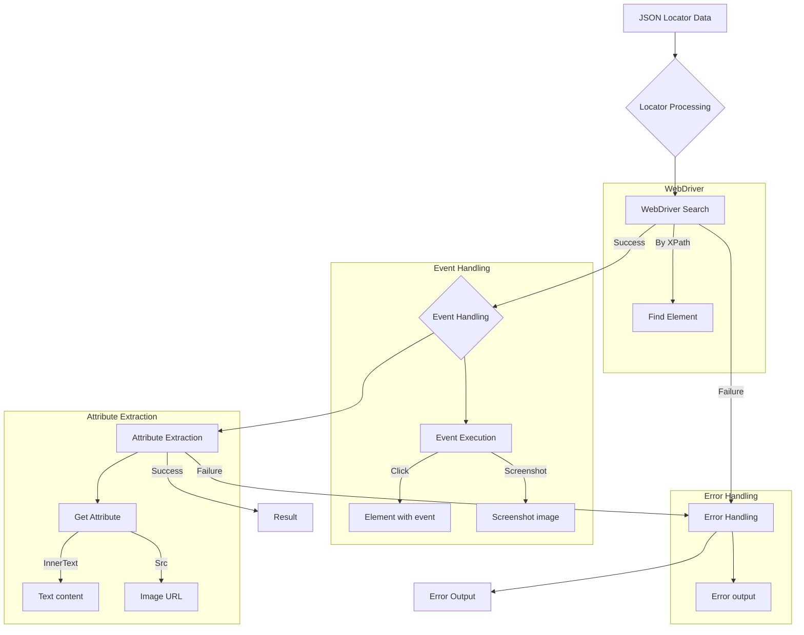

# Локаторы полей на `HTML`-странице

### Пример локатора:

```json
"close_banner": {
    "attribute": null,
    "by": "XPATH",
    "selector": "//button[@id = 'closeXButton']",
    "if_list": "first",
    "use_mouse": false,
    "mandatory": false,
    "event": "click()",
    "locator_description": "Закрываю pop-up окно. Если оно не появилось — не страшно (`mandatory`: `false`)."\n  },
  "additional_images_urls": {
    "attribute": "src",
    "by": "XPATH",
    "selector": "//ol[contains(@class, 'flex-control-thumbs')]//img",
    "if_list": "all",
    "use_mouse": false,
    "mandatory": false,
    "event": null,
    "locator_description": "Получает список `url` дополнительных изображений."\n  },
  "id_supplier": {
    "attribute": "innerText",
    "by": "XPATH",
    "selector": "//span[@class = 'ltr sku-copy']",
    "if_list": "first",
    "use_mouse": false,
    "mandatory": true,
    "event": null,
    "locator_description": "SKU Morlevi."\n  },
  "default_image_url": {
    "attribute": null,
    "by": "XPATH",
    "selector": "//a[@id = 'mainpic']//img",
    "if_list": "first",
    "use_mouse": false,
    "event": "screenshot()",
    "mandatory": true,
    "locator_description": "Внимание! В Morlevi картинка получается через screenshot и возвращается как PNG (`bytes`)."\n  }
```

### <algorithm>

**Шаг 1:** Получение локатора из конфигурационного файла (JSON).
* **Вход:** JSON-строка с локаторами.
* **Выход:** Словарь с локаторами.
* **Пример:** `"close_banner": {"attribute": null, ...}`

**Шаг 2:** Обработка локатора.
* **Вход:** Словарь с локатором.
* **Выход:** Найденный элемент (или список элементов) и информация об ошибке.
* **Пример:** WebDriver использует `by` и `selector`, чтобы найти веб-элемент по XPath.
*   **Обработка списка элементов:** если `if_list` = "first" возвращается первый элемент, если `if_list` = "all" - все элементы.

**Шаг 3:** Выполнение события (если указано).
* **Вход:** Найденный элемент и значение `event` из локатора.
* **Выход:** Результат выполнения события (например, элемент после нажатия кнопки).
* **Пример:** `event = "click()"` - нажимается кнопка, `event = "screenshot()"` - делается скриншот.
*  **Обработка событий со списками:** если `event` имеет тип списка, события выполняются для каждого элемента списка.

**Шаг 4:** Получение атрибута (если указан).
* **Вход:** Результат шага 2 (элемент или список элементов) и значение `attribute` из локатора.
* **Выход:** Значение атрибута.
* **Пример:** `attribute = "innerText"` - возвращает текст элемента, `attribute = "src"` - возвращает URL изображения.


### <mermaid>



**Dependencies Analysis**:

The diagram relies on `WebDriver`'s functions (`find_element`, `click()`, etc.).   The specific implementation of `WebDriver` (e.g., Selenium, Playwright) would have a strong influence on the underlying API calls. There is no direct import statement shown in the code snippet.  The analysis assumes that the necessary WebDriver library (likely Selenium) is properly imported in the calling code. The relationship with other project parts is indirect via the `ProductFields` class, which implies a project structure that involves objects related to product data.


### <explanation>

**Imports:**

The code itself does not contain any `import` statements.  The explanation assumes `WebDriver` (likely Selenium) is imported and available in the calling code.


**Classes:**

No classes are directly defined in the provided code.  The key concept is the use of a `ProductFields` class (mentioned in the docstrings), which likely defines the structure and properties for different product attributes. This `ProductFields` class is crucial for associating the locator information with the product fields.

**Functions:**

No functions are defined within this snippet.  The logic for processing the locator data is assumed to be defined elsewhere in the project, using the data contained in the locator JSON files.

**Variables:**

The variables are data structures. The important variables are the JSON data defining the locators and the result of the element lookup and attribute extraction.  The variables are represented by the JSON objects and data structures.

**Potential Errors/Improvements:**

* **Error Handling:** The code lacks explicit error handling. If an element is not found or the locator is malformed, the WebDriver call will likely throw an exception, and the calling code should handle such errors gracefully (e.g., with `try-catch` blocks).  It is crucial to prevent the entire application from crashing if a specific locator fails.

* **Robustness:**  The `if_list` parameter accepts a flexible range of values including lists and strings. Thorough testing with various valid and invalid cases is necessary to ensure robustness and avoid unexpected behavior. The code should be enhanced to handle potential errors and edge cases in the locator data (e.g., incorrect `selector` syntax).

* **Type Safety (Enhancement):** Consider using a strongly typed language to define the locator data structure in a way that makes validation and error detection easier during development. Using a proper data validation framework will prevent mismatched types and unexpected errors.

* **Code Organization:** The JSON format for locators is reasonably well-structured, but separating the locator data from the code that uses it into dedicated configuration files would be a good practice for organization and extensibility.


**Relationships:**

The relationship is primarily through the `ProductFields` class.  The locator data defines how to interact with specific fields of a product (and how to access them from HTML pages).  Other parts of the project (likely related to product processing or UI testing) would use the `ProductFields` class and associated locator data to interact with the web application.
```