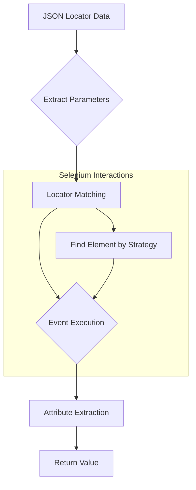

# Code Explanation: Locator Configuration for Web Elements

## <input code>

```
# Локаторы полей на `HTML`-странице

### Пример локатора:
```json
"close_banner": {
    "attribute": null, 
    "by": "XPATH",
    "selector": "//button[@id = 'closeXButton']",
    "if_list": "first",
    "use_mouse": false,
    "mandatory": false,
    "event": "click()",
    "locator_description": "Закрываю pop-up окно. Если оно не появилось — не страшно (`mandatory`: `false`)."
  },
  "additional_images_urls": {
    "attribute": "src",
    "by": "XPATH",
    "selector": "//ol[contains(@class, 'flex-control-thumbs')]//img",
    "if_list": "all",
    "use_mouse": false,
    "mandatory": false,
    "event": null,
    "locator_description": "Получает список `url` дополнительных изображений."
  },
  "id_supplier": {
    "attribute": "innerText",
    "by": "XPATH",
    "selector": "//span[@class = 'ltr sku-copy']",
    "if_list": "first",
    "use_mouse": false,
    "mandatory": true,
    "event": null,
    "locator_description": "SKU Morlevi."
  },
  "default_image_url": {
    "attribute": null,
    "by": "XPATH",
    "selector": "//a[@id = 'mainpic']//img",
    "if_list": "first",
    "use_mouse": false,
    "event": "screenshot()",
    "mandatory": true,
    "locator_description": "Внимание! В Morlevi картинка получается через screenshot и возвращается как PNG (`bytes`)."
  }
```

### Детали:
... (rest of the original code)
```


## <algorithm>

The algorithm defines a configuration for locating and interacting with web elements on an HTML page.  It uses a structured JSON format.

**Step 1:** Define a locator.
    * Input: JSON object specifying locator details.
    * Output: None (but stores locator for use).

**Step 2:** Extract parameters.
    * Input: JSON locator object.
    * Output:  Parameters: attribute, by, selector, if_list, use_mouse, mandatory, event, locator_description.
    * Example: For `close_banner` locator, `attribute` = `null`, `by` = `XPATH`, `selector` = `"//button[@id = 'closeXButton']"`

**Step 3:** Determine the method for locating the element.
   * Input: `by` parameter.
   * Output: Corresponding Selenium `By` method (e.g., `By.XPATH`).
   * Example: `by` = `XPATH` -> `By.XPATH`

**Step 4:** Use the locator to find the web element.
   * Input: `selector`, `if_list`, `by`.
   * Output: Matching `WebElement`.
   * Example: Using the XPath `"//button[@id = 'closeXButton']"`, retrieves the corresponding button element.

**Step 5:** Perform an event action if defined.
   * Input: `event` parameter.
   * Output: None. WebDriver executes the action.
   * Example: `event = "click()"` -> WebDriver clicks the element.

**Step 6:** Extract the attribute value.
   * Input: `attribute`, `WebElement`.
   * Output: Requested attribute value or the `WebElement` itself.
   * Example: `attribute = "innerText"` -> Retrieves the text content of the element.  `attribute = null` -> Returns the `WebElement` object.


## <mermaid>



**Dependencies (implied):**

* `selenium` library (or any similar WebDriver library) is implicitly needed to perform the `find` operation and `event` execution.
* `json` (or equivalent) handling to parse the configuration data.


## <explanation>

**Imports:**

No explicit import statements are shown. However, the code relies on a library (likely Selenium) to interact with web elements.  Import of a suitable Python package (e.g., `selenium.webdriver`) would be necessary.  This is implied, crucial for the element retrieval, interaction, and attribute extraction.  Further dependencies on `json` processing are needed.


**Classes:**

There are no classes defined in the provided configuration. The data is presented in a structured JSON format.  The code describes the use of the `ProductFields` class (referenced in documentation) which likely handles the use of these locator specifications.

**Functions:**

This code defines a structure and data for locator configuration.  There are no functions to execute within the JSON structure itself. Selenium WebDriver functions are used but not explicitly coded here.


**Variables:**

The JSON data is the primary variable.  Variables like `attribute`, `by`, `selector`, etc., are used as key-value pairs within the JSON objects and represent the configuration for each locator.

**Potential Errors/Improvements:**

1. **Error Handling:**  Missing error handling in this configuration to deal with missing or invalid web elements. The "mandatory" field is a good step toward this; however, robust error checks and exception handling for cases where an element cannot be found are important to ensure the script's stability.
2. **Flexibility:** The `if_list` parameter allows for selecting specific elements from a list, which can become complex with multiple, arbitrarily defined conditions.  This complexity may need clear error conditions or clearer use cases.


**Relationships with Other Parts of the Project:**

This JSON configuration is part of the `src/suppliers/locator.ru.md` file and likely interacts with the `ProductFields` class within the `src/product/product_fields` package to implement the actual element interactions during a test or automation process.  This suggests the configuration is used by a script to build appropriate locator specifications for interactions.