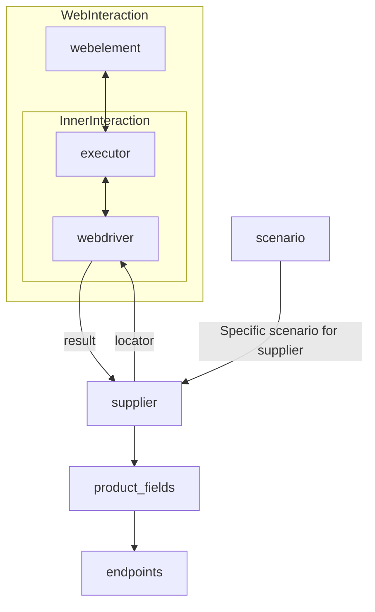

# Supplier Class Analysis

## <input code>

```[Русский](https://github.com/hypo69/hypo/blob/master/README.RU.MD)
# **Class** `Supplier`
### **Base class for all suppliers**
*In the context of the code, `Supplier` represents an information provider.  
A supplier can be a producer of goods, data, or information.  
The supplier's sources include a website's landing page, a document, a database, or a table.  
This class unifies different suppliers under a standardized set of operations.  
Each supplier has a unique prefix. ([Details on prefixes](prefixes.md))*  

The `Supplier` class serves as the foundation for managing interactions with suppliers.  
It handles initialization, configuration, authentication, and execution of workflows for various data sources, such as `amazon.com`, `walmart.com`, `mouser.com`, and `digikey.com`. Clients can also define additional suppliers.  

---

## List of implemented suppliers:

[aliexpress](aliexpress)  - Implemented with two workflows: `webdriver` and `api`  
[amazon](amazon) - `webdriver`  
[bangood](bangood)  - `webdriver`  
[cdata](cdata)  - `webdriver`  
[chat_gpt](chat_gpt) - Interacts with the ChatGPT interface (NOT THE MODEL!)  
[ebay](ebay)  - `webdriver`  
[etzmaleh](etzmaleh)  - `webdriver`  
[gearbest](gearbest)  - `webdriver`  
[grandadvance](grandadvance)  - `webdriver`  
[hb](hb)  - `webdriver`  
[ivory](ivory) - `webdriver`  
[ksp](ksp) - `webdriver`  
[kualastyle](kualastyle) `webdriver`  
[morlevi](morlevi) `webdriver`  
[visualdg](visualdg) `webdriver`  
[wallashop](wallashop) `webdriver`  
[wallmart](wallmart) `webdriver`  

[Details on WebDriver :class: `Driver`](../webdriver)  
[Details on workflows :class: `Scenario`](../scenarios)

---

## <algorithm>

The `Supplier` class manages interactions with various online stores (suppliers).

**1. Initialization (`__init__`):**  Sets up the supplier's prefix, localization, and webdriver type.
   * Example: `supplier = Supplier(supplier_prefix='aliexpress', locale='en', webdriver='chrome')`

**2. Loading Settings and Initializing WebDriver (`_payload`):** Loads settings, locators (for web elements), and initiates the webdriver instance.
   * Example: `supplier._payload(webdriver='firefox')`

**3. Authentication (`login`):** Logs in to the supplier's website.
   * Example: `supplier.login()`

**4. Executing Scenarios (`run_scenario_files`, `run_scenarios`):** Executes predefined actions (scenarios) to extract data.
    *   Example: `supplier.run_scenario_files(['example_scenario.json'])`  or  `supplier.run_scenarios([{'action': 'scrape', 'target': 'product_list'}])`

The data flows between these methods are not explicitly shown in the provided diagram but implicit. The `webdriver` is used to interact with the supplier's website, resulting in data obtained and stored using `product_fields` and `endpoints`. This data is then processed using `supplier` logic according to the defined `scenario`.


## <mermaid>

```mermaid
graph TD
    subgraph Supplier Management
        Supplier --> _init_  
        _init_ --> _payload_
        _payload_ --> login
        login --> run_scenario_files
        run_scenario_files --> run_scenarios
        run_scenarios -->|Results| Data Processing
    end
    subgraph Web Interaction
        Supplier --> webdriver
        webdriver --> webelement
        webelement --> executor
        executor --> webdriver
    end
    webdriver -->|Result| Supplier
    Supplier --> product_fields
    product_fields --> endpoints
    subgraph Scenario
        scenario --> Supplier
    end

```


## <explanation>

**Imports:**

The code snippet doesn't show any import statements.  The provided `mermaid` graph assumes the existence of classes like `Driver`, `Scenario`, `product_fields`, `endpoints`, and `executor` imported from other parts of the project (`../webdriver`, `../scenarios`).

**Classes:**

*   **Supplier:** This is the central class for interacting with suppliers. It defines methods for initialization, loading settings, authentication, and executing scenarios.

**Functions:**

*   **`__init__`:** Initializes a `Supplier` object. Takes `supplier_prefix`, `locale`, and `webdriver` as arguments.
*   **`_payload`:** Loads supplier settings and initializes the WebDriver.
*   **`login`:** Handles authentication on the supplier's website.
*   **`run_scenario_files`:** Executes scenarios specified in files.
*   **`run_scenarios`:** Executes predefined scenarios in a dictionary format.

**Attributes:**

The `Supplier` class has various attributes, including `supplier_id`, `supplier_prefix`, `supplier_settings`, and `driver` (the webdriver instance) for accessing and manipulating data and for controlling interactions with the respective supplier.

**Potential Errors/Improvements:**

*   **Error Handling:** The code lacks robust error handling.  For example, if loading settings fails, or if authentication fails, the program might crash. Implementing `try...except` blocks would improve reliability.
*   **Explicit Dependencies:** While the code defines the expected interaction, the diagram should clarify where data is coming from and where it's going.

**Relationships with Other Parts:**

The `Supplier` class depends on the `Driver` (for web interaction) and `Scenario` (for defining and executing the actions/operations) classes. The `Supplier` class interacts with the web page (indicated by the `webelement` node) to extract information.   The details of those dependencies and how they are implemented are not given. This `Supplier` class is likely a part of a larger system that orchestrates data scraping from various e-commerce websites to collect relevant product information.