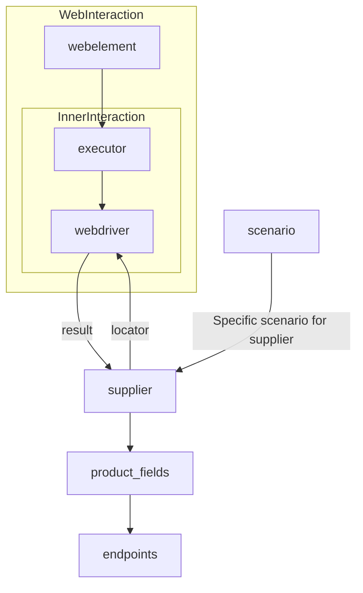
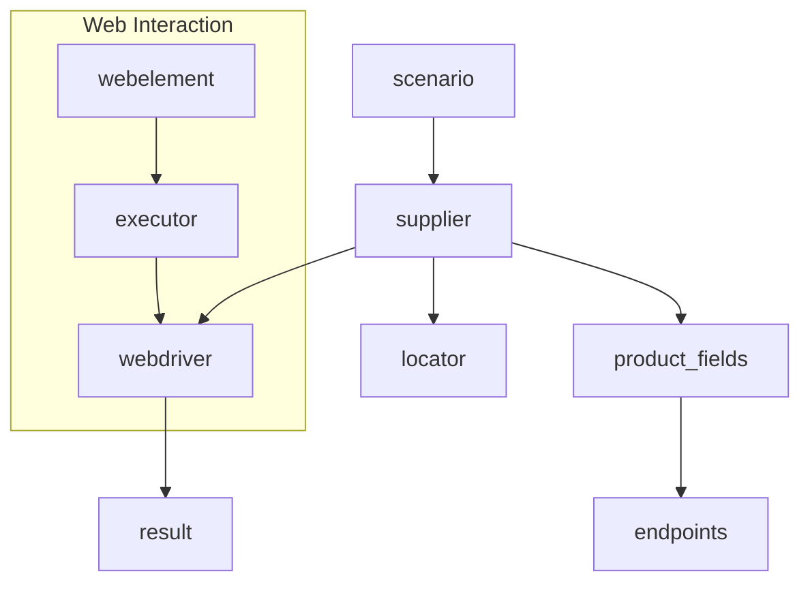

# Code Explanation: Supplier Class

## <input code>

```
# **Класс** `Supplier`
### **Базовый класс для всех поставщиков**
*В контексте кода `Supplier` - поставщик информации.
Поставщиком может быть производитель какого-либо тавара, данных или информации
Источники потавщика - целевая страница сайта, документ, база данных, таблица.
Класс сводит разных поставщиков к одинаковому алгоритму действий внутри класса.
У каждого поставщика есть свой уникальный префикс. ([подробно о префиксах](prefixes.md))*


Класс `Supplier` служит основой для управления взаимодействиями с поставщиками. 
Он выполняет инициализацию, настройку, аутентификацию и запуск сценариев для различных источников данных, таких как `amazon.com`, `walmart.com`, `mouser.com` и `digikey.com`. Клиент может определить дополнительные поставщики.


---
## Список реализованныx поставщиков:

[aliexpress](aliexpress/README.RU.MD)  - Реализован в двух варианах сценариев: `webriver` и `api` 

[amazon](amazon/README.RU.MD) - `webdriver` 

[bangood](bangood/README.RU.MD)  - `webdriver` 

[cdata](cdata/README.RU.MD)  - `webdriver` 

[chat_gpt](chat_gpt/README.RU.MD)  - Работа с чатом chatgpt (НЕ С МОДЕЛЬЮ!) 

[ebay](ebay/README.RU.MD)  - `webdriver` 

[etzmaleh](etzmaleh/README.RU.MD)  - `webdriver` 

[gearbest](gearbest/README.RU.MD)  - `webdriver` 

[grandadvance](grandadvance/README.RU.MD)  - `webdriver` 

[hb](hb/README.RU.MD)  - `webdriver` 

[ivory](ivory/README.RU.MD) - `webdriver` 

[ksp](ksp/README.RU.MD) - `webdriver`

[kualastyle](kualastyle/README.RU.MD) `webdriver` 

[morlevi](morlevi/README.RU.MD) `webdriver` 

[visualdg](visualdg/README.RU.MD) `webdriver` 

[wallashop](wallashop/README.RU.MD) `webdriver`  

[wallmart](wallmart/README.RU.MD) `webdriver` 

[подробно о вебдрайвере :class: `Driver`](../webdriver/README.RU.MD)    
[подробно о сценариях :class: `Scenario`](../scenarios/README.RU.MD)
---

## <algorithm>

The `Supplier` class manages interactions with data providers.  The workflow involves:

1. **Initialization (`__init__`):**  Sets up the supplier's properties (prefix, locale, webdriver type).  
    * Example: `supplier = Supplier(supplier_prefix='aliexpress', locale='en', webdriver='chrome')`

2. **Data Loading (`_payload`):** Loads configuration, locators, and initializes the WebDriver.
    * Example: `supplier._payload(webdriver='firefox')`

3. **Authentication (`login`):**  Handles the login process on the provider's website.
    * Example: `supplier.login()`

4. **Scenario Execution (`run_scenario_files`, `run_scenarios`):** Executes predefined scenarios to extract data.
    * Example (Scenario Files): `supplier.run_scenario_files(['example_scenario.json'])`
    * Example (Specific Scenarios): `supplier.run_scenarios([{'action': 'scrape', 'target': 'product_list'}])`

The data flows from the `scenario` files/dictionaries to the `supplier` class, which uses the `webdriver` to interact with the targeted websites, extracts the required data, and returns it.


## <mermaid>



**Dependencies:**

*   The diagram shows a relationship between `webelement`, `executor`, `webdriver`, and `supplier` within the web interaction subgraph.
*   The `supplier` interacts with `webdriver` to fetch data, and this interaction is dependent on the `locator` information provided.
*  `scenarios` and `product_fields/endpoints` are likely other components in the project, possibly defined elsewhere.


## <explanation>

**Imports:**

There are no explicit import statements in the provided code snippet.  However, the references to `Driver`, `Scenario`, and other files like `prefixes.md` and the numerous README files suggest the code is part of a larger project with modules for web drivers, scenarios, and supplier-specific configurations.

**Classes:**

*   **`Supplier`:**  Acts as an abstract base class for interacting with various data sources (e.g., e-commerce sites). It handles initialization, authentication, and scenario execution.
    *   Attributes: `supplier_id`, `supplier_prefix`, `supplier_settings`, `locale`, `price_rule`, `related_modules`, `scenario_files`, `current_scenario`, `login_data`, `locators`, `driver`, `parsing_method`. These are crucial to managing supplier-specific data and actions.
    *   Methods: `__init__` (Initialization), `_payload` (Loading configuration and WebDriver), `login` (Authentication), `run_scenario_files` (Running scenario files), `run_scenarios` (Running specific scenarios).  These methods represent the different stages of the data retrieval process.

**Functions:**

*   `__init__`: Takes the `supplier_prefix`, `locale`, and `webdriver` as arguments.
*   `_payload`: Loads settings, locators, and initializes the WebDriver. Returns `True` on success.
*   `login`: Handles login to the supplier website. Returns `True` on successful login.
*   `run_scenario_files`, `run_scenarios`: Execute pre-defined scenarios to extract data. Return `True` on successful scenario execution.


**Variables:**

Variables are defined within the methods and represent the data required by the functions.

**Potential Errors and Improvements:**

* **Error Handling:** The code should include more robust error handling (e.g., `try...except` blocks) for issues like incorrect configurations, network problems, or failed login attempts.
* **Clearer Data Structure:** Using more descriptive data structures (classes) for scenario files (instead of just strings or lists) could improve maintainability.
* **Logging:** Implementing logging mechanisms to track the progress of data retrieval and potential errors would be helpful for debugging and monitoring.


**Relationships:**

The `Supplier` class relies on other components (like WebDriver, scenario files, and other modules):

*   **`Driver`:**  This module presumably provides the actual implementation for web interactions.
*   **`Scenario`:**  These files likely contain instructions for extracting data in a structured way.


The structure suggests a framework for automating data collection from various e-commerce websites.  The `prefixes.md` and specific supplier READMEs likely contain detailed configuration information for each source.