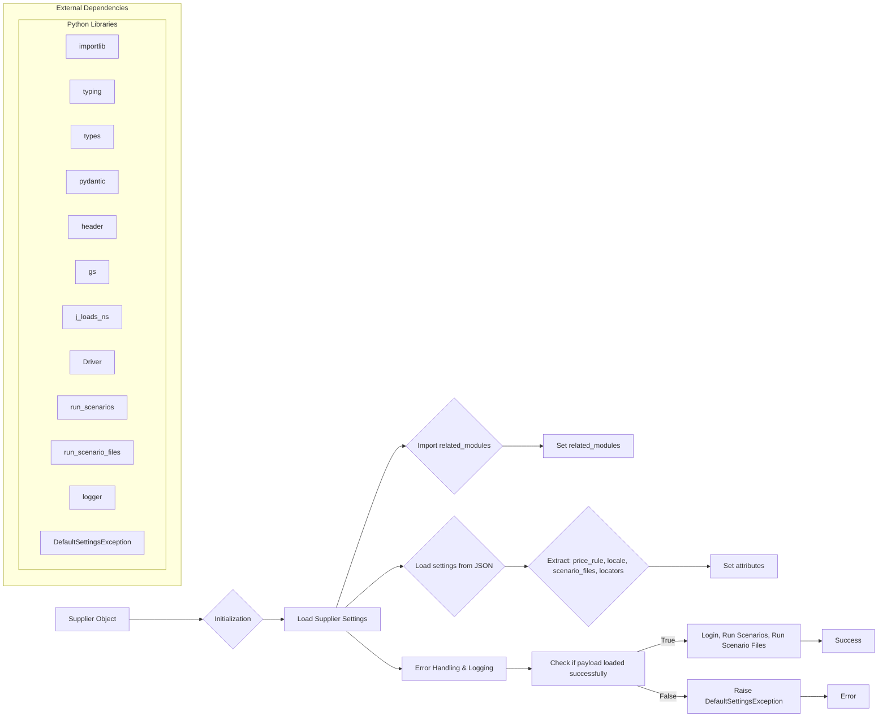

# Analysis of hypotez/src/suppliers/supplier.py

## <input code>

```python
## \file hypotez/src/suppliers/supplier.py
# -*- coding: utf-8 -*-
#! venv/Scripts/python.exe
#! venv/bin/python/python3.12

"""
.. module: src.suppliers.supplier 
	:platform: Windows, Unix
	:synopsis: Base class for suppliers

"""
MODE = 'dev'


import importlib
from typing import List, Optional, Dict, Any
from types import ModuleType, SimpleNamespace

from pydantic import BaseModel, Field, validator
import header
from src import gs
from src.utils.jjson import j_loads_ns
from src.webdriver.driver import Driver
from src.scenario import run_scenarios, run_scenario_files
from src.logger import logger
from src.logger.exceptions import DefaultSettingsException


class Supplier(BaseModel):
    """Класс Supplier. Выполняет сценарии для различных поставщиков.

    Атрибуты:
        supplier_id (Optional[int]): Идентификатор поставщика.
        supplier_prefix (str): Префикс поставщика.
        locale (str): Код локали в формате ISO 639-1.
        price_rule (Optional[str]): Правило расчета цен.
        related_modules (Optional[ModuleType]): Функции, относящиеся к каждому поставщику.
        scenario_files (List[str]): Список файлов сценариев для выполнения.
        current_scenario (Dict[str, Any]): Текущий исполняемый сценарий.
        locators (Dict[str, Any]): Локаторы для элементов страницы.
        driver (Optional[Driver]): Веб-драйвер.
    """

    # ... (rest of the code)
```

## <algorithm>

**Step 1: Initialization**

*   The `Supplier` class is initialized with various parameters.
*   Data validation is performed.
*   `_payload()` function is called to load supplier settings.

**Step 2: Loading Supplier Settings**

*   Imports the `related_modules` based on `supplier_prefix`.
*   Determines the `settings_path` for the specific supplier.
*   Loads the settings from the JSON file using `j_loads_ns`.
*   Extracts `price_rule`, `locale`, `scenario_files`, and `locators` from the settings.

**Step 3: Setting Attributes**

*   Sets `price_rule`, `locale`, `scenario_files`, and `locators` as attributes of the `Supplier` object.
*   Sets `related_modules` to the imported module.

**Step 4: Error Handling and Logging**

*   Error handling using `try-except` blocks for `importlib.import_module` and `j_loads_ns`.
*   Logs errors and success messages throughout the process.


## <mermaid>




## <explanation>

**Imports:**

*   `importlib`: Used to dynamically import modules at runtime, crucial for loading supplier-specific modules.
*   `typing`: Provides type hints for better code clarity and maintainability.
*   `types`:  Provides type information for various Python types.
*   `pydantic`: Used for data validation and model creation.  `BaseModel` is used to structure data and enforce data types.
*   `header`: Likely a custom module; this needs context from other files.
*   `gs`: Likely a custom module related to file paths and resources.
*   `j_loads_ns`: Custom function for loading JSON data into a namespace object, likely from `src.utils.jjson` providing cleaner handling of JSON values.
*   `Driver`: Implies a custom class from `src.webdriver.driver` for web driver interaction.
*   `run_scenarios`, `run_scenario_files`: Functions from `src.scenario` for executing test scenarios.
*   `logger`, `DefaultSettingsException`: Part of the logging system in the `src.logger` package, used for handling exceptions and logging information.


**Classes:**

*   `Supplier`:  The base class for different suppliers. It encapsulates supplier-specific data (like `supplier_prefix`, `locale`, settings) and methods (like `login`, `run_scenario_files`, and `run_scenarios`) to manage their execution. `BaseModel` from Pydantic provides data validation, making it less prone to errors.


**Functions:**

*   `_payload()`: Loads the configuration for the specified supplier from a JSON file. It returns `True` if the loading is successful and `False` otherwise, handling potential errors gracefully.
*   `login()`:  Executes the login process for a particular supplier.
*   `run_scenario_files()`, `run_scenarios()`: Call external functions for running test scenarios.


**Variables:**

*   `MODE`: A string variable defining the current mode (likely 'dev' or 'prod').
*   `supplier_prefix`: The identifier used for the specific supplier, crucial for importing the correct supplier module.


**Potential Errors and Improvements:**

*   Error handling could be improved by providing more specific error messages for various failures during setting loading.
*   Consider using a dedicated configuration loader (like `configparser` or similar tools) instead of hard-coding JSON loading for different supplier settings.
*   Clearer exception handling for the `_payload` method, returning informative messages or better exception context.
*   Adding unit tests for the `Supplier` class will help catch issues early in the development cycle and improve overall maintainability.


**Relationships with other parts of the project:**

*   `Supplier` depends on `src.scenario` (for scenario execution), `src.webdriver.driver` (for web driver operations), `src.utils.jjson` (for handling JSON), `src.logger` (for logging), and likely other `src` packages based on the imports.  This suggests a well-structured architecture with separated concerns.


**Summary:**

The code defines a reusable base class (`Supplier`) for managing and executing scenarios against various suppliers. It utilizes a modular approach by dynamically importing supplier-specific modules, loading configuration from JSON files, and calling functions for actions like login and scenario execution.  The use of `pydantic` improves the structure and robustness of the class.