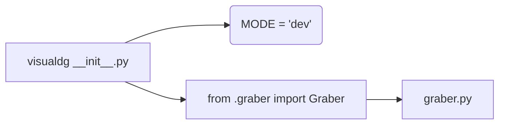

# <input code>

```python
## \file hypotez/src/suppliers/visualdg/__init__.py
# -*- coding: utf-8 -*-
#! venv/Scripts/python.exe
#! venv/bin/python/python3.12

"""
.. module: src.suppliers.visualdg 
	:platform: Windows, Unix
	:synopsis:

"""
MODE = 'dev'

from .graber import Graber
```

# <algorithm>

The code initializes a module `visualdg` within the `suppliers` package.

**Step 1: Module Initialization**

- The module sets a global variable `MODE` to the string 'dev'. This likely controls runtime behavior.

**Step 2: Importing `Graber`**

- The code imports the `Graber` class from the `graber.py` file located in the same directory (`./graber`).

This is a very basic initialization.  The actual functionality lies within the `graber.py` file, which is imported but not used directly here. This `__init__.py` file serves as a way to make the `graber` module accessible from the `visualdg` package.


# <mermaid>



**Dependencies Analysis:**

The mermaid graph shows that `visualdg/__init__.py` imports `graber.py`.  This creates a dependency relationship where `visualdg` relies on `graber` for its functionality.

# <explanation>

**Imports:**

- `from .graber import Graber`: This line imports the `Graber` class from the `graber.py` file within the same directory. The `.` in front of `graber` indicates a relative import, meaning the file is expected to be in the same package.  This is a standard Python import method.  The import implies that the `visualdg` package needs the `Graber` class's functionality.

**Variables:**

- `MODE = 'dev'`: This global variable is likely used for conditional logic within the package's modules, especially useful for distinguishing development ("dev") from production ("prod") modes.

**Classes (Implied):**

- `Graber`: This class is defined in `graber.py` (which is assumed but not shown in this file). Its functionality is not detailed here, but the import indicates its importance to the `visualdg` package.


**Functions (Implied):**

- Methods within the `Graber` class.  We don't know what they do, but their presence is crucial to the `visualdg` module's behavior.

**Potential Errors or Improvements:**

- **Lack of documentation:**  While a docstring is provided, it could be more thorough, describing the purpose of the `MODE` variable, and any other logic expected to be present in the `visualdg` package.
- **Missing functionality description:**  The `graber.py` file is essential but not included; hence, its function and interaction with the external world remain undefined.  The `__init__.py` file is only setting up the environment, no actual work is done here.

**Relationships with Other Project Parts:**

The `visualdg` package likely interacts with other parts of the project through the `Graber` class, which would potentially fetch or process data. The `Graber` class could handle data from a specific data source relevant to the `hypotez` project.


**Overall:**

This `__init__.py` file is a simple but necessary piece of the `visualdg` package, acting as an import point for the essential `Graber` class defined elsewhere. The code structure implies a data processing pipeline, but details of the data and its sources are not available from this `__init__.py` file alone.