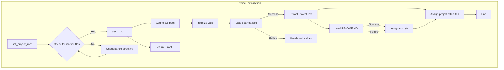

# Code Explanation for hypotez/src/suppliers/wallmart/header.py

## <input code>

```python
## \file hypotez/src/suppliers/wallmart/header.py
# -*- coding: utf-8 -*-\n#! venv/Scripts/python.exe
#! venv/bin/python/python3.12

"""
.. module: src.suppliers.wallmart 
	:platform: Windows, Unix
	:synopsis:

"""
MODE = 'dev'


import sys
import json
from packaging.version import Version

from pathlib import Path
def set_project_root(marker_files=('pyproject.toml', 'requirements.txt', '.git')) -> Path:
    """
    Finds the root directory of the project starting from the current file's directory,
    searching upwards and stopping at the first directory containing any of the marker files.

    Args:
        marker_files (tuple): Filenames or directory names to identify the project root.
    
    Returns:
        Path: Path to the root directory if found, otherwise the directory where the script is located.
    """
    __root__:Path
    current_path:Path = Path(__file__).resolve().parent
    __root__ = current_path
    for parent in [current_path] + list(current_path.parents):
        if any((parent / marker).exists() for marker in marker_files):
            __root__ = parent
            break
    if __root__ not in sys.path:
        sys.path.insert(0, str(__root__))
    return __root__


# Get the root directory of the project
__root__ = set_project_root()
"""__root__ (Path): Path to the root directory of the project"""

from src import gs

settings:dict = None
try:
    with open(gs.path.root / 'src' / 'settings.json', 'r') as settings_file:
        settings = json.load(settings_file)
except (FileNotFoundError, json.JSONDecodeError):
    ...

doc_str:str = None
try:
    with open(gs.path.root / 'src' / 'README.MD', 'r') as settings_file:
        doc_str = settings_file.read()
except (FileNotFoundError, json.JSONDecodeError):
    ...


__project_name__ = settings.get("project_name", 'hypotez') if settings  else 'hypotez'
__version__: str = settings.get("version", '')  if settings  else ''
__doc__: str = doc_str if doc_str else ''
__details__: str = ''
__author__: str = settings.get("author", '')  if settings else ''
__copyright__: str = settings.get("copyrihgnt", '')  if settings else ''
__cofee__: str = settings.get("cofee", "Treat the developer to a cup of coffee for boosting enthusiasm in development: https://boosty.to/hypo69")  if settings else "Treat the developer to a cup of coffee for boosting enthusiasm in development: https://boosty.to/hypo69"
```

## <algorithm>

1. **`set_project_root` Function:**
   - Takes a tuple of marker file names as input.
   - Starts from the current file's directory.
   - Traverses up the directory hierarchy.
   - Checks if any of the marker files exist in the current directory.
   - If found, sets `__root__` to the current directory and breaks the loop.
   - Adds the project root to `sys.path`.
   - Returns the project root.

   ```
   Input: marker_files = ('pyproject.toml', 'requirements.txt', '.git')
   Output: Path object representing the root directory
   Example:
   set_project_root() -> /path/to/hypotez
   ```


2. **Initialization:**
    - Calls `set_project_root()` to get the project root and stores it in `__root__`.
    - Initializes empty variables for project settings.


3. **Loading Settings:**
    - Attempts to open `settings.json` file in the project's `src` folder.
    - If the file exists and is valid JSON, loads the contents into `settings`.
    - Handles `FileNotFoundError` and `json.JSONDecodeError` gracefully.


4. **Loading Documentation:**
    - Attempts to open `README.MD` file in the project's `src` folder.
    - If the file exists, reads the contents into `doc_str`.
    - Handles `FileNotFoundError` and `json.JSONDecodeError` gracefully.


5. **Retrieving Project Information:**
    - Extracts project name, version, and other details from the `settings` dictionary.
    - Fallback values are defined in case `settings` is `None` or a key is missing.

## <mermaid>



**Dependencies:**

- `sys`: Provides access to system-specific parameters and functions.
- `json`: For handling JSON data.
- `packaging.version`: For working with software versions.
- `pathlib`: For working with file paths in a more object-oriented way.
- `src.gs`: Likely a custom module providing path-related functions and access to the project root (`gs.path.root`).

## <explanation>

- **Imports:**
    - `sys`: Used to modify the Python path.
    - `json`: Used to parse the settings file.
    - `packaging.version`: Used for version handling (not directly used in this example).
    - `pathlib`: Provides `Path` objects for better file path manipulation.
    - `src.gs`:  This is a custom module within the project. It likely contains functions for working with file paths (e.g., getting the project root). The presence of `gs.path.root` indicates this module is responsible for providing a way to access the project root, simplifying file path references relative to the project root.  This is a common pattern for organizing code in larger projects.


- **Classes:**  There are no classes.

- **Functions:**
    - `set_project_root()`:  Crucial function for finding the project root directory. It's important for ensuring that modules in different subdirectories are found during import.  The `marker_files` parameter enables the script to discover the project root even when starting from a module within a package. This ensures that `sys.path` is set correctly.

- **Variables:**
    - `MODE`: A string variable holding the current mode (likely 'dev' or 'prod').
    - `__root__`: The path to the root directory of the project.
    - `settings`: A dictionary containing project settings loaded from `settings.json`.
    - `doc_str`: Contains the content of the README file.
    - `__project_name__`, `__version__`, `__doc__`, `__details__`, `__author__`, `__copyright__`, `__cofee__`:  Variables that store project metadata, extracted from the `settings` dictionary. The `get` method provides a way to handle cases where the key might be missing, preventing crashes. The use of defaults is a good defensive programming practice.

- **Potential Errors/Improvements:**
    - Error handling is present, but more specific error messages could be useful for debugging.
    - The use of `...` for exceptions handling is not the best practice; it might hide potential issues during development. Consider raising meaningful exceptions in such scenarios.
    - The `__cofee__` variable is somewhat unconventional.  Consider a more standard name for the project's coffee link.
    - The use of `__root__` as both a variable and as a docstring variable could be confusing.  Consider using a different naming convention for the variable storing the project root.

**Relationship Chain:**

This code's functionality relies on `src.gs` to locate the project root. Other parts of the project likely use the `__root__` variable to construct paths relative to the project root, thus allowing access to files and modules in other packages/directories within the project.  The structure implies a larger project using a well-defined directory structure to manage multiple suppliers and their respective configurations.
```