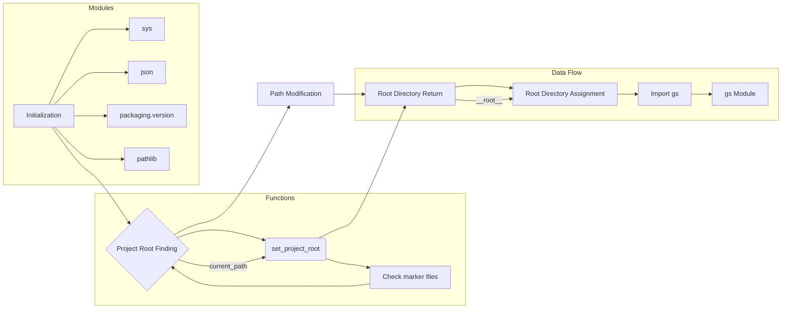

# <input code>

```python
## \file hypotez/src/templates/header.py
# -*- coding: utf-8 -*-\n#! venv/Scripts/python.exe
#! venv/bin/python/python3.12

"""
.. module: src.templates 
	:platform: Windows, Unix
	:synopsis:

"""

MODE = 'dev'


import sys
import json
from packaging.version import Version

from pathlib import Path
def set_project_root(marker_files=(\'pyproject.toml\', \'requirements.txt\', \'.git\')) -> Path:
    """
    Finds the root directory of the project starting from the current file's directory,
    searching upwards and stopping at the first directory containing any of the marker files.

    Args:
        marker_files (tuple): Filenames or directory names to identify the project root.
    
    Returns:
        Path: Path to the root directory if found, otherwise the directory where the script is located.
    """
    __root__:Path
    current_path:Path = Path(__file__).resolve().parent
    __root__ = current_path
    for parent in [current_path] + list(current_path.parents):
        if any((parent / marker).exists() for marker in marker_files):
            __root__ = parent
            break
    if __root__ not in sys.path:
        sys.path.insert(0, str(__root__))
    return __root__


# Get the root directory of the project
__root__ = set_project_root()
"""__root__ (Path): Path to the root directory of the project"""

from src import gs
```

# <algorithm>

**Algorithm Workflow**

1. **Initialization:**
   - The script begins by defining a constant `MODE` with the value `'dev'`.
   - It imports necessary modules: `sys`, `json`, `Version` (from `packaging`), and `Path` from `pathlib`.  
   - Example: sys.path = ['/usr/lib/python3.12', ...].
2. **Project Root Finding:**
   - `set_project_root` is a function that identifies the project's root directory.
   - It takes a tuple of marker files (`marker_files`) to search for.
   - It starts from the directory containing the current script (`__file__`).
   - It traverses upward through the parent directories.
   - For each parent, it checks if any of the marker files exist in that directory.
   - If found, it assigns the parent directory to `__root__` and breaks the loop.
   - Example: Marker files = ['pyproject.toml', 'requirements.txt']. A parent directory contains these files, so `__root__` is set to that parent.
3. **Path Modification (if needed):**
   - It checks if the determined root directory is already in `sys.path`.
   - If not, it prepend it to `sys.path`.
   - Example: The root directory is not present in sys.path. It is prepended.
4. **Root Directory Return:**
   - The function returns the path to the project root (`__root__`).
5. **Root Directory Assignment:**
   - The project root is stored in the variable `__root__`.
6. **Import `gs`:**
   - The script imports the `gs` module from the `src` package.


# <mermaid>



**Dependencies Analysis:**

- `sys`: Provides access to system-specific parameters and functions, crucial for manipulating the Python environment, like `sys.path`.
- `json`: Enables working with JSON data (though not directly used here).
- `packaging.version`: Used for handling software version information (likely used elsewhere in the project).
- `pathlib`: Provides a way to work with file paths in a more object-oriented fashion, simplifying path manipulation. This is heavily used in the `set_project_root` function.

# <explanation>

**Imports:**

- `sys`: Used to manipulate the Python path (`sys.path`).
- `json`: Likely used for handling JSON data in other parts of the project.
- `packaging.version`: Used for version handling, essential for dependencies and potentially version comparisons.
- `pathlib`: Provides a more object-oriented way of handling file paths.

**Classes:**

- No classes are defined in this file.

**Functions:**

- `set_project_root(marker_files=...)`:
    - **Purpose:** Locates the project root directory.
    - **Arguments:** `marker_files`: A tuple of filenames/directory names used to identify the project root. Defaults to a tuple of ('pyproject.toml', 'requirements.txt', '.git').
    - **Return Value:** A `Path` object representing the project root directory.
    - **Example:** `set_project_root()` will return the path to the parent directory containing the 'pyproject.toml' file if it exists within the current directory or its parent directories.


**Variables:**

- `MODE`: A constant string, likely used for determining different operating modes (development, production, etc.).
- `__root__`: A `Path` object storing the location of the project root.

**Potential Errors/Improvements:**

- **Error Handling:**  While the code handles the case where the root is not found, more robust error handling (e.g., raising an exception if no root is found after checking all necessary directories) could be added for better error management.


**Relationships:**

This file (`hypotez/src/templates/header.py`) is a foundational module for locating the project root. It's crucial for the rest of the `src` package (other modules, potentially config files) to find their position within the project.  The `src` package is highly likely to contain multiple modules, and those modules will utilize the `__root__` path to discover resources (e.g., configuration files, data, other modules) within the project.  The `gs` module import (`from src import gs`) implies that `gs` (likely another Python module) within the `src` package is utilized by other components and is expected to function based on the location of the project root.