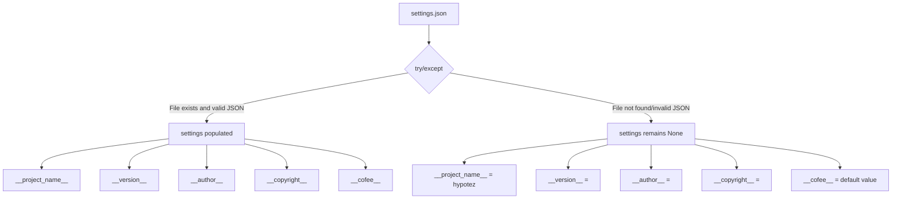

# Code Explanation: hypotez/src/templates/version.py

## <input code>

```python
## \file hypotez/src/templates/version.py
# -*- coding: utf-8 -*-\n#! venv/Scripts/python.exe
#! venv/bin/python/python3.12
"""
.. module: src.templates 
	:platform: Windows, Unix
	:synopsis:

"""
MODE = 'dev'

"""
	:platform: Windows, Unix
	:synopsis:

"""


"""
	:platform: Windows, Unix
	:synopsis:

"""


"""
  :platform: Windows, Unix

"""
"""
  :platform: Windows, Unix
  :platform: Windows, Unix
  :synopsis:
"""MODE = 'dev'
  
""" module: src.templates """


import json

settings:dict = None

try:
    with open('../settings.json', 'r') as settings_file:
        settings = json.load(settings_file)
except (FileNotFoundError, json.JSONDecodeError):
    ...

__project_name__ = settings.get("project_name", 'hypotez') if settings  else 'hypotez'
__version__: str = settings.get("version", '')  if settings  else ''
__doc__: str = ''
__details__: str = ''
__author__: str = settings.get("author", '')  if settings  else ''
__copyright__: str = settings.get("copyrihgnt", '')  if settings  else ''
__cofee__: str = settings.get("cofee", "Treat the developer to a cup of coffee for boosting enthusiasm in development: https://boosty.to/hypo69")  if settings else "Treat the developer to a cup of coffee for boosting enthusiasm in development: https://boosty.to/hypo69"
```

## <algorithm>

This code snippet defines several variables related to the project's metadata, likely for use in documentation or build systems.  It reads a settings file (`settings.json`) to obtain values for these variables.

1. **Initialization:**  `settings` is initialized as `None`.
2. **Reading Settings:** Attempts to open and parse `settings.json`.  
   - If the file is found and the JSON is valid, `settings` is populated with the parsed data.
   - If the file is not found or the JSON is invalid, the `try...except` block is executed, and `settings` remains `None`.
3. **Data Extraction:**  If `settings` contains data, it extracts values for project name, version, author, copyright, and a coffee link from the JSON. 
   -  Uses `settings.get()` to safely retrieve the value, providing a default if the key is not found.
4. **Storing Data:** The extracted values are assigned to the corresponding variables (`__project_name__`, `__version__`, etc.).
5. **Fallback Values:** If `settings` is `None` (file not found or invalid JSON), default values are used.

```
Example Data flow:
settings.json:
{
    "project_name": "MyProject",
    "version": "1.2.3",
    "author": "John Doe"
}


settings = { ... parsed values from JSON}


__project_name__ = "MyProject"
__version__ = "1.2.3"
__author__ = "John Doe"
```


## <mermaid>



**Dependencies:**

The only dependency is the `json` module for parsing the `settings.json` file.


## <explanation>

**Imports:**

- `json`: Used for working with JSON data.  It's crucial for reading the external configuration file.  It's part of the Python standard library, so no external dependencies.

**Classes:**

- No classes are defined in this code snippet.

**Functions:**

- No custom functions are defined; the script consists mostly of variable assignments.

**Variables:**

- `settings`: A dictionary that stores data read from `settings.json`.  It's crucial for accessing project metadata.
- `__project_name__`, `__version__`, `__author__`, `__copyright__`, `__cofee__`: Strings representing project metadata. These variables will likely be used in the project's metadata.
- `MODE`: A string variable.  Its purpose isn't clear from the provided context, it might control a development mode.  

**Potential Errors/Improvements:**

- **Error Handling:** The `try...except` block is good for handling potential `FileNotFoundError` or `json.JSONDecodeError`, but the `...` in the `except` block might be improved with a specific message or logging to aid debugging.
- **Default Values:** Setting default values is a good practice if the required information isn't present in the settings file.
- **File Path:** The file path `'../settings.json'` is relative to the current file's location. It's good practice to check if it correctly resolves the path in different scenarios.


**Relationship to other parts of the project:**

This file ( `hypotez/src/templates/version.py` ) likely provides values that other parts of the `hypotez` project will use.  For example, it may be used for generating project documentation or used in configuration.  The values (like `__version__`) are generally used by project build or deployment tools to handle versioning.

```
Relationship chain:  settings.json -> version.py -> (project build/deploy tools) -> documentation, packaging, etc.