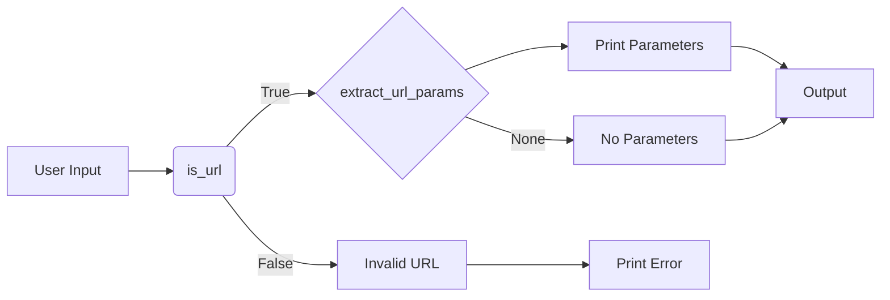

# Code Explanation for `hypotez/src/utils/string/url.py`

## <input code>

```python
## \file hypotez/src/utils/string/url.py
# -*- coding: utf-8 -*-\
#! venv/Scripts/python.exe
#! venv/bin/python/python3.12

"""
.. module: src.utils.string 
	:platform: Windows, Unix
	:synopsis: Модуль для работы с URL строками, включая извлечение параметров запроса и проверку на валидность UR

"""
MODE = 'dev'


from urllib.parse import urlparse, parse_qs
import validators

def extract_url_params(url: str) -> dict | None:
    """ Извлекает параметры из строки URL.

    Args:
        url (str): Строка URL для парсинга.

    Returns:
        dict | None: Словарь параметров запроса и их значений или `None`, если URL не содержит параметров.
    """
    parsed_url = urlparse(url)
    params = parse_qs(parsed_url.query)
    
    # Преобразуем значения из списка в строку, если параметр имеет одно значение
    if params:
        params = {k: v if len(v) > 1 else v[0] for k, v in params.items()}
        return params
    return None

def is_url(text: str) -> bool:
    """ Проверяет, является ли переданный текст валидным URL с использованием библиотеки validators.

    Args:
        text (str): Строка для проверки.

    Returns:
        bool: `True` если строка является валидным URL, иначе `False`.
    """
    return validators.url(text)

if __name__ == "__main__":
    # Получаем строку URL от пользователя
    url = input("Введите URL: ")
    
    # Проверяем валидность URL
    if is_url(url):
        params = extract_url_params(url)
        
        # Выводим параметры
        if params:
            print("Параметры URL:")
            for key, value in params.items():
                print(f"{key}: {value}")
        else:
            print("URL не содержит параметров.")
    else:
        print("Введенная строка не является валидным URL.")
```

## <algorithm>

1. **Input:** Takes a URL string from user input.
2. **`is_url` Function:** Validates the input string as a URL using `validators`.
   * **Example:** `is_url("https://www.example.com/path?param1=value1&param2=value2")` returns `True`.
3. **`extract_url_params` Function:**
   * Parses the URL using `urllib.parse.urlparse`.
   * Extracts query parameters using `urllib.parse.parse_qs`.
   * Handles cases where a parameter has a single value (converts list to string).
   * **Example:** `extract_url_params("https://www.example.com/path?param1=value1&param2=value2")` returns `{'param1': 'value1', 'param2': 'value2'}`.  If the URL has no parameters, returns `None`.
4. **Main Block:**
   * **Output:** Prints results based on validation and extraction. If valid and parameters exist, prints them. Otherwise, displays appropriate messages.

## <mermaid>



**Dependencies Analysis:**

* **`urllib.parse`:** Provides functions for parsing URLs (e.g., `urlparse`, `parse_qs`), crucial for extracting query parameters.  It's part of the standard Python library.
* **`validators`:** External library (`pip install validators`) used for URL validation.  Implements a broader and potentially more robust set of validation checks. The dependency is essential for handling potential malicious input or poorly formatted URLs.

## <explanation>

* **Imports:**
    * `urllib.parse`:  Used for parsing URLs, extracting query string parameters.
    * `validators`:  Used to validate if a given input string is a valid URL. This import is crucial for enhancing security.
* **Classes:**  There are no classes defined in this code.
* **Functions:**
    * `extract_url_params(url: str) -> dict | None`: This function takes a URL string as input and returns a dictionary containing the extracted query parameters or `None` if there are no parameters or if the input is invalid. It handles cases where a parameter may have a single value.
    * `is_url(text: str) -> bool`:  This function takes a string as input and checks if it's a valid URL using the `validators` library.
* **Variables:**
    * `MODE = 'dev'`: A simple variable likely used for configuration, potentially toggling different functionalities in a development environment.
* **Potential Errors and Improvements:**
    * **Robustness:** While `validators` improves URL validation, the code doesn't explicitly handle cases where the input might not be a string (e.g., an integer or a different data type).  Adding a check (`isinstance(url, str)`) would make it more robust.
    * **Error Handling:** The code lacks more detailed error handling.  Catching potential exceptions like `TypeError` could make it more user-friendly.  Returning a more descriptive error message could help debug issues.
    * **Input Validation:** Checking for potential invalid characters or very long URLs would increase robustness against potential attacks (e.g., preventing an input that can crash or slow the program).


**Relationship with other project parts (hypothetical):**

This `url` module likely serves as a helper for other modules or functions within the `hypotez` project, allowing these modules to extract parameters or validate URLs from user input, database records, or other sources without having to implement this logic repeatedly. The `hypotez` project is likely focused on a data-related process or service. The use of `urllib` indicates the code interacts with internet-based data and thus might be part of a web application component or an API client.

**Example usage of the function in a larger context:**

```python
# Assuming this is part of a larger script within hypotez
import url  # Assuming the file is named url.py or similar
...
# User inputs a URL from a web form.
url_from_user = request.form.get("url")
try:
    valid_url = url.is_url(url_from_user)
    if valid_url:
        parameters = url.extract_url_params(url_from_user)
        if parameters:
             # Process the parameters
             print(parameters["key"])
        else:
            print("No parameters were extracted.")
    else:
        print("Invalid URL")
except Exception as e:  # Handle potential errors in the url processing
    print(f"An error occurred: {e}")
...
```