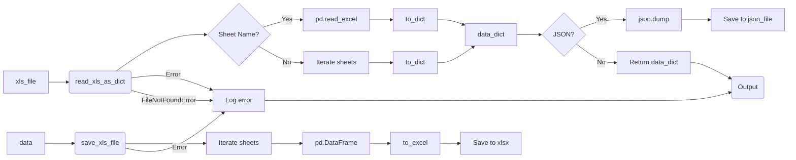

# <input code>

```python
## \file hypotez/src/utils/xls.py
# -*- coding: utf-8 -*-\n#! venv/Scripts/python.exe
#! venv/bin/python/python3.12

"""
.. module: src.utils 
	:platform: Windows, Unix
	:synopsis: Converter for Excel (`xls`) to JSON and JSON to Excel (`xls`)

"""
MODE = 'dev'

""" This module provides functions to convert Excel files to JSON format, handle multiple sheets, and save JSON data back to Excel files.

Functions:
    read_xls_as_dict(xls_file: str, json_file: str = None, sheet_name: Union[str, int] = None) -> Union[Dict, List[Dict], bool]:
        Reads an Excel file and converts it to JSON.  Optionally, converts a specific sheet and saves the result to a JSON file.  Handles errors gracefully.

    save_xls_file(data: Dict[str, List[Dict]], file_path: str) -> bool:
        Saves JSON data to an Excel file.  The data should be a dictionary where keys are sheet names and values are lists of dictionaries representing rows. Handles errors gracefully.

Examples:
    # Reading and optionally saving to JSON
    data = read_xls_as_dict('input.xlsx', 'output.json', 'Sheet1')  # Reads sheet named 'Sheet1'
    if data:
        print(data)  # Output will be {'Sheet1': [{...}]}

    # Saving from JSON data
    data_to_save = {'Sheet1': [{'column1': 'value1', 'column2': 'value2'}]}
    success = save_xls_file(data_to_save, 'output.xlsx')
    if success:
        print("Successfully saved to output.xlsx")
"""

import pandas as pd
import json
from typing import List, Dict, Union
from pathlib import Path
import logging

# Configure logging
logging.basicConfig(level=logging.INFO, format='%(asctime)s - %(levelname)s - %(message)s')


def read_xls_as_dict(
    xls_file: str,
    json_file: str = None,
    sheet_name: Union[str, int] = None
) -> Union[Dict, List[Dict], bool]:
    """
    Reads an Excel file and converts it to JSON.  Optionally, converts a specific sheet and saves the result to a JSON file.
    Handles errors gracefully.
    """
    try:
        xls_file_path = Path(xls_file)
        if not xls_file_path.exists():
            logging.error(f"Excel file not found: {xls_file}")
            return False  # Indicate failure

        xls = pd.ExcelFile(xls_file)

        if sheet_name is None:
            data_dict = {}
            for sheet in xls.sheet_names:
                try:
                    df = pd.read_excel(xls, sheet_name=sheet)
                    data_dict[sheet] = df.to_dict(orient='records')
                except Exception as e:
                    logging.error(f"Error processing sheet '{sheet}': {e}")
                    return False

        else:
            try:
                df = pd.read_excel(xls, sheet_name=sheet_name)
                data_dict = df.to_dict(orient='records')
            except Exception as e:
                logging.error(f"Error processing sheet '{sheet_name}': {e}")
                return False


        if json_file:
            with open(json_file, 'w', encoding='utf-8') as f:
                json.dump(data_dict, f, ensure_ascii=False, indent=4)
                logging.info(f"JSON data saved to {json_file}")

        return data_dict

    except FileNotFoundError as e:
        logging.error(f"File not found: {e}")
        return False
    except Exception as e:
        logging.error(f"An error occurred: {e}")
        return False


def save_xls_file(data: Dict[str, List[Dict]], file_path: str) -> bool:
    """Saves JSON data to an Excel file. Handles errors gracefully."""
    try:
        with pd.ExcelWriter(file_path, engine='xlsxwriter') as writer:
            for sheet_name, rows in data.items():
                df = pd.DataFrame(rows)
                df.to_excel(writer, sheet_name=sheet_name, index=False)
                logging.info(f"Sheet '{sheet_name}' saved to {file_path}")
        return True
    except Exception as e:
        logging.error(f"Error saving Excel file: {e}")
        return False
```

# <algorithm>

**Read XLS to JSON**

1. **Input:** Excel file path (`xls_file`).
2. **Check Existence:** Verify if the Excel file exists. If not, log an error and return `False`.
3. **Read Excel:**  Use `pd.ExcelFile` to open the Excel file.
4. **Optional Sheet Selection:** If `sheet_name` is provided, read only that sheet using `pd.read_excel`. Otherwise, iterate over all sheets.
5. **Convert to Dictionary:** Use `df.to_dict(orient='records')` to convert each DataFrame to a list of dictionaries.
6. **Save to JSON (optional):** If `json_file` is specified, write the `data_dict` to the JSON file using `json.dump`.
7. **Return Value:** Return the `data_dict` (containing sheet name and data).
8. **Error Handling:**  Wraps the entire process within a `try...except` block to handle potential `FileNotFoundError` and other exceptions. Log errors for debugging.

**Example:** `read_xls_as_dict('data.xlsx', 'data.json', 'Sheet1')`

**Save JSON to XLS**

1. **Input:** Dictionary data (`data`) and file path (`file_path`).
2. **Create ExcelWriter:** Open an Excel writer using `pd.ExcelWriter` with the specified file path and `engine='xlsxwriter'`.
3. **Iterate and Save Sheets:** Iterate over the sheets (keys) in the input `data`.
4. **Create DataFrame:** Create a pandas DataFrame from the list of dictionaries for each sheet.
5. **Write to Excel:** Write the DataFrame to the specified sheet using `df.to_excel`.
6. **Return Value:** Return `True` if the operation was successful. Log errors for debugging.
7. **Error Handling:**  Wraps the entire process within a `try...except` block to handle potential errors during the writing process.


# <mermaid>



**Dependencies Analysis:**
- `pandas`: Used for reading and writing Excel files.
- `json`: For working with JSON data.
- `typing`:  Used to define type hints (critical for code clarity and maintainability).
- `pathlib`: Provides object-oriented filesystem paths.
- `logging`: For logging information and errors.

# <explanation>

**Imports:**

- `pandas as pd`:  Used for handling and manipulating data in various formats, particularly Excel (`.xls`).  It's a crucial library for data analysis tasks in Python, facilitating operations like reading, writing, and transforming tabular data. Its relationship with the broader project is one of data manipulation and processing.  `src` packages likely involve data-related tasks that are supported by the Pandas data manipulation tools.
- `json`: Used for handling JSON data, allowing for conversion between JSON and Python dictionaries.  Its connection is for exchanging or storing data in a format compatible with external or other project parts.
- `typing`: Contains the `List`, `Dict`, and `Union` types, crucial for type hinting in the code. This module is crucial for type safety and code maintainability. It's used throughout `hypotez`, particularly in functions that handle structured data.
- `pathlib`: Provides an object-oriented way to work with file paths. It's vital for managing file system operations in a robust and clear manner.  Its role in `hypotez` is to deal with data file paths for data processing tasks.
- `logging`: Facilitates logging operations, providing information and error messages during execution. This is crucial for debugging, tracking, and understanding the code's behavior during operation. The `logging` module can help trace and track code flow in larger projects, giving useful insights into program behavior.

**Classes:**
- None. The code defines functions, not classes.

**Functions:**

- `read_xls_as_dict`: Takes an Excel file path, an optional JSON file path, and an optional sheet name as input. Reads the Excel file and converts the data in specified sheet or all sheets to a dictionary, potentially saving it to JSON. Its purpose is to read and convert data from Excel sheets and handle various errors during the process.
    - Arguments: `xls_file`, `json_file`, `sheet_name`.
    - Return values: A dictionary containing the converted data if successful, `False` otherwise.


- `save_xls_file`: Takes a dictionary of data (sheets and rows) and an Excel file path as input. Writes the data in the dictionary to an Excel file, overwriting or creating the file. Its purpose is to write data from a dictionary into an Excel file.
    - Arguments: `data`, `file_path`.
    - Return values: `True` on success, `False` on failure.


**Variables:**

- `MODE`:  A string variable with a value of `'dev'`.  It's likely a configuration variable to control the behavior of the script, in a development or testing mode. Its presence suggests a potential for different configurations (e.g. production mode) that might impact the logging level or other options.
- `xls_file_path`: Stores the path to the Excel file.
- `xls`: Holds the `pd.ExcelFile` object representing the opened Excel file.


**Potential Errors/Improvements:**

- **Robustness:** The `try...except` blocks are good, but consider more specific error handling. For example, instead of catching `Exception`, catch more specific exceptions, such as `ValueError` if there are problems with the data format.
- **File Handling:** Using `Path` objects is a good practice.
- **Clearer Error Messages:** The logging messages could be more informative to help diagnose problems.  It could be improved by specifying the exact error in the logging message and potentially providing context or more details on the failing operation.
- **Input Validation:**  Consider input validation on the function arguments, especially `xls_file` and `file_path` to ensure they're correct file paths and data types.


**Relationship to other project parts:**

The `utils/xls.py` module likely serves as a utility for data manipulation and conversion. Its role in the project is to support other parts of the system that need to interact with Excel files. The functionality provided is commonly needed in applications requiring data transfer to or from external sources such as Excel spreadsheets.