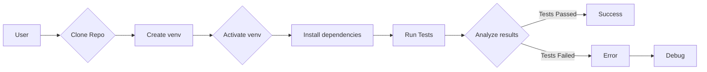

# Code Explanation: Guide for DriverBase Testing with pytest

## <input code>

```
### Руководство для Тестера

#### Введение

Этот документ предоставляет руководство для тестирования класса `DriverBase`, используя `pytest`. В этом руководстве описаны шаги по установке необходимых инструментов, запуску тестов, а также интерпретации результатов тестирования.

#### Предварительные условия

Перед началом тестирования убедитесь, что у вас установлены следующие компоненты:

1. **Python 3.12**:
    Убедитесь, что у вас установлена версия Python 3.12. Вы можете проверить текущую версию Python с помощью команды:
    ```bash
    python --version
    ```

2. **pytest**:
    Установите `pytest`, если он еще не установлен:
    ```bash
    pip install pytest
    ```

3. **unittest.mock**:
    Библиотека `unittest.mock` входит в стандартную библиотеку Python, начиная с версии 3.3.

#### Структура проекта

Проект имеет следующую структуру:

```
src/
|-- webdriver/
|   |-- driver.py
|   |-- javascript/
|   |-- executor/
|-- logger.py
|-- utils/
|   |-- jjson.py
tests/
|-- test_driver.py
```

#### Настройка окружения

1. **Клонирование репозитория**:
    Склонируйте репозиторий проекта на локальную машину:
    ```bash
    git clone <URL_вашего_репозитория>
    cd <имя_проекта>
    ```

2. **Создание и активация виртуального окружения**:
    Создайте виртуальное окружение для установки зависимостей:
    ```bash
    python -m venv venv
    source venv/bin/activate  # На Windows используйте: venv\Scripts\activate
    ```

3. **Установка зависимостей**:
    Установите необходимые зависимости, перечисленные в `requirements.txt` (если таковой имеется):
    ```bash
    pip install -r requirements.txt
    ```

#### Написание и запуск тестов

1. **Написание тестов**:
    Тесты для класса `DriverBase` находятся в файле `tests/test_driver.py`. Примеры тестов включают в себя тестирование методов `driver_payload`, `scroll`, `locale`, и других.

2. **Запуск тестов**:
    Для запуска тестов выполните следующую команду в корневой директории проекта:
    ```bash
    pytest tests/test_driver.py
    ```

3. **Интерпретация результатов тестов**:
    После запуска тестов `pytest` предоставит отчет о результатах. Пример выходных данных:
    ```
    ============================== test session starts ===============================\
    platform linux -- Python 3.12.0, pytest-7.0.0, pluggy-0.13.1\
    rootdir: /path/to/your/project\
    collected 9 items\
\
    tests/test_driver.py ........                                        [100%]\
\
    =============================== 9 passed in 1.23s ================================\
    ```
    Выходные данные показывают количество пройденных тестов и общее время выполнения. Если какой-либо тест не прошел, `pytest` предоставит детали ошибки.

#### Полезные команды

1. **Запуск всех тестов**:
    ```bash
    pytest
    ```

2. **Запуск тестов с подробным выводом**:
    ```bash
    pytest -v
    ```

3. **Запуск тестов с отчетом о покрытии кода**:
    Установите `pytest-cov`:
    ```bash
    pip install pytest-cov
    ```
    Затем запустите тесты с отчетом о покрытии:
    ```bash
    pytest --cov=src tests/
    ```

#### Заключение

Тестирование является важной частью разработки программного обеспечения. Используя `pytest` и следуя этому руководству, вы сможете эффективно тестировать функциональность класса `DriverBase`, обеспечивая его корректную работу и предотвращая регрессии.
```

## <algorithm>

This document describes how to run tests for the `DriverBase` class using `pytest`. The algorithm is a set of instructions for users to follow:

1. **Prerequisites**: Ensure Python 3.12 and `pytest` are installed. The `unittest.mock` library is part of standard Python 3.3+.
2. **Project Structure**: The project's structure is given (`src/webdriver/`, `tests/`).
3. **Environment Setup**: Clone the repository, create a virtual environment, activate it and install dependencies (if `requirements.txt` exists).
4. **Test Writing**: Tests for `DriverBase` are in `test_driver.py`. These tests likely contain functions that call methods like `driver_payload`, `scroll`, `locale` on the `DriverBase` object.
5. **Test Execution**: Run `pytest tests/test_driver.py` in the project root directory.
6. **Result Interpretation**: Analyze the `pytest` output for the test results, checking whether all tests passed. If a test failed, `pytest` will display an error message.
7. **Advanced Options**:  Options like running all tests, running tests with verbose output, or running tests with code coverage reports can be used.


## <mermaid>



**Dependencies Analysis:**

The diagram shows a basic flow, no specific dependencies on imported libraries are explicitly shown.  The success and failure states indicate that the test execution is the main focus.  The provided text outlines the necessary libraries, Python version, and tool to perform the tests (pytest).


## <explanation>

**Imports:**

The document primarily focuses on instructions for using `pytest` to test the `DriverBase` class.  No code is provided to be analyzed for specific imports.  Crucially, it mentions `unittest.mock`, which is a standard library module for mocking objects, commonly used in testing to simulate dependencies. The text also expects `pytest` to be installed, a popular testing framework. This implies dependencies on a range of Python libraries.


**Classes:**

The document mentions the `DriverBase` class. This is likely a custom class defined in `src/webdriver/driver.py` responsible for browser interaction, possibly handling initialization, actions (like `scroll`, `locale`), and potentially other methods.

**Functions:**

The document discusses functions like `driver_payload`, `scroll`, and `locale`, which are likely methods of the `DriverBase` class. Without the code, precise details are not available.

**Variables:**

The document discusses the setup of the testing environment (e.g., cloning a repository, creating a virtual environment, installing dependencies). These are variables used during the process.  There are likely internal variables inside the `DriverBase` class and the tests (for example, the results from the tests) that are not detailed.

**Potential Errors/Improvements:**

* **Missing Code for Analysis:** The provided text is a user guide, not the code itself. This prevents detailed analysis of variables, data structures, etc.
* **Unclear Purpose**: The guide provides instructions for running tests but does not explicitly mention the purpose of the `DriverBase` class or the tests.
* **Error Handling:** The guide does not specify the approach to handling errors in the tests.
* **Specific Error Conditions:** The guide doesn't specify specific error conditions that should be tested for in the `DriverBase` class.
* **Documentation:** The guide provides instructions but lacks detailed documentation on the methods (functions) within `DriverBase` and their functionalities.
* **Specific Test Cases:**  The guide mentions examples of tests, but the actual test cases in `tests/test_driver.py` are missing.


**Relationship Chain:**

The user guide creates a relationship between the project's testing workflow and the `DriverBase` class in `src/webdriver/`.  The tests (`test_driver.py`) are designed to test the functionalities of `DriverBase`, and thus this is the main relationship chain.   Other parts of the project (like `logger.py` or `utils/jjson.py`) are indirectly involved in the testing process since these libraries may be used in `driver.py`.

**Note:** Without the actual code, this analysis is limited to the documentation of the testing procedure.  A proper analysis requires the code itself.