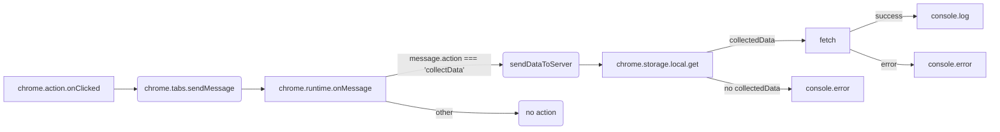

# Code Explanation: `background.js`

## <input code>

```javascript
// background.js

chrome.action.onClicked.addListener((tab) => {
    chrome.tabs.sendMessage(tab.id, { action: 'collectData', url: tab.url });
});

/**
 * This function listens for messages sent from other parts of the extension, 
 * such as content scripts or other background scripts, using the `chrome.runtime.sendMessage()` method.
 * 
 * Here's a breakdown of what each part does:
 * 
 * - `chrome.runtime.onMessage.addListener()`: This function sets up a listener for messages sent from other parts of the extension.
 * - `(message, sender, sendResponse) => { ... }`: This is an arrow function that defines what should happen when a message is received. It takes three parameters:
 *   - `message`: The message object sent from the sender.
 *   - `sender`: Information about the sender of the message, such as its ID and whether it is a tab or another extension.
 *   - `sendResponse`: A function that can be used to send a response back to the sender if needed.
 * - `if (message.action === 'collectData') { ... }`: This condition checks if the received message has a property named `action` with a value of `'collectData'`. This is often used to determine the purpose or type of the message.
 * - `sendDataToServer(message.url)`: If the received message has an action of `'collectData'`, this function calls another function named `sendDataToServer()` and passes the URL from the message as an argument. This typically triggers some action or behavior in response to the received message.
 * 
 * In summary, this function listens for messages with the action `'collectData'`, and when such a message is received, it triggers the `sendDataToServer()` function, presumably to collect data and send it to a server.
 */
chrome.runtime.onMessage.addListener((message, sender, sendResponse) => {
    if (message.action === 'collectData') {
        sendDataToServer(message.url);
    }
});

function sendDataToServer(url) {
    const serverUrl = 'http://127.0.0.1/hypotez/catch_request.php'; // Change to your server endpoint
    chrome.storage.local.get('collectedData', (result) => {
        const collectedData = result.collectedData;
        if (collectedData) {
            fetch(serverUrl, {
                method: 'POST',
                headers: {
                    'Content-Type': 'application/json'
                },
                body: JSON.stringify(collectedData)
            })
                .then(response => {
                    if (!response.ok) {
                        throw new Error('Failed to send data to server');
                    }
                    console.log('Data sent to server successfully');
                })
                .catch(error => {
                    console.error('Error sending data to server:', error);
                });
        } else {
            console.error('No collected data found');
        }
    });
}
```

## <algorithm>

**1. `chrome.action.onClicked.addListener`:**
   - **Input:** A tab object (`tab`).
   - **Output:** No direct output.  Triggers `chrome.tabs.sendMessage`.
   - **Example:** When a browser action icon is clicked, the `tab` object representing that tab is passed.
   - **Functionality:**  Listens for clicks on the browser action.  Sends a message to the active tab to initiate data collection.

**2. `chrome.runtime.onMessage.addListener`:**
   - **Input:** A message object (`message`), sender information (`sender`), and a sendResponse function.
   - **Output:** No direct output; triggers `sendDataToServer` if the message is `'collectData'`.
   - **Example:** Receives a message with `action: 'collectData'` and `url: 'https://www.example.com'`.
   - **Functionality:** Listens for messages from content scripts. If the message type is `collectData`, the URL is passed to `sendDataToServer`.

**3. `sendDataToServer`:**
   - **Input:** A URL string (`url`).
   - **Output:** Logs success or error messages to the console.
   - **Example:** `url = 'https://www.example.com'`
   - **Functionality:**
      - Retrieves `collectedData` from `chrome.storage.local`.
      - If `collectedData` exists, sends a POST request to the `serverUrl` with the `collectedData` as JSON.
      - Handles potential errors during the fetch process.  If no `collectedData`, logs error.


## <mermaid>



**Dependencies Analysis:**

- `chrome.action.onClicked`, `chrome.tabs.sendMessage`: Chrome extension API for interacting with browser actions and tabs.
- `chrome.runtime.onMessage`: Chrome extension API for handling messages between extension components.
- `chrome.storage.local`: Chrome extension API for managing local storage.
- `fetch`:  Browser API for making HTTP requests (crucial for communication with the server).
- Implicit dependencies on the `JSON.stringify()` and error handling mechanisms of JavaScript.

## <explanation>

**Imports:**

- No explicit imports are present, but the code heavily relies on built-in Chrome extension APIs. These APIs allow the extension to interact with the browser's context, communicate with other components (tabs, browser action), and manage storage.

**Classes:**

- No custom classes are defined. The code uses built-in Chrome APIs and JavaScript functions.

**Functions:**

- `chrome.action.onClicked.addListener`:  Takes a callback function which is executed when a browser action is clicked.  The `tab` parameter contains information about the tab where the action was clicked. This function is crucial for initiating the data collection process.

- `chrome.runtime.onMessage.addListener`:  Listens for messages sent to the background script from content scripts or other parts of the extension. The message object likely contains data to be processed.  Critical for receiving messages containing data from the browser tab.

- `sendDataToServer`: This is the core function that handles the communication with the server.
   - **Arguments:** `url` (string): The URL of the page.
   - **Return Value:** None (indirectly, it logs messages or errors to the console)
   - **Purpose:** Collects data from local storage, constructs a POST request, sends the request to the server, and handles potential errors during the fetch process. The response is processed and logs messages to the console.

**Variables:**

- `serverUrl`: String: Stores the URL of the server endpoint.  **Crucial:**  This constant needs to be the correct endpoint. Hard-coded for simplicity, but not suitable for production due to security issues and maintainability concerns.

- `collectedData`: Variable: Stores the data collected from local storage. It's an object potentially containing the collected data.

**Potential Errors and Areas for Improvement:**

- **Hardcoded Server URL:** The `serverUrl` is hardcoded, which isn't good practice.  A configuration file or a more dynamic approach is needed for production.
- **Error Handling:** While the code includes `try...catch` blocks, error handling could be more robust (e.g., retry mechanisms, more informative error messages).
- **Data Validation:** The code doesn't validate the `collectedData` before sending it. This could lead to unexpected behavior if the data is not in the expected format or if there are missing fields.
- **Security:** Sending sensitive data directly to a server using a hardcoded URL can pose a significant security risk. For production, consider more secure methods, like a proxy or a secure API endpoint.
- **Idempotency:** There's no mechanism to ensure the server request is idempotent. For example, if the POST request fails, this process should ideally retry or use other mechanisms to prevent duplicate requests.

**Relationship Chain:**

1. User clicks browser action.
2. `chrome.action.onClicked` triggers message sending to the active tab.
3. Content script (likely in `content.js`) receives the message and collects data.
4. Content script sends a message back to the background script (`background.js`) containing the collected data, with `action: 'collectData'` and the URL as parameters.
5. `chrome.runtime.onMessage` receives the message, passes `url` to `sendDataToServer`.
6. `sendDataToServer` fetches data from `chrome.storage.local`.
7. Data is sent to the server via POST request.
8. Server responds, sending back a success/error message to the extension.

This process describes the data flow and interactions between different parts of the extension and potentially the server-side application.  Critical is to have well-defined and secure communication channels and protocols.