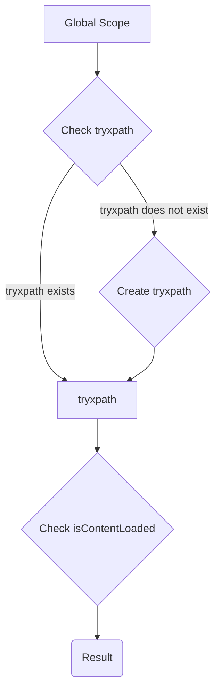

# Code Analysis of try_xpath_check_frame.js

## <input code>

```javascript
/* This Source Code Form is subject to the terms of the Mozilla Public
 * License, v. 2.0. If a copy of the MPL was not distributed with this
 * file, You can obtain one at http://mozilla.org/MPL/2.0/. */

// namespace
if (!tryxpath) {
    var tryxpath = {};
}

tryxpath.isContentLoaded;
```

## <algorithm>

This code snippet is extremely simple and doesn't perform any substantial actions.  Its functionality is limited to checking if a property exists in an object and declaring a namespace.  There's no data processing or complex logic.

**Step 1:**  Namespace Check and Creation

   * **Input:**  None (explicitly). Implicitly, it checks for the existence of a global variable named `tryxpath`.
   * **Example:** Assume `tryxpath` doesn't exist.
   * **Output:** `tryxpath` is declared as an empty object if it doesn't exist.


**Step 2:** Property Existence Check.

   * **Input:**  None (explicitly). The implicit input is the existence of an object `tryxpath`.
   * **Example:** Checks if the `tryxpath` object has a property called `isContentLoaded`.
   * **Output:** If the `isContentLoaded` property exists it returns either `undefined`, `true` or `false` if it's a boolean based on the type of value stored in the property.


## <mermaid>




## <explanation>

**Imports:**  There are no imports. The code operates entirely within the global scope.


**Classes:** No classes are defined.


**Functions:** No functions are defined.


**Variables:**


* `tryxpath`: This is a variable declared within the global scope.


**Potential Errors or Areas for Improvement:**

The code is extremely rudimentary and likely doesn't serve a practical purpose by itself.  It's probably part of a larger project.  To be meaningful, this code would need to be part of an initialization or setup, where `tryxpath.isContentLoaded` is later used to determine the state of something in a web application.  For example, it might check if the content of a web page has loaded before attempting to manipulate it.

**Relationship to Other Parts of the Project:**

The code's relationship to other parts of the project can only be inferred from its filename (`try_xpath_check_frame.js`) which suggests it likely interacts with functions related to web page manipulation using XPath expressions (`tryxpath`).  It is highly probable that other files, using `tryxpath.isContentLoaded` will perform tasks on the page.