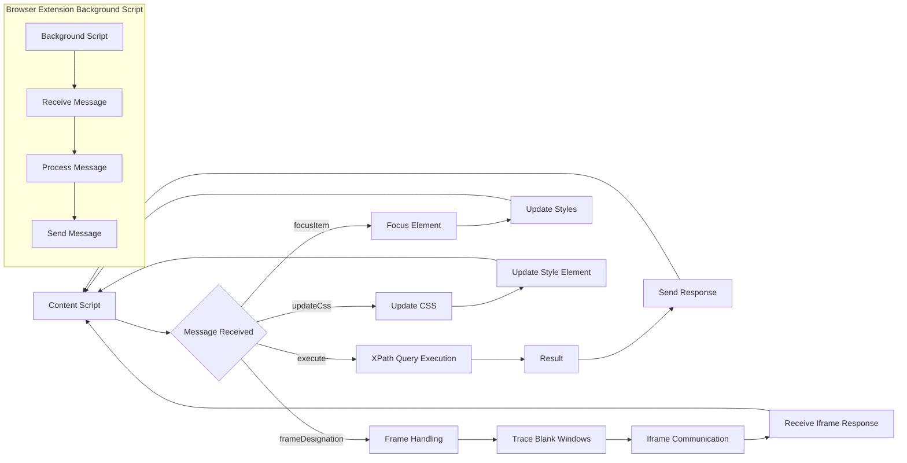

# try_xpath_content.js Analysis

## <input code>

```javascript
/* ... (license information) */

(function (window, undefined) {
    "use strict";

    // alias
    var tx = tryxpath;
    var fu = tryxpath.functions;

    // prevent multiple execution
    if (tx.isContentLoaded) {
        return;
    }
    tx.isContentLoaded = true;

    // ... (constant definitions)

    // ... (attributes object)

    // ... (variable declarations)

    // ... (functions: setAttr, setIndex, isFocusable, focusItem, setMainAttrs, restoreAttrs, resetPrev, makeTypeStr, updateCss, getFrames, parseFrameDesignation, traceBlankWindows, handleCssChange, findFrameByMessage, setFocusFrameListener, initBlankWindow, findStyleParent, updateStyleElement, updateAllStyleElements, removeStyleElement, removeAllStyleElements, createResultMessage, genericListener)

    // ... (genericListener.listeners object and event handling)

    // ... (browser storage listener)

    // ... (window message listener)

    // ... (initializations)
})(window);
```

## <algorithm>

This JavaScript code appears to be a content script for a browser extension (likely Chrome) that handles XPath queries and focusing elements within the page and potentially within iframes.  The core logic revolves around communication with a background script (`browser.runtime.sendMessage`).  The core algorithm can be broken down into steps:

1. **Initialization:**
   - Checks if the script has already run (tx.isContentLoaded). Prevents duplicate execution.
   - Initializes variables for handling results, attributes, and CSS.
   - Registers listener functions to handle incoming messages from the background script.

2. **Message Handling (genericListener):**
   - Handles various events (execute, focusItem, focusContextItem, focusFrame, etc.).
   - Each event handler performs specific actions like executing XPath queries, setting focus, updating the displayed CSS, and managing iframes.
   - Uses try/catch blocks to handle errors during execution.

3. **XPath Query Execution (execute handler):**
   - Retrieves query information from the message.
   - Determines context (possibly a frame).
   - Uses `fu.execExpr` (likely a custom XPath evaluation function) on the determined context to execute the query.
   - Stores query results.
   - Builds a response message containing the results and sends it back to the background script.

4. **Focus Handling (focusItem, focusContextItem, focusFrame):**
   - Receives focus requests, determines the target element based on the index.
   - Handles focus within iframes.
   - Updates styles (likely for highlighting the focused item).

5. **CSS Management (updateCss, updateStyleElement, removeAllStyleElements):**
   - Receives CSS updates from the background script.
   - Adds or updates style elements in the current document (to provide highlighted/focused styling).
   - Updates or removes the style elements when changes occur.

6. **Frame Handling (getFrames, parseFrameDesignation, traceBlankWindows, findFrameByMessage):**
    - Handles communication with and querying of frames (iframes).
    - Tracks which iframe is currently being focused in order to properly send the message.
    - Sends messages to iframe content scripts to update their focus state recursively.


## <mermaid>



**Dependencies:**

- `tryxpath`: Likely a namespace or module containing the XPath evaluation function (`fu.execExpr`) and helper functions.  A significant portion of the code is highly dependent on the internals of this module, as it is the core execution engine for the entire content script.
- `browser`: Browser API for interacting with the browser's runtime, storage, and messaging system.  These calls are crucial for communication between the content script and the background script of the extension.
- `fu`: Appears to be an alias for `tryxpath.functions`. This likely contains helper functions for interacting with DOM elements (e.g., `fu.isNodeItem`, `fu.getParentElement`), XPath result manipulation (`fu.getxpathResultStr`), and others.


## <explanation>

**Imports:**

- `browser`: This is a core browser API for making calls into the browser context, including storage, communication, and other actions that would otherwise be blocked by security restrictions for a script running in a page context. This is crucial for communication between the content script and the background script.

**Classes:**

- No explicit classes are defined.  The code heavily relies on functions to encapsulate various actions.

**Functions:**

- `setAttr`, `setIndex`: These functions update attributes of HTML elements (like `data-tryxpath-element` and `data-tryxpath-focused`) and handles the `originalAttributes` object.  
- `isFocusable`: A helper function to verify if an element or attribute is focusable.
- `focusItem`: Sets focus to a given element, handling ancestor highlighting (`data-tryxpath-focused-ancestor`).
- `setMainAttrs`: Sets essential attributes for the main XPath result display.
- `restoreAttrs`: Resets attributes to prevent state carryover.
- `resetPrev`: Resets state in preparation for a new execution.
- `makeTypeStr`: Converts result types to strings with type information for display.
- `updateCss`:  Sends a message to the background script to update the CSS that's used for highlighting.
- `getFrames`, `parseFrameDesignation`, `traceBlankWindows`, `findFrameByMessage`, `setFocusFrameListener`, `initBlankWindow`:  These functions deal with handling iframe communication.  Crucially, `traceBlankWindows` handles scenarios where the designated iframe isn't found or is not empty, returning a failure flag. This is essential for robust handling of various window scenarios.
- `updateStyleElement`, `updateAllStyleElements`, `removeStyleElement`, `removeAllStyleElements`:  These handle the insertion and updating of style elements in the DOM, crucial for dynamically applying styles for focusing.
- `genericListener`: This function is the central hub for receiving messages from the background script. The various listeners for different message types are attached to this listener.
- `createResultMessage`: Creates a default error message.


**Variables:**

- `attributes`: An object that stores the CSS attributes used for focus handling.
- `originalAttributes`: Stores original attributes of items before modification. This allows for restoration later.
- `currentItems`: Stores items as results from XPath queries.
- `currentCss`: Stores current style information used for highlighting.

**Potential Errors and Improvements:**

- **Error Handling:** While the code uses `try...catch` blocks, more specific error messages in catch blocks could improve debugging.
- **Efficiency:** The repeated message passing within iframes (`setFocusFrameListener`) could be optimized for large or complex iframe hierarchies.
- **Maintainability:**  The numerous functions could be organized into more classes to improve structure.  Consider refactoring.


**Relationships:**

This script is heavily dependent on `tryxpath.functions` (likely a separate module) for XPath processing and DOM manipulation. It communicates with a browser extension background script using `browser.runtime.sendMessage` for various actions (CSS updates, executing queries, etc.).  There's a clear communication chain:  user interaction → background script → content script → DOM element modifications.