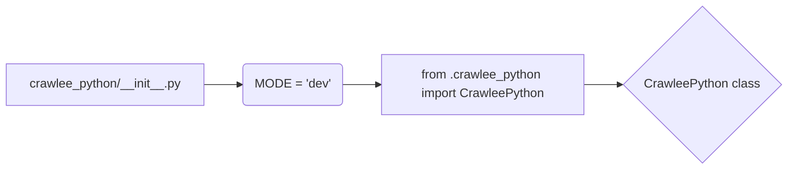

# <input code>

```python
## \file hypotez/src/webdriver/crawlee_python/__init__.py
# -*- coding: utf-8 -*-\
#! venv/Scripts/python.exe
#! venv/bin/python/python3.12

"""
.. module: src.webdriver.crawlee_python 
	:platform: Windows, Unix
	:synopsis:

"""
MODE = 'dev'

from .crawlee_python import CrawleePython
```

# <algorithm>

This code snippet is a Python module initialization file (`__init__.py`) for a package called `crawlee_python` within the `webdriver` sub-package of the `hypotez` project.  It doesn't contain complex logic; it primarily serves to import and make available a class named `CrawleePython`.

There's no complex algorithm or data flow. The function of this file is purely to export a class definition for import and use by other parts of the project.

* **Step 1:** The `__init__.py` file sets the variable `MODE` to 'dev'.  This variable likely controls configuration for development mode.  Example: A value of "prod" would indicate production environment settings.
* **Step 2:** The `from .crawlee_python import CrawleePython` line imports the `CrawleePython` class.  This is a fundamental step in making the `CrawleePython` class accessible to other modules in the project.


# <mermaid>



The mermaid diagram shows a single file (`crawlee_python/__init__.py`) setting a variable (`MODE`) and importing another module (`crawlee_python`) to get the `CrawleePython` class.  There's no external dependency implied in this short snippet.


# <explanation>

* **Imports:**
    * `from .crawlee_python import CrawleePython`: This line imports the `CrawleePython` class from the `crawlee_python` module within the same directory. The `.` indicates a relative import, crucial for package organization.  This assumes a file named `crawlee_python.py` exists in the same directory as this `__init__.py` file.  This import makes the `CrawleePython` class available for use in other modules that import this `__init__.py`.

* **Classes:**
    * `CrawleePython`: This class is defined in the `crawlee_python.py` file (which is not shown).  Its exact functionality is unknown from this snippet, but based on the import statement, this class likely handles web crawling using a webdriver (e.g., Selenium). The class definition is critical for the project's ability to perform web scraping tasks.


* **Functions:**
   There are no functions defined within this file.


* **Variables:**
    * `MODE`: A string variable set to 'dev'.  This variable likely controls configuration settings in the project (e.g., different logging, database connection, or API key).


* **Potential Errors/Improvements:**

    * **Missing `crawlee_python.py`:** The import statement assumes that `crawlee_python.py` exists.  If that file is missing, there would be a `ModuleNotFoundError`.  If `crawlee_python.py` defines additional functionality (e.g. constants or functions), the `__init__.py` file needs to import those items accordingly.
    * **Missing Docstrings for `CrawleePython`:** The code could benefit from docstrings explaining the class's purpose, methods, and attributes within `crawlee_python.py`.


* **Project Relationships:**

This `__init__.py` file forms a critical link in the `hypotez` project's structure.  It connects the `crawlee_python` module, potentially with other modules related to web scraping, data processing, and data storage.  The `CrawleePython` class from within this module will be instrumental in the web scraping process. The actual implementation of the crawling strategy and its data handling will exist within `crawlee_python.py`, forming a larger piece of the overall system.


```